# **KS5005(KS5006)Keyestudio ESP32 37 in 1 Sensor Kit**

You need to look through the file“Get started with Arduino C before
class”first before get started with this kit.

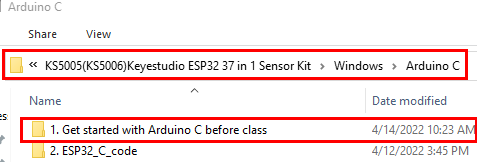

## 1. Description：

The Keyestudio ESP32 37 in 1 sensor kit mainly contains 37 commonly used
sensors and modules, an ESP32 board, an ESP32 expansion board and Dupont
wires.

All sensors and modules are fully compatible with the ESP32 expansion
board. You only need to stack the ESP32 mainboard onto the ESP32
expansion Board, and hook up them with Dupont wires, which is simple and
convenient.

To make you master the electronic knowledge, detailed tutorials,
schematic diagrams, wiring methods and test code are included. Through
these projects, you will have a better understanding about programming,
logic and electronics.

## 2. Kit：

(Note: the ESP32 board is included in the KS5005 kit；but not in the KS5006 kit)

<table>
<tbody>
<tr class="odd">
<td>#</td>
<td>Picture</td>
<td>Name</td>
<td>QTY</td>
</tr>
<tr class="even">
<td><ol type="1">
<li></li>
</ol></td>
<td></td>
<td>Keyestudio LED Module</td>
<td>1</td>
</tr>
<tr class="odd">
<td><ol start="2" type="1">
<li></li>
</ol></td>
<td></td>
<td>Keyestudio Common Cathode RGB Module</td>
<td>1</td>
</tr>
<tr class="even">
<td><ol start="3" type="1">
<li></li>
</ol></td>
<td></td>
<td>Keyestudio Traffic Lights Module</td>
<td>1</td>
</tr>
<tr class="odd">
<td><ol start="4" type="1">
<li></li>
</ol></td>
<td></td>
<td>Keyestudio Active Buzzer</td>
<td>1</td>
</tr>
<tr class="even">
<td><ol start="5" type="1">
<li></li>
</ol></td>
<td></td>
<td>Keyestudio 8002b Audio Power Amplifier</td>
<td>1</td>
</tr>
<tr class="odd">
<td><ol start="6" type="1">
<li></li>
</ol></td>
<td></td>
<td>Keyestudio Button Module</td>
<td>1</td>
</tr>
<tr class="even">
<td><ol start="7" type="1">
<li></li>
</ol></td>
<td></td>
<td>Keyestudio Tilt Sensor</td>
<td>1</td>
</tr>
<tr class="odd">
<td><ol start="8" type="1">
<li></li>
</ol></td>
<td></td>
<td>Keyestudio PIR Motion Sensor</td>
<td>1</td>
</tr>
<tr class="even">
<td><ol start="9" type="1">
<li></li>
</ol></td>
<td></td>
<td>Keyestudio Obstacle Avoidance Sensor</td>
<td>1</td>
</tr>
<tr class="odd">
<td><ol start="10" type="1">
<li></li>
</ol></td>
<td></td>
<td>Keyestudio 6812 RGB Module</td>
<td>1</td>
</tr>
<tr class="even">
<td><ol start="11" type="1">
<li></li>
</ol></td>
<td></td>
<td>
Keyestudio NTC-MF52AT

Thermistor
</td>
<td>1</td>
</tr>
<tr class="odd">
<td><ol start="12" type="1">
<li></li>
</ol></td>
<td></td>
<td>Keyestudio Photoresistor</td>
<td>1</td>
</tr>
<tr class="even">
<td><ol start="13" type="1">
<li></li>
</ol></td>
<td></td>
<td>Keyestudio Sound Sensor</td>
<td>1</td>
</tr>
<tr class="odd">
<td><ol start="14" type="1">
<li></li>
</ol></td>
<td></td>
<td>
Keyestudio

Rotary Potentiometer
</td>
<td>1</td>
</tr>
<tr class="even">
<td><ol start="15" type="1">
<li></li>
</ol></td>
<td></td>
<td>Keyestudio IR Receiver</td>
<td>1</td>
</tr>
<tr class="odd">
<td><ol start="16" type="1">
<li></li>
</ol></td>
<td></td>
<td>Keyestudio Reed Switch Sensor</td>
<td>1</td>
</tr>
<tr class="even">
<td><ol start="17" type="1">
<li></li>
</ol></td>
<td></td>
<td>Keyestudio Rotary Encoder Module</td>
<td>1</td>
</tr>
<tr class="odd">
<td><ol start="18" type="1">
<li></li>
</ol></td>
<td></td>
<td>Keyestudio Joystick Module</td>
<td>1</td>
</tr>
<tr class="even">
<td><ol start="19" type="1">
<li></li>
</ol></td>
<td></td>
<td>Keyestudio HT16K33 8X8 Dot Matrix Module</td>
<td>1</td>
</tr>
<tr class="odd">
<td><ol start="20" type="1">
<li></li>
</ol></td>
<td></td>
<td>Keyestudio TM1650 4-Digit Tube Display</td>
<td>1</td>
</tr>
<tr class="even">
<td><ol start="21" type="1">
<li></li>
</ol></td>
<td></td>
<td>Keyestudio Thin-film Pressure Sensor</td>
<td>1</td>
</tr>
<tr class="odd">
<td><ol start="22" type="1">
<li></li>
</ol></td>
<td></td>
<td>Keyestudio DS1307 Clock Sensor</td>
<td>1</td>
</tr>
<tr class="even">
<td><ol start="23" type="1">
<li></li>
</ol></td>
<td></td>
<td>Keyestudio SR01 Ultrasonic Sensor</td>
<td>1</td>
</tr>
<tr class="odd">
<td><ol start="24" type="1">
<li></li>
</ol></td>
<td></td>
<td>Servo</td>
<td>1</td>
</tr>
<tr class="even">
<td><ol start="25" type="1">
<li></li>
</ol></td>
<td></td>
<td>Keyestudio Capacitive Sensor</td>
<td>1</td>
</tr>
<tr class="odd">
<td><ol start="26" type="1">
<li></li>
</ol></td>
<td></td>
<td>Keyestudio Photo Interrupter</td>
<td>1</td>
</tr>
<tr class="even">
<td><ol start="27" type="1">
<li></li>
</ol></td>
<td></td>
<td>Keyestudio Hall Sensor</td>
<td>1</td>
</tr>
<tr class="odd">
<td><ol start="28" type="1">
<li></li>
</ol></td>
<td></td>
<td>Keyestudio Flame Sensor</td>
<td>1</td>
</tr>
<tr class="even">
<td><ol start="29" type="1">
<li></li>
</ol></td>
<td></td>
<td>Keyestudio Line Tracking Sensor</td>
<td>1</td>
</tr>
<tr class="odd">
<td><ol start="30" type="1">
<li></li>
</ol></td>
<td></td>
<td>Keyestudio Analog Gas Sensor</td>
<td>1</td>
</tr>
<tr class="even">
<td><ol start="31" type="1">
<li></li>
</ol></td>
<td></td>
<td>Keyestudio XHT11 Temperature and Humidity Sensor</td>
<td>1</td>
</tr>
<tr class="odd">
<td><ol start="32" type="1">
<li></li>
</ol></td>
<td></td>
<td>Keyestudio 18B20 Temperature Sensor</td>
<td>1</td>
</tr>
<tr class="even">
<td><ol start="33" type="1">
<li></li>
</ol></td>
<td></td>
<td>Keyestudio 130 Motor</td>
<td>1</td>
</tr>
<tr class="odd">
<td><ol start="34" type="1">
<li></li>
</ol></td>
<td></td>
<td>Fan</td>
<td>1</td>
</tr>
<tr class="even">
<td><ol start="35" type="1">
<li></li>
</ol></td>
<td></td>
<td>Keyestudio Laser Module</td>
<td>1</td>
</tr>
<tr class="odd">
<td><ol start="36" type="1">
<li></li>
</ol></td>
<td></td>
<td>Keyestudio Steam Sensor</td>
<td>1</td>
</tr>
<tr class="even">
<td><ol start="37" type="1">
<li></li>
</ol></td>
<td></td>
<td>Keyestudio Relay Module</td>
<td>1</td>
</tr>
<tr class="odd">
<td><ol start="38" type="1">
<li></li>
</ol></td>
<td></td>
<td>Keyestudio RFID Module</td>
<td>1</td>
</tr>
<tr class="even">
<td><ol start="39" type="1">
<li></li>
</ol></td>
<td></td>
<td><blockquote>

Keyestudio ESP32 Development Board

</blockquote></td>
<td>1</td>
</tr>
<tr class="odd">
<td><ol start="40" type="1">
<li></li>
</ol></td>
<td></td>
<td><blockquote>

Keyestudio ESP32-IO Expansion Board

</blockquote></td>
<td>1</td>
</tr>
<tr class="even">
<td><ol start="41" type="1">
<li></li>
</ol></td>
<td></td>
<td>Keyestudio IR Remote Control</td>
<td>1</td>
</tr>
<tr class="odd">
<td><ol start="42" type="1">
<li></li>
</ol></td>
<td></td>
<td>USB Cable</td>
<td>1</td>
</tr>
<tr class="even">
<td><ol start="43" type="1">
<li></li>
</ol></td>
<td></td>
<td>F-F Dupont Wire</td>
<td>1</td>
</tr>
<tr class="odd">
<td><ol start="44" type="1">
<li></li>
</ol></td>
<td></td>
<td>White Card</td>
<td>1</td>
</tr>
<tr class="even">
<td><ol start="45" type="1">
<li></li>
</ol></td>
<td></td>
<td>ABS RFID Key</td>
<td>1</td>
</tr>
<tr class="odd">
<td><ol start="46" type="1">
<li></li>
</ol></td>
<td></td>
<td>6 AA Battery Holder</td>
<td>1</td>
</tr>
</tbody>
</table>

## 3. Arduino C library and set up the ESP32 environment:

The Arduino C is in the folder Arduino Libraries, and you can refer to
Preparation before class for C(Raspberry Pi) to set the ESP32
environment

If the Arduino C is added, just skip this part.

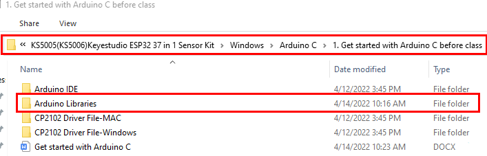

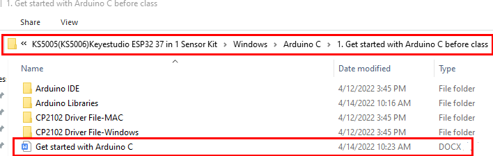

## Projects：

There are 37 sensors and modules in this kit. Next, we will analyze and
introduce how they work step by step. Interface sensors with the ESP32
board and its expansion board, run test codes and observe experimental
phenomenon.

**Note: please wire up components according to the given connection
diagrams.**

**What’s more, wire up the power and signals correctly, otherwise,
sensors or modules will get damaged or no test results will be shown.**

### Project 1: Hello World

**Overview**

In this project, we will make an experiment to light up the white LED
module. The high and low levels can be controlled by programming, then
the state of the LED can be controlled.

**Required Components**

<table>
<tbody>
<tr class="odd">
<td>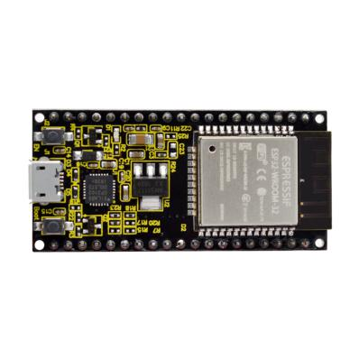</td>
<td></td>
</tr>
<tr class="even">
<td>ESP32*1</td>
<td>USB Cable *1</td>
</tr>
</tbody>
</table>

**Wire Up：**

Connect the ESP32 to your computer

**4.Test Code**

<table>
<tbody>
<tr class="odd">
<td>
//*************************************************************************************

/*

* Filename : Hello World

* Description : Enter the letter R,and the serial port displays"Hello World".

* Auther :http//www.keyestudio.com

*/

char val;// defines variable "val"

void setup()

void loop()

}

}

//*************************************************************************************
</td>
</tr>
</tbody>
</table>

Before uploading the test code to the
ESP32，click“Tools”→“Board”，select“ESP32 Wrover Module”.

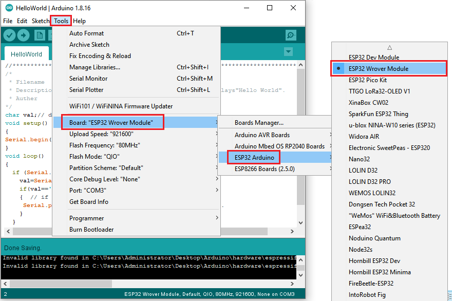

Select the correct serial port

Note：for macOS users，if the code is uploaded unsuccessfully，set the baud
rate to 115200 before clicking

Click  to upload the test code to the ESP32.

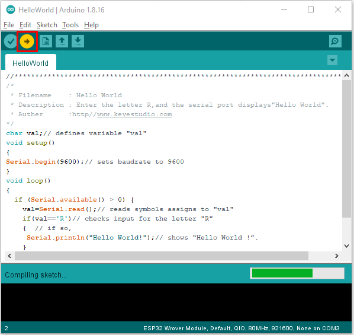

Note: If uploading code fails, you can press and hold the Boot button on
the ESP32 after clickingand release the Boot
button after the percentage of uploading progress
appears., as shown below:  

The code is uploaded successfully

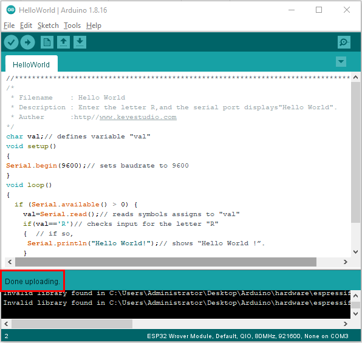

**5. Test Result**

After uploading successfully，we will use a USB cable to power
on，click, set the baud rate to 9600，we need to
press the reset button on the ESP32 motherboard and enter the
letter“R”，click“Send”，then the serial monitor prints“Hello
World\!”.

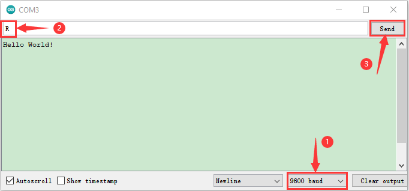

Project 2: Lighting up LED

**Overview**

In this project, we will make an experiment to light up the white LED
module. The high and low levels can be controlled by programming, then
the state of the LED can be controlled.

**Working Principle**

The two circuit diagrams are given. The left one is wrong wiring-up
diagram. Why? Theoretically, when the S terminal outputs high levels,
LED will receive the voltage and light up.

Due to limitation of IO ports of Pico board, weak current can’t make LED
brighten.

The right one is correct wiring-up diagram. GND and VCC are powered up.
When the S terminal is a high level, the triode Q1 will be connected and
LED will light up(note: current passes through LED and R3 to reach GND
by VCC not IO ports). Conversely, when the S terminal is a low level,
the triode Q1 will be disconnected and LED will go off.

The triode Q1 is equal to a switch and R1 and R3 stand for limited
resistors which can curb the size of current to prevent from burning out
components

**Required Components：**

<table>
<tbody>
<tr class="odd">
<td></td>
<td></td>
<td></td>
<td></td>
<td></td>
</tr>
<tr class="even">
<td>ESP32 Board*1</td>
<td>ESP32 Expansion Board*1</td>
<td>Keyestudio Purple LED Module*1</td>
<td>3P Dupont Wire*1</td>
<td>Micro USB Cable*1</td>
</tr>
</tbody>
</table>

**4.Wiring Diagram**

**Test Code**

<table>
<tbody>
<tr class="odd">
<td>
//*************************************************************************************

/*

* Filename : Blink

* Description : led Flashing 1 s

* Auther : http://www.keyestudio.com

*/

int ledPin = 0; //Define LED pin connection to GPIO0

void setup() 

void loop() 

//*************************************************************************************
</td>
</tr>
</tbody>
</table>

**Code Explanation**

**Code 1：**

1.  pinMode(pin,mode)；pin stands for the pin of pico GPIO to set
    mode；mode: (Optional) input mode INPUT , OUTPUT or INPUT\_PULLUP.
    We set pin0 to output.

2.  digitalWrite(pin, value)；pin stands for the pin of GPIO.
    
    We define GP0；value is the digital level to be output(HIGH/LOW).
    
    When using pinMode(), need to set pin to OUTPUT and voltage to the
    corresponding value: 3.3V is HIGH，low level is 0V (grounded).
    
    Not setting pinMode() to OUTPUT，when using digitalWrite (HIGH)，LED
    may get dim.
    
    Hence digitalWrite() enables the pull-up resistor.
    
    **Code 2：**
    
    Setup()：run the code once, yet, the code in the function loop()
    loops
    
    delay(ms): delayed function. Data type: unsigned long（ 0\~
    4,294,967,295 (2^32 - 1)）

Connect the signal end(GPO) of the module to ledpin, and set high level.
Then LED will light up.

The second code, delay in 1000ms, means lighting up LED for 1s.

More details for Arduino: **https://www.arduino.cc/reference/en/**

**Test Result**

upload the code and power on, the white LED lights up

Note: if you fail to upload the code, hold down the BOOT after clicking
, then release it when process box
appears.

### Project 3: Traffic Light Module

**Overview**

In this lesson, we will learn how to control multiple LED lights and
simulate the operation of traffic lights.

Traffic lights are signal devices positioned at road intersections,
pedestrian crossings, and other locations to control flows of traffic.

In this kit, we will use the traffic light module to simulate the
traffic light.

**Working Principle**

In previous lesson, we already know how to control an LED. In this part,
we only need to control three separated LEDs. Output high levels to the
signal R(3.3V), then the red LED will be on.

**3.Required Components：**

<table>
<tbody>
<tr class="odd">
<td></td>
<td></td>
<td></td>
<td></td>
<td></td>
</tr>
<tr class="even">
<td>ESP32 Board*1</td>
<td>ESP32 Expansion Board*1</td>
<td>Keyestudio Traffic Lights Module*1</td>
<td>5P Dupont Wire *1</td>
<td>Micro USB Cable*1</td>
</tr>
</tbody>
</table>

**4.Wiring Diagram**

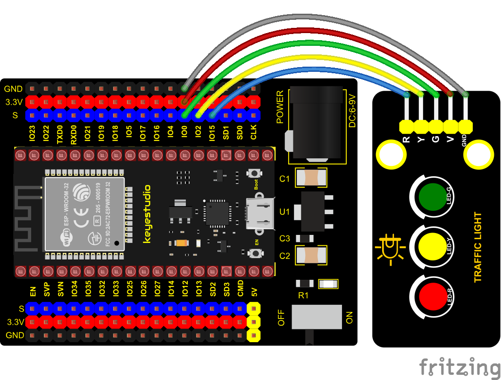

**Test Code：**

<table>
<tbody>
<tr class="odd">
<td>
//*************************************************************************************

/*

* Filename : Traffic_Light

* Description : Simulated traffic lights

* Auther : http://www.keyestudio.com

*/

int redPin = 15; //Red LED connected to GPIO15

int yellowPin = 2; //Yellow LED connected to GPIO2

int greenPin = 0; //Green LED connected to GPIO0

void setup() 

void loop() 

digitalWrite(redPin, HIGH); //Lighting red LED

delay(5000); //Delay5s

digitalWrite(redPin, LOW); //Turn off red LED

}

//*************************************************************************************
</td>
</tr>
</tbody>
</table>

**Code Explanation**

We use the function for(). for (int i = 1; i \<= 3; i = i + 1)
represents the variable i adds 1 fir each time from 1 to 3.

The function for (int i = 255; i \>= 0; i = i - 1) indicates that i
reduces by 1 each time. When i\<0, exit the for() loop and execute 256
times

**Test Result**

Upload the code, the green LED will be on for 5s then off, the yellow
LED will flash for 3s then go off and the red one will be on 5s then
off.

### Project 4: Laser Sensor

**Description**

Lasers are widely used to cut, weld, surface treat, and more on specific
materials. The energy of the laser is very high. The toy laser pointer
may cause glare to the human eye, and it may cause retinal damage for a
long time. my country also prohibits the use of laser to illuminate the
aircraft.

**Working Principle**

The laser head sensor module is mainly composed of a laser head with a
light-emitting die, a condenser lens, and a copper adjustable sleeve.

We can see the circuit schematic diagram of this module which is very
similar to the LED we have learned. They are all driven by triodes. A
high-level digital signal is directly input at the signal end, then the
sensor will start to work; if inputting low levels, the sensor won’t
work.

**3.Required Components:**

<table>
<tbody>
<tr class="odd">
<td></td>
<td></td>
<td></td>
<td></td>
<td></td>
</tr>
<tr class="even">
<td>ESP32 Board*1</td>
<td>ESP32 Expansion Board*1</td>
<td>Keyestudio Laser Module*1</td>
<td>3P Dupont Wire*1</td>
<td>Micro USB Cable*1</td>
</tr>
</tbody>
</table>

**4.Wiring Diagram**

**Test Code：**

<table>
<tbody>
<tr class="odd">
<td>
//*************************************************************************************

/*

* Filename : Laser sensor

* Description : Laser light flashing

* Auther : http://www.keyestudio.com

*/

int laserPin = 0; //Define the laser pin as GPIO 0

void setup() 

void loop() 

//*************************************************************************************
</td>
</tr>
</tbody>
</table>

**Test Results**

Upload the test code successfully and power on, the laser module will
emit red laser signals for 2 seconds and stop emitting signals for 2
seconds.

### Project 5: Breathing LED

**Overview**

A“breathing LED”is a phenomenon where an LED's brightness smoothly
changes from dark to bright and back to dark, continuing to do so and
giving the illusion of an LED“breathing. This phenomenon is similar to a
lung breathing in and out. So how to control LED’s brightness? We need
to take advantage of PWM.

**2.Required Components：**

<table>
<tbody>
<tr class="odd">
<td></td>
<td></td>
<td></td>
<td></td>
<td></td>
</tr>
<tr class="even">
<td>ESP32 Board*1</td>
<td>ESP32 Expansion Board*1</td>
<td>Keyestudio Purple LED Module*1</td>
<td>3P Dupont Wire*1</td>
<td>Micro USB Cable*1</td>
</tr>
</tbody>
</table>

**3.Wiring Diagram**

**4.Test Code**

<table>
<tbody>
<tr class="odd">
<td>
//**********************************************************************

/*

* Filename : Breathing Led

* Description : Make led light fade in and out, just like breathing.

* Auther : http//www.keyestudio.com

*/

#define PIN_LED 0 //define the led pin

#define CHN 0 //define the pwm channel

#define FRQ 1000 //define the pwm frequency

#define PWM_BIT 8 //define the pwm precision

void setup() 

void loop() 

for (int i = 255; i &gt; -1; i--) 

}

//*************************************************************************************
</td>
</tr>
</tbody>
</table>

**Test Result**

Run the test code, the LED on the module gradually gets dimmer then
brighter, cyclically, like human breathe

### Project 6: RGB Module

1.  **Overview**

Among these modules is a RGB module. It adopts a F10-full color RGB
foggy common cathode LED. We connect the RGB module to the PWM port of
MCU and the other pin to GND(for common anode RGB, the rest pin will be
connected to VCC). So what is PWM?

PWM is a means of controlling the analog output via digital means.
Digital control is used to generate square waves with different duty
cycles (a signal that constantly switches between high and low levels)
to control the analog output.In general, the input voltages of ports are
0V and 5V. What if the 3V is required? Or a switch among 1V, 3V and
3.5V? We cannot change resistors constantly. For this reason, we resort
to PWM.

For Arduino digital port voltage outputs, there are only LOW and HIGH
levels, which correspond to the voltage outputs of 0V and 5V
respectively. You can define LOW as“0”and HIGH as“1’, and let the
Arduino output five hundred‘0’or“1”within 1 second. If output five
hundred‘1’, that is 5V; if all of which is‘0’,that is 0V; if output 250
01 pattern, that is 2.5V.

This process can be likened to showing a movie. The movie we watch are
not completely continuous. Actually, it generates 25 pictures per
second, which cannot be told by human eyes. Therefore, we mistake it as
a continuous process. PWM works in the same way. To output different
voltages, we need to control the ratio of 0 and 1. The more‘0’or‘1’
output per unit time, the more accurate the control.

2.  **Working Principle**

For our experiment, we will control the RGB module to display different
colors through three PWM values.

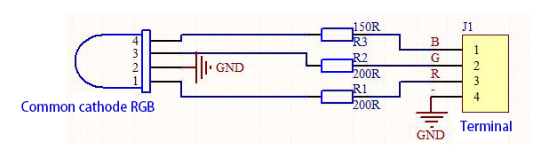

**3.Required Components：**

<table>
<tbody>
<tr class="odd">
<td></td>
<td></td>
<td></td>
<td></td>
<td></td>
</tr>
<tr class="even">
<td>ESP32 Board*1</td>
<td>ESP32 Expansion Board*1</td>
<td>Keyestudio Common Cathode RGB Module *1</td>
<td>4P Dupont Wire1</td>
<td>Micro USB Cable*1</td>
</tr>
</tbody>
</table>

**4.Wiring Diagram**

**Test Code：**

<table>
<tbody>
<tr class="odd">
<td>
//**********************************************************************

/*

* Filename : RGB LED

* Description : Use RGBLED to show random color.

* Auther : http//www.keyestudio.com

*/

int ledPins[] = ; //define red, green, blue led pins

const byte chns[] = ; //define the pwm channels

int red, green, blue;

void setup() 

}

void loop() 

void setColor(byte r, byte g, byte b) 

//*************************************************************************************
</td>
</tr>
</tbody>
</table>

**Test Result**

Wire up, power on, compile and upload the code to the ESP32. After
uploading successfully，we will use a USB cable to power on，we will see
that the RGB LED on the module starts to display random colors.

### Project 7: Button Sensor

**Overview**

In this kit, there is a Keyestudio single-channel button module, which
mainly uses a tact switch and comes with a yellow button cap.

In previous lessons, we learned how to make the pins of our single-chip
microcomputer output a high level or low level. In this experiment, we
will read the high level (3.3V) and low level (0V).

We can determine whether the button on the sensor is pressed by reading
the high and low level of the S terminal on the sensor.

**Working Principle**

The button module has four pins. The pin 1 is connected to the pin 3 and
the pin 2 is linked with the pin 4. When the button is not pressed, they
are disconnected. Yet, when the button is pressed, they are connected.
If the button is released, the signal end is high level.

**3.Required Components：**

<table>
<tbody>
<tr class="odd">
<td></td>
<td></td>
<td></td>
<td></td>
<td></td>
</tr>
<tr class="even">
<td>ESP32 Board*1</td>
<td>ESP32 Expansion Board*1</td>
<td>Keyestudio Button Sensor*1</td>
<td>3P Dupont Wire*1</td>
<td>Micro USB Cable*1</td>
</tr>
</tbody>
</table>

**4.Wiring Diagram**

**Test Code：**

<table>
<tbody>
<tr class="odd">
<td>
//*************************************************************************************

/*

* Filename : button

* Description : Read key value

* Auther : http://www.keyestudio.com

*/

int val = 0; //Useto store key values

int button = 15; //The pin of the button is connected to GP15

void setup() 

void loop() 

else 

}

//*************************************************************************************
</td>
</tr>
</tbody>
</table>

**Code Explanation**

1.  **pinMode(button, INPUT)**; set the pin of the button module to GP15
    and INPUT.
    
    Configure INPUT through pinMode(). INPUT must use the pull-up or
    pull-down resistor(ours module has the pull-up resistor RI).
    
    2\. **Serial.begin(9600)**: Initialize serial communication and set
    the baud rate to 9600.
    
    3\. **digitalRead(button)**: read the digital level of the
    button(HIGH or LOW). If this pin is not connected to pins, the
    digitalRead() will return HIGH or LOW.
    
    4\. if..else..：if the logic behind () is true, execute the code of
    (); otherwise execute the code of **else**.
    
    5\. If the button is pressed, the signal end is low level, GP15 is
    low level and Val is 0. Then the monitor will show the corresponding
    value and characters; otherwise, the sensor is released, val is 1
    and monitor will show 1 and other characters
    
    **Test Result**
    
    Upload the test code successfully. After powering on the USB cable,
    open the serial monitor and set the baud rate to 9600. The serial
    monitor will display the corresponding data and characters. When the
    button is pressed, val is 0, the monitor will show“Press the
    button”；when the button is released, val is 1，the monitor will
    show“Loosen the button”; as shown below
    
    

### Project 8: Capacitive Sensor

**Description**

In this kit, there is a capacitive touch module which mainly uses a
TTP223-BA6 chip. It is a touch detection chip, which provides a touch
button, and its function is to replace the traditional button with a
variable area button. When we power on, the sensor needs about 0.5
seconds to stabilize. Do not touch the keys during this time period. At
this time, all functions are disabled, and self-calibration is always
performed. The calibration period is about 4 seconds. We display the
test results in the shell.

**Working Principle**

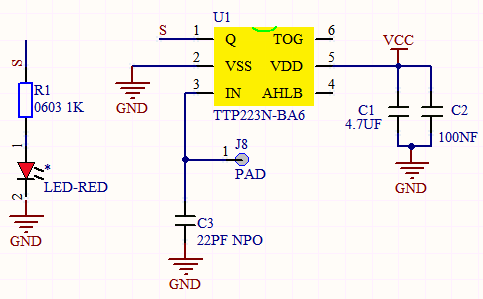

When our fingers touch the module, the signal S outputs high levels, the
red LED on the module flashes. We can determine if the button is pressed
or not by reading high and low levels on the sensor.

**3.Required Components：**

<table>
<tbody>
<tr class="odd">
<td></td>
<td></td>
<td></td>
<td></td>
<td></td>
</tr>
<tr class="even">
<td>ESP32 Board*1</td>
<td>ESP32 Expansion Board*1</td>
<td>Keyestudio Capacitive Module*1</td>
<td>3P Dupont Wire*1</td>
<td>Micro USB Cable*1</td>
</tr>
</tbody>
</table>

**4.Wiring Diagram**

**Test Code：**

<table>
<tbody>
<tr class="odd">
<td>
//*************************************************************************************

/*

* Filename : Touch sensor

* Description : Reading touch value

* Auther : http://www.keyestudio.com

*/

int val = 0;

int touch = 15; //The key of PIN

void setup() 

void loop() 

else 

}

//*************************************************************************************
</td>
</tr>
</tbody>
</table>

**Code Explanation**

When we touch the sensor, the Shell monitor will show“You pressed the
button\!”, if not,“You loosen the button\!”will be shown on the monitor.

**Test Result**

Wire up, upload the code to the ESP32 and open the monitor and set baud
rate to 9600. The shell monitor shows corresponding data and characters.
In the experiment, when the button is pressed, the red LED lights up and
val is 1.Then the shell shows“You pressed the button\!”; if the button
is released, the red LED is off and val is 0;“You loosen the
button\!”will be displayed.

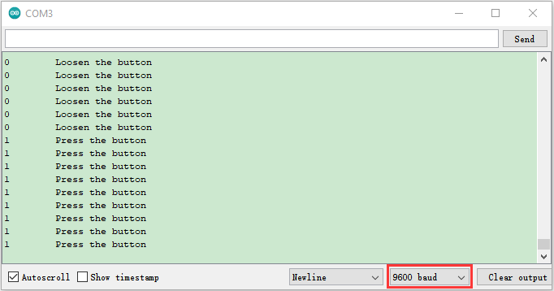

### Project 9: Obstacle Avoidance Sensor

**Overview**

In this kit, there is a Keyestudio obstacle avoidance sensor, which
mainly uses an infrared emitting and a receiving tube. In the
experiment, we will determine whether there is an obstacle by reading
the high and low level of the S terminal on the sensor.

**Working Principle**

NE555 circuit provides IR signals with frequency to the emitter TX, then
the IR signals will fade with the increase of transmission distance. If
encountering the obstacle, it will be reflected back.

When the receiver RX meets the weak signals reflected back, the
receiving pin will output high levels, which indicates the obstacle is
far away. On the contrary, it the reflected signals are stronger, low
levels will be output, which represents the obstacle is close. There are
two potentiometers on the module, and one is for adjusting emission
power, another one is for receiving frequency.

**3.Required Components:**

<table>
<tbody>
<tr class="odd">
<td></td>
<td></td>
<td></td>
<td></td>
<td></td>
</tr>
<tr class="even">
<td>ESP32 Board*1</td>
<td>ESP32 Expansion Board*1</td>
<td>Keyestudio Obstacle Avoidance Sensor*1</td>
<td>3P Dupont Wire*1</td>
<td>Micro USB Cable*1</td>
</tr>
</tbody>
</table>

**4.Wiring Diagram**

**Test Code：**

<table>
<tbody>
<tr class="odd">
<td>
//*************************************************************************************

/*

* Filename : obstacle avoidance sensor

* Description : Reading the obstacle avoidance value

* Auther : http://www.keyestudio.com

*/

int val = 0;

void setup() 

void loop() 

else 

}

//*************************************************************************************
</td>
</tr>
</tbody>
</table>

**Note:**

Upload the test code and wire up according to the connection diagram.
After powering on, we start to adjust the two potentiometers to sense
distance.

1.  Adjust the potentiometer transmitting power. Make the P LED at the
    critical point of ON and OFF states.

2\. Adjust the potentiometer receiving frequency. Rotate it clockwise,
the frequency will increase. Make the S LED at the critical point of ON
and OFF states, then the 38KHz square wave can be produced.

**Test Result**

Upload the code power up by a USB cable, open the serial monitor and set
baud rate to 9600. When the sensor detects the obstacle, the monitor
will show“There are obstacles”; if the obstacle is not detected, “All
going well” will be shown.

### Project 10: Line Tracking Sensor

**Description**

In this kit, there is a DIY electronic building block single-channel
line tracking sensor which mainly uses a TCRT5000 reflective black and
white line recognition sensor element.

In the experiment, we judge the color (black and white) of the object
detected by the sensor by reading the high and low levels of the S
terminal on the module; and display the test results on the shell.

**Working Principle**

When a black or no object is detected, the signal terminal will output
high levels; when white object is detected, the signal terminal is low
level; its detection height is 0-3cm. We can adjust the sensitivity by
rotating the potentiometer on the sensor. When the potentiometer is
rotated, the sensitivity is best when the red LED on the sensor is at
the critical point between off and on.

**3.Required Components：**

<table>
<tbody>
<tr class="odd">
<td></td>
<td></td>
<td></td>
<td></td>
<td></td>
</tr>
<tr class="even">
<td>ESP32 Board*1</td>
<td>ESP32 Expansion Board*1</td>
<td>Keyestudio Line Tracking Sensor*1</td>
<td>3P Dupont Wire*1</td>
<td>Micro USB Cable*1</td>
</tr>
</tbody>
</table>

**4.Wiring Diagram**

**Test Code：**

<table>
<tbody>
<tr class="odd">
<td>
//*************************************************************************************

/*

* Filename : line tracking

* Description : Reading the tracking sensor value

* Auther : http://www.keyestudio.com

*/

int val = 0;

void setup() 

void loop() 

else 

}

//*************************************************************************************
</td>
</tr>
</tbody>
</table>

**Test Result**

Upload test code, wire up, open the monitor and set baud rate to 9600.

In the experiment, when the sensor doesn’t detect an object or detects a
black object, the val is 1, and the monitor will display "1 Black" ;
when a white object (can reflect light) is detected, the val is 0, and
the monitor will display "0 White" ;

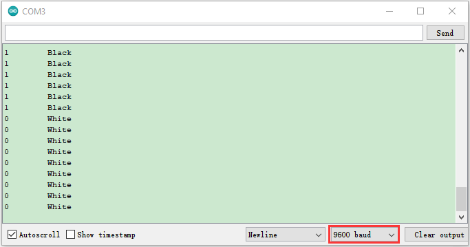

### Project 11: Photo Interrupter

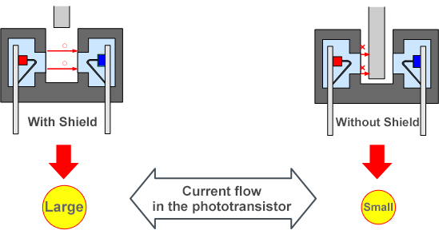

**Description**

This kit contains a photo interrupter which mainly uses 1 ITR-9608
photoelectric switch. It is a photoelectric switch optical switch
sensor.

**Working Principle**

When the paper is put in the slot, C is connected with VCC and the
signal end S of the sensor are high levels; then the red LED will be
off. Otherwise, the red LED will be on.

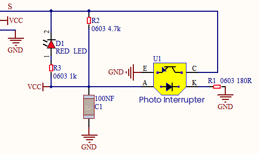

**3.Required Components：**

<table>
<tbody>
<tr class="odd">
<td></td>
<td></td>
<td></td>
<td></td>
<td></td>
</tr>
<tr class="even">
<td>ESP32 Board*1</td>
<td>ESP32 Expansion Board*1</td>
<td>Keyestudio Photo Interrupter*1</td>
<td>3P Dupont Wire*1</td>
<td>Micro USB Cable*1</td>
</tr>
</tbody>
</table>

**4.Wiring Diagram**

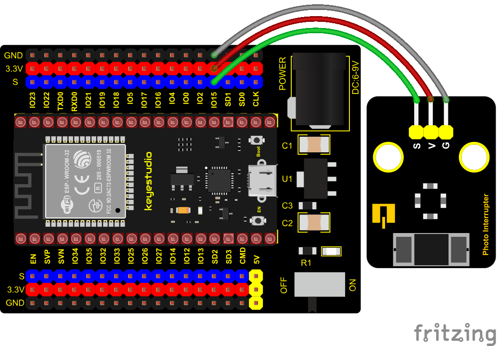

**Test Code：**

<table>
<tbody>
<tr class="odd">
<td>
//*************************************************************************************

/*

* Filename : Photo_Interrupt

* Description : Light snap sensor counting

* Auther : http://www.keyestudio.com

*/

int PushCounter = 0; //The count variable is assigned an initial value of 0

int State = 0; //Store the current state of the sensor output

int lastState = 0; //Stores the state of the last sensor output

void setup() 

void loop() 

}

lastState = State;//Update state

}

//*************************************************************************************
</td>
</tr>
</tbody>
</table>

**Code Explanation**

Logic setting:

<table>
<tbody>
<tr class="odd">
<td>Initial Setting</td>
<td>Set PushCounter to 0</td>
<td></td>
</tr>
<tr class="even">
<td></td>
<td>Set State to 0 (value of the sensor)</td>
<td></td>
</tr>
<tr class="odd">
<td></td>
<td>Set lastState to 0</td>
<td></td>
</tr>
<tr class="even">
<td>when an object enters the slot</td>
<td>lastState is 0，State turns into 1; lastState turns into 1</td>
<td>
Set PushCounter to PushCounter+1

print the value of PushCounter
</td>
</tr>
<tr class="odd">
<td>when the object leaves the slot</td>
<td>lastState is 1，State becomes 0，two data are not equal，lastState turns into 0.</td>
<td>
PushCounterdoesn’t change;

Don’t print the value of PushCounter
</td>
</tr>
<tr class="even">
<td>When the object goes through this slot again</td>
<td>lastState is 0, State becomes 1，two data are not equal，lastState turns into 1.</td>
<td>
Set PushCounter to PushCounter+1

And print the value of PushCounter
</td>
</tr>
<tr class="odd">
<td>When the object leaves this slot again</td>
<td>lastState is 1，State turns into 0，two data are not equal lastState turns into 0</td>
<td>
PushCounter doesn’t change;

Don’t print the PushCounter value
</td>
</tr>
</tbody>
</table>

**Test Result**

Wire up, upload test code and power up. Open the monitor and set baud
rate to 9600. Then the shell displays the PushCounter data. Every time
when the object passes through the slot of the sensor, the PushCounter
data will increase by 1 continuously, as shown below;

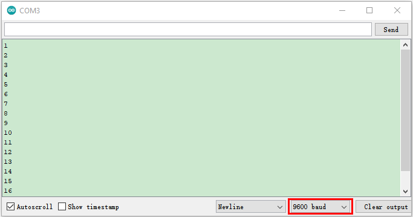

### Project 12: Tilt Module

**Overview**

In this kit, there is a Keyestudio tilt sensor. The tilt switch can
output signals of different levels according to whether the module is
tilted. There is a ball inside. When the switch is higher than the
horizontal level, the switch is turned on, and when it is lower than the
horizontal level, the switch is turned off. This tilt module can be used
for tilt detection, alarm or other detection.

**Working Principle**

The working principle is pretty simple. When pin 1 and 2 of the ball
switch P1 are connected, the signal S is low level and the red LED will
light up; when they are disconnected, the pin will be pulled up by the
4.7K R1 and make S a high level, then LED will be off.

**3.Required Components：**

<table>
<tbody>
<tr class="odd">
<td></td>
<td></td>
<td></td>
<td></td>
<td></td>
</tr>
<tr class="even">
<td>ESP32 Board*1</td>
<td>ESP32 Expansion Board*1</td>
<td>
Keyestudio

Tilt Sensor*1
</td>
<td>3P Dupont Wire*1</td>
<td>Micro USB Cable*1</td>
</tr>
</tbody>
</table>

**4.Wiring Diagram**

**Test Code：**

<table>
<tbody>
<tr class="odd">
<td>
//*************************************************************************************

/*

* Filename : Tilt switch

* Description : Reading the tilt sensor value

* Auther :http://www.keyestudio.com

*/

int val; //Store the level value output by the tilt sensor

void setup() 

void loop() 

//*************************************************************************************
</td>
</tr>
</tbody>
</table>

**Test Result**

Upload the code power up by a USB cable, open the serial monitor and set
baud rate to 9600.

Make the tilt module incline to one side, the red LED on the module will
be off and the monitor will display“1”. In contrast, if you make it
incline the other side, the red LED will light up and the monitor will
display“0”.

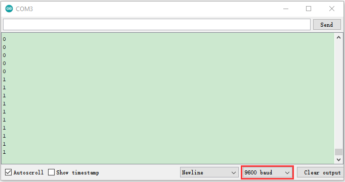

### Project 13: Hall Sensor

**Description**

In this kit, there is a Hall sensor which mainly adopts an A3144 linear
Hall element. The element P1 is composed of a voltage regulator, a Hall
voltage generator, a differential amplifier, a Schmitt trigger, a
temperature compensation circuit and an open-collector output stage. In
the experiment, we use the Hall sensor to detect the magnetic field and
display the test results on the shell.

**Working Principle**

When the sensor detects no magnetic field or a north pole magnetic
field, the signal terminal will be high level; when it senses a south
pole magnetic field, the signal terminal will be low levels.

The stronger the magnetic field strength is, induction distance is
longer.

**3.Required Components：**

<table>
<tbody>
<tr class="odd">
<td></td>
<td></td>
<td></td>
<td></td>
<td></td>
</tr>
<tr class="even">
<td>ESP32 Board*1</td>
<td>ESP32 Expansion Board*1</td>
<td>Keyestudio Hall Sensor*1</td>
<td>3P Dupont Wire*1</td>
<td>Micro USB Cable*1</td>
</tr>
</tbody>
</table>

**4.Wiring Diagram**

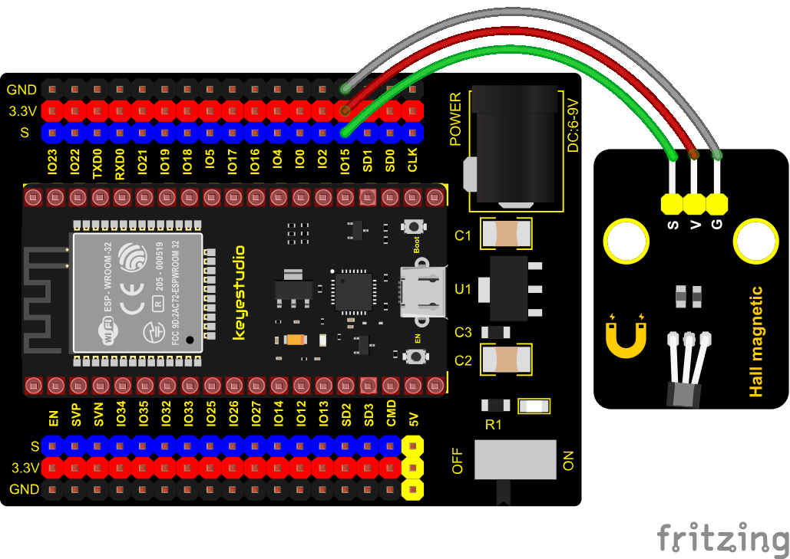

**Test Code：**

<table>
<tbody>
<tr class="odd">
<td>
//*************************************************************************************

/*

* Filename : Hall magnetic

* Description : Reading the value of hall magnetic sensor

* Auther : http://www.keyestudio.com

*/

int val = 0;

int hallPin = 15; //Hall sensor pin is connected to GPIO15

void setup() 

void loop() 

else 

}

//*************************************************************************************
</td>
</tr>
</tbody>
</table>

**Test Result**

Upload the test code, open the monitor and set baud rate to 9600.

when the sensor detects no magnetic fields or the north pole magnetic
field, the monitor l will show“1 Just be all normal\!”and the LED on the
sensor will be off; When it detects the south pole magnetic field,“0 The
magnetic field at the South Pole\!”and the LED on the sensor will be on

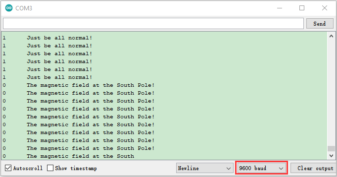

### Project 14: Reed Switch Module

**Overview**

In this kit, there is a Keyestudio reed switch module, which mainly uses
a MKA10110 green reed component.

The reed switch is the abbreviation of the dry reed switch. It is a
passive electronic switch element with contacts.

It has the advantages of simple structure, small size and easy control.

Its shell is a sealed glass tube with two iron elastic reed electric
plates.

In the experiment, we will determine whether there is a magnetic field
near the module by reading the high and low level of the S terminal on
the module; and, we display the test result in the shell.

**Working Principle**

Reed switch is an abbreviation of the dry reed contacts a passive

electronic switching elements, and has the advantages of simple
structure, small size and ease of control, its shell is a sealed glass
tube, the tubes are installed two iron elastic reed plate, but also
filling called rhodium metal inert gas. In peacetime, the glass tube in
the two reeds made of special materials are separated. When a magnetic
substance close to the glass tube, in the role of the magnetic field
lines, the pipe within the two reeds are magnetized to attract each
other in contact, the reed will suck together, so that the junction
point of the connected circuit communication. After the disappearance of
the outer magnetic reed because of their flexibility and separate, the
line is disconnected. Therefore, as a use of the magnetic field signals
to control the line switching device, reed tube can be used as a sensor
for counting the number, spacing, etc., and also are widely used in a
variety of communication devices.

**3.Required Components：**

<table>
<tbody>
<tr class="odd">
<td></td>
<td></td>
<td></td>
<td></td>
<td></td>
</tr>
<tr class="even">
<td>ESP32 Board*1</td>
<td>ESP32 Expansion Board*1</td>
<td>Keyestudio Reed Switch Module**1</td>
<td>3P Dupont Wire*1</td>
<td>Micro USB Cable*1</td>
</tr>
</tbody>
</table>

**4.Wiring Diagram**

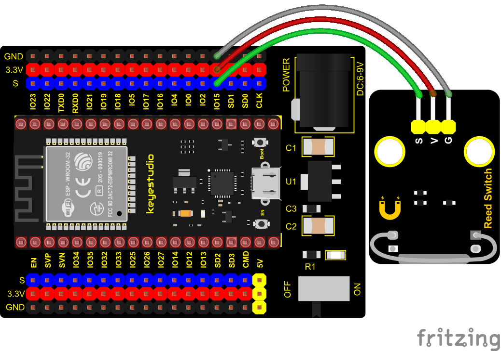

**Test Code：**

<table>
<tbody>
<tr class="odd">
<td>
//*************************************************************************************

/*

* Filename : Reed Switch

* Description : Read the value of the reed sensor

* Auther : http://www.keyestudio.com

*/

int val = 0;

int reedPin = 15; //Define dry reed module signal pin connected to GPIO15

void setup() 

void loop() 

else 

}

//*************************************************************************************
</td>
</tr>
</tbody>
</table>

**Test Result**

Upload the code power up by a USB cable, open the serial monitor and set
baud rate to 9600. When the sensor detects a magnetic field, val is 0
and the red LED of the module lights up, "A magnetic field" will be
displayed; when no magnetic field is detected, val is 1, and the LED on
the module goes out, "There is no magnetic field" will be shown, as
shown below.

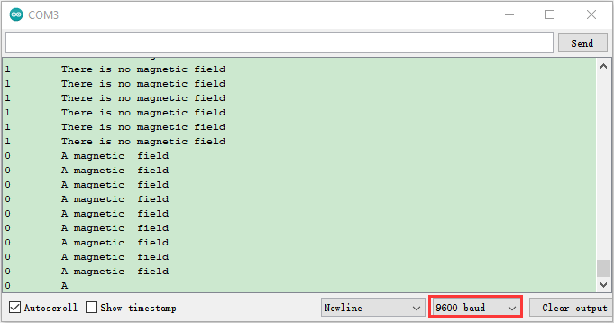

### Project 15: PIR Motion Sensor

**Overview**

In this kit, there is a Keyestudio PIR motion sensor, which mainly uses
an RE200B-P sensor elements. It is a human body pyroelectric motion
sensor based on pyroelectric effect, which can detect infrared rays
emitted by humans or animals, and the Fresnel lens can make the sensor's
detection range farther and wider.

In the experiment, we determine if there is someone moving nearby by
reading the high and low levels of the S terminal on the module. The
detected results will be displayed on the Shell.

**Working Principle**

The upper left part is voltage conversion(VCC to 3.3V). The working
voltage of sensors we use is 3.3V, therefore we can’t use 5V directly.
The voltage conversion circuit is needed.

When no person is detected or no infrared signal is received, and pin 1
of the sensor outputs low level. At this time, the LED on the module
will light up and the MOS tube Q1 will be connected and the signal
terminal S will detect Low levels.

When one is detected or an infrared signal is received, and pin 1 of the
sensor outputs a high level. Then LED on the module will go off, the MOS
tube Q1 is disconnected and the signal terminal S will detect high
levels.

**3.Required Components：**

<table>
<tbody>
<tr class="odd">
<td></td>
<td></td>
<td></td>
<td></td>
<td></td>
</tr>
<tr class="even">
<td>ESP32 Board*1</td>
<td>ESP32 Expansion Board*1</td>
<td>Keyestudio PIR Motion Sensor*1</td>
<td>3P Dupont Wire*1</td>
<td>Micro USB Cable*1</td>
</tr>
</tbody>
</table>

**4.Wiring Diagram**

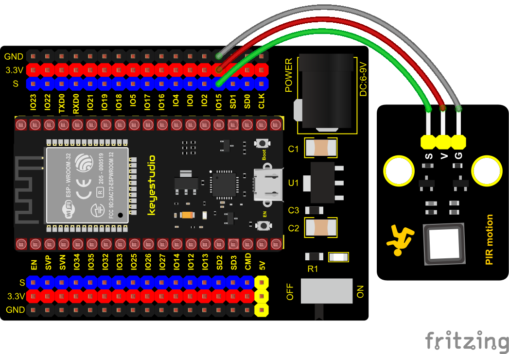

**Test Code：**

<table>
<tbody>
<tr class="odd">
<td>
//*************************************************************************************

/*

* Filename : PIR motion

* Description : Reading the value of the human body infrared sensor

* Auther : http://www.keyestudio.com

*/

int val = 0;

int pirPin = 15; //The pin of PIR motion sensor is defined as GPIO15

void setup() 

void loop() 

else 

}

//*************************************************************************************
</td>
</tr>
</tbody>
</table>

**Test Result**

Upload the code power up by a USB cable, open the serial monitor and set
baud rate to 9600. When the sensor detects someone nearby, value is 1,
the LED will go off and the monitor will show“Somebody is in this
area\!”. In contrast, the value is 0, the LED will go up and“0 No
one\!”will be shown.

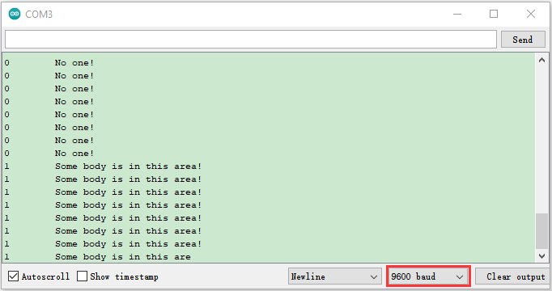

### Project 16: Active Buzzer

**Overview**

In this kit, it contains an active buzzer module and a power amplifier
module (the principle is equivalent to a passive buzzer). In this
experiment, we control the active buzzer to emit sounds. Since it has
its own oscillating circuit, the buzzer will automatically sound if
given large voltage.

**Working Principle**

From the schematic diagram, the pin of buzzer is connected to a resistor
R2 and another port is linked with a NPN triode Q1. So, if this triode
Q1 is powered, the buzzer will sound.

If the base electrode of the triode connected to the R1 resistor is a
high level, the triode Q1 will be connected.If the base electrode is
pulled down by the resistor R3, the triode is disconnected.

When we output a high level from the IO port to the triode, the buzzer
will emit sounds; if outputting low levels, the buzzer won’t emit
sounds.

**3.Required Components：**

<table>
<tbody>
<tr class="odd">
<td></td>
<td></td>
<td></td>
<td></td>
<td></td>
</tr>
<tr class="even">
<td>ESP32 Board*1</td>
<td>ESP32 Expansion Board*1</td>
<td>Keyestudio Active Buzzer*1</td>
<td>3P Dupont Wire*1</td>
<td>Micro USB Cable*1</td>
</tr>
</tbody>
</table>

**4.Wiring Diagram**

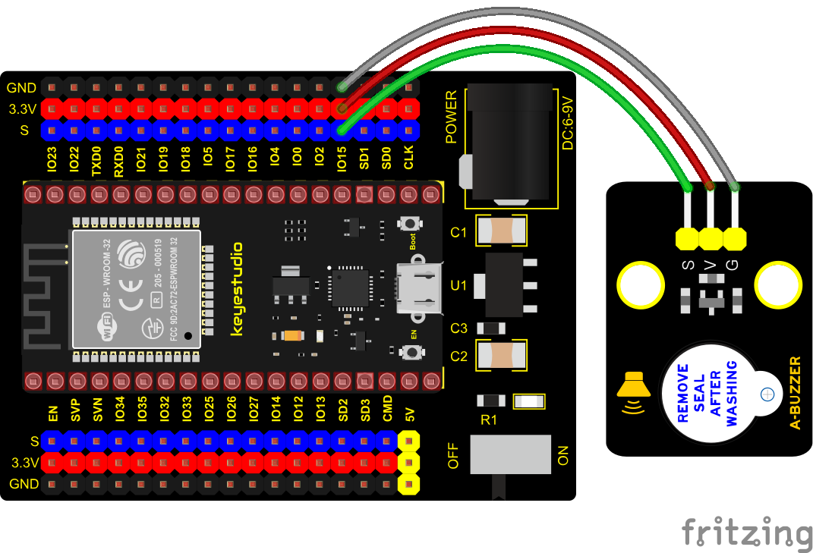

**Test Code：**

<table>
<tbody>
<tr class="odd">
<td>
//*************************************************************************************

/*

* Filename : Active buzzer

* Description : An active buzzer produces sound

* Auther : http://www.keyestudio.com

*/

int buzzer = 15; //Define buzzer receiver pin GPIO15

void setup() 

void loop() 

//*************************************************************************************
</td>
</tr>
</tbody>
</table>

**Code Explanation**

In the experiment, we set the pin number to GPIO15. When setting to
high, the active buzzer will beep; when setting to low, the active
buzzer will stop emitting sounds

**Test Result**

Upload the code and power on. The active buzzer will emit sound for 1
second, and stop for 1 second.

### Project 17: 8002b Audio Power Amplifier

**Overview**

In this kit, there is a Keyestudio 8002b audio power amplifier. The main
components of this module are an adjustable potentiometer, a speaker,
and an audio amplifier chip;

The main function of this module is: it can amplify the output audio
signal, with a magnification of 8.5 times, and play sound or music
through the built-in low-power speaker, as an external amplifying device
for some music playing equipment.

In the experiment, we used the 8002b power amplifier speaker module to
emit sounds of various frequencies.

**Working Principle**

In fact, it is similar to a passive buzzer. The active buzzer has its
own oscillation source.Yet, the passive buzzer does not have internal
oscillation. When controlling the circuit, we need to input square waves
of different frequencies to the positive pole of the component and
ground the negative pole to control the buzzer to chime sounds of
different frequencies.

**3.Required Components：**

<table>
<tbody>
<tr class="odd">
<td></td>
<td></td>
<td></td>
<td></td>
<td></td>
</tr>
<tr class="even">
<td>ESP32 Board*1</td>
<td>ESP32 Expansion Board*1</td>
<td>Keyestudio 8002bAudio Power Amplifier*1</td>
<td>3P Dupont Wire*1</td>
<td>Micro USB Cable*1</td>
</tr>
</tbody>
</table>

**4.Wiring Diagram**

**Test Code：**

<table>
<tbody>
<tr class="odd">
<td>
//**********************************************************************

/*

* Filename : Passive Buzzer

* Description : Passive Buzzer sounds the alarm.

* Auther : http//www.keyestudio.com

*/

#define LEDC_CHANNEL_0 0

// LEDC timer uses 13 bit accuracy

#define LEDC_TIMER_13_BIT 13

// Define tool I/O ports

#define BUZZER_PIN 15

//Create a musical melody list, Super Mario

int melody[] = ;

//Create a list of tone durations

int noteDurations[] = ;

void setup() 

void loop() 

}

//**********************************************************************
</td>
</tr>
</tbody>
</table>

**Code Explanation**

In the experiment, we use the function tone(). We set pin to 21.
Function tone generates waves of frequency.

**Test Result**

Upload the test code successfully and power on.The power amplifier
module will play a song.

### Project 18: 130 Motor 

**Description**

The 130 motor driver module is compatible with servo motors, which has
high efficiency and good quality fans.

It adopts a HR1124S motor control chip. HR1124S is a single-channel
H-bridge driver chip for DC motor solutions. In addition, this chip has
low standby current and low quiescent current.

The module is compatible with various single-chip control boards. In the
experiment, we can control the rotation direction of the motor by
outputting the voltage directions of the two signal terminals IN+ and
IN- to make the motor rotate.

**Working Principle**

The chip is used to help drive the motor.

We can’t drive it with a triode or an IO port due to its a large current
of need. It is very simple to make the motor rotate. Just apply voltage
to both ends of the motor. The direction of the motor is different in
different voltage directions. Within the rated voltage, the higher the
voltage, the faster the motor rotates; on the contrary, the lower the
voltage, the slower the motor rotates, or even unable to rotate.

So we can use the PWM port to control the speed of the motor. We haven't
learned PWM here, so we use the high and low levels to control the motor
first.

**3.Required Components：**

<table>
<tbody>
<tr class="odd">
<td></td>
<td></td>
<td></td>
<td></td>
</tr>
<tr class="even">
<td>ESP32 Board*1</td>
<td>ESP32 Expansion Board*1</td>
<td>keyestudio 130 Motor*1</td>
<td>4P Dupont Wire*1</td>
</tr>
<tr class="odd">
<td></td>
<td></td>
<td></td>
<td></td>
</tr>
<tr class="even">
<td>Micro USB Cable*1</td>
<td>6 AA Battery Holder*1</td>
<td>AA Battery(*6</td>
<td></td>
</tr>
</tbody>
</table>

Note: the motor is separated with its fan, you need to assemble it
first.

**4.Wiring Diagram**

<table>
<tbody>
<tr class="odd">
<td>130 Motor</td>
<td>ESP32 Expansion Board</td>
</tr>
<tr class="even">
<td>G</td>
<td>G</td>
</tr>
<tr class="odd">
<td>V</td>
<td>5V</td>
</tr>
<tr class="even">
<td>IN+</td>
<td>IO15</td>
</tr>
<tr class="odd">
<td>IN-</td>
<td>IO4</td>
</tr>
</tbody>
</table>

**Test Code：**

<table>
<tbody>
<tr class="odd">
<td>
//*************************************************************************************

/*

* Filename : 130DC Fan motor

* Description : Motor positive and negative rotation

* Auther : http://www.keyestudio.com

*/

//Define two pins interfaces of the motor, respectively 15 and 4

int INA = 15; //INA corresponds to IN+

int INB = 4; //INB corresponds to IN-

void setup() 

void loop() 

//*************************************************************************************
</td>
</tr>
</tbody>
</table>

**Code Explanation**

Set pins to 14 and 15, when the pin 14 outputs high levels and the pin
15 outputs low levels, the motor will rotate counterclockwise; when both
pins are set to low, the motor stops rotating.

**Test Result**

Burn the test 130 motor code, and connect the wires according to the
Wiring Diagram; after power-on, the fan rotates counterclockwise for 2
seconds; stops for 1 second; rotates clockwise for 2 seconds; stops for
1 second; cycle alternately.

Wire up, upload test code and test the 130 motor, the fan will rotate
counterclockwise for 2 seconds, stop for 1 second and clockwise for 2
seconds and stop for 1 second; cycle alternately.

### Project 19: Potentiometer

1.  **Overview**

The following we will introduce is the Keyestudio rotary potentiometer
which is an analog sensor.

The digital IO ports can read the voltage value between 0 and 3.3V and
the module only outputs high levels. However, the analog sensor can read
the voltage value through 16 ADC analog ports on the ESP32 board. In the
experiment, we will display the test results on the Shell.

It uses a 10K adjustable resistor. We can change the resistance by
rotating the potentiometer. The signal S can detect the voltage
changes(0-3.3V) which are analog quantity.

**ADC:** The more bits an ADC has, the denser the partitioning of the
simulation, the higher the accuracy of the final conversion.

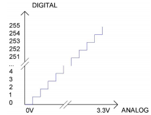

The conversion formula is as follows:

**DAC：**The higher the precision of DAC, the higher the precision of the
output voltage value.  

The conversion formula is as follows:  

**ADC on ESP32：**

The ESP32 has 16 pins that can be used to measure analog signals.  GPIO
pin serial numbers and analog pin definitions are shown below:  

<table>
<tbody>
<tr class="odd">
<td>ADC number in ESP32</td>
<td>ESP32 GPIO number</td>
</tr>
<tr class="even">
<td>ADC0</td>
<td>GPIO 36</td>
</tr>
<tr class="odd">
<td>ADC3</td>
<td>GPIO 39</td>
</tr>
<tr class="even">
<td>ADC4</td>
<td>GPIO 32</td>
</tr>
<tr class="odd">
<td>ADC5</td>
<td>GPIO33</td>
</tr>
<tr class="even">
<td>ADC6</td>
<td>GPIO34</td>
</tr>
<tr class="odd">
<td>ADC7</td>
<td>GPIO 35</td>
</tr>
<tr class="even">
<td>ADC10</td>
<td>GPIO 4</td>
</tr>
<tr class="odd">
<td>ADC11</td>
<td>GPIO0</td>
</tr>
<tr class="even">
<td>ADC12</td>
<td>GPIO2</td>
</tr>
<tr class="odd">
<td>ADC13</td>
<td>GPIO15</td>
</tr>
<tr class="even">
<td>ADC14</td>
<td>GPIO13</td>
</tr>
<tr class="odd">
<td>ADC15</td>
<td>GPIO12</td>
</tr>
<tr class="even">
<td>ADC16</td>
<td>GPIO14</td>
</tr>
<tr class="odd">
<td>ADC17</td>
<td>GPIO27</td>
</tr>
<tr class="even">
<td>ADC18</td>
<td>GPIO25</td>
</tr>
<tr class="odd">
<td>ADC19</td>
<td>GPIO26</td>
</tr>
</tbody>
</table>

**DAC on ESP32：**

The ESP32 has two 8-bit digital-to-analog converters connected to GPIO25
and GPIO26 pins, which are immutable, as shown below :

<table>
<tbody>
<tr class="odd">
<td>Simulate pin number</td>
<td>GPIO number</td>
</tr>
<tr class="even">
<td>DAC1</td>
<td>GPIO25</td>
</tr>
<tr class="odd">
<td>DAC2</td>
<td>GPIO26</td>
</tr>
</tbody>
</table>

**3.Required Components：**

<table>
<tbody>
<tr class="odd">
<td></td>
<td></td>
<td></td>
<td></td>
<td></td>
</tr>
<tr class="even">
<td>ESP32 Board*1</td>
<td>ESP32 Expansion Board*1</td>
<td>Keyestudio Rotary Potentiometer*1</td>
<td>3P Dupont Wire*1</td>
<td>Micro USB Cable*1</td>
</tr>
</tbody>
</table>

**4.Wiring Diagram**

**Test Code：**

<table>
<tbody>
<tr class="odd">
<td>
//**********************************************************************************

/*

* Filename : Rotary_potentiometer

* Description : Read the basic usage of ADC，DAC and Voltage

* Auther : http//www.keyestudio.com

*/

#define PIN_ANALOG_IN 34 //the pin of the Potentiometer

void setup() 

//In loop()，the analogRead() function is used to obtain the ADC value,

//and then the map() function is used to convert the value into an 8-bit precision DAC value.

//The input and output voltage are calculated according to the previous formula,

//and the information is finally printed out.

void loop() 

//**********************************************************************************
</td>
</tr>
</tbody>
</table>

**6. Code Explanation**

1\. analogVal means analog value. The rotary potentiometer outputs
analog values(0\~4095), therefore, we set pins to analog ports. For
example, we connect to GPIO34.

2\. analogRead(pin): read the value of the specified analog pin. The
ESP32 contains a multi-channel, 12-bit converter. This means that it
will map the input voltage between 0 and the working voltage (5V or 3.3V
) to an integer value between 0 and 4095. For example, this will produce
a resolution among readings: 3.3V/4096 stands for 0.0008V per unit.

3\. The map() function converts this 12-bit DAC value to an 8-bit DAC
value.  

4\. Pin: the name of analog input pin.

5\. The serial monitor displays the values of adcVal, dacVal, voltage,
the baud rate must be set before display (we default to 9600,which can
be changed).  

7.  **Test Result**
    
    Wire up, compile and upload the code to the ESP32. After uploading
    successfully，we will use a USB cable to power on, open the serial
    monitor and set the baud rate to 9600. We need to press the reset
    button on the ESP32, then the serial monitor will display the
    potentiometer's ADC value, DAC value and voltage value. Rotate the
    potentiometer handle, the analog values will change.
    
    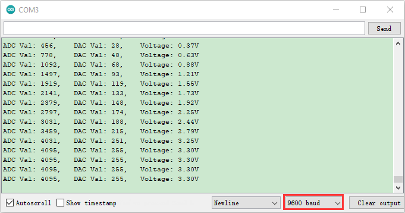

### Project 20: Steam Sensor

**Description**

This is a commonly used steam sensor. Its principle is to detect the
amount of water by bare printed parallel lines on the circuit board. The
more the water is, the more wires will be connected. As the conductive
contact area increases, the output voltage will gradually rise. It can
detect water vapor in the air as well. The steam sensor can be used as a
rain water detector and level switch. When the humidity on the sensor
surface surges, the output voltage will increase.

In the experiment, we connect the signal terminal (S terminal) of the
sensor to the analog port of the pico development board. The analog
value detected will be displayed on the serial monitor.

**Working Principle**

Its principle is to detect the amount of water through the exposed
printed parallel lines on the circuit board. The more water there is,
the more wires will be connected, and the conductive contact area
increases. The voltage output by pin 2 will gradually increase. The
larger the analog value detected by the signal terminal S is.

It can also detect steam in the air. Two position holes are used to
install on the other devices

**3.Required Components：**

<table>
<tbody>
<tr class="odd">
<td></td>
<td></td>
<td></td>
<td></td>
<td></td>
</tr>
<tr class="even">
<td>ESP32 Board*1</td>
<td>ESP32 Expansion Board*1</td>
<td>Keyestudio Steam Sensor *1</td>
<td>3P Dupont Wire*1</td>
<td>Micro USB Cable*1</td>
</tr>
</tbody>
</table>

**4.Wiring Diagram**

**Test Code：**

<table>
<tbody>
<tr class="odd">
<td>
//**********************************************************************************

/*

* Filename : Steam sensor

* Description : Read the basic usage of ADC，DAC and Voltage

* Auther : http//www.keyestudio.com

*/

#define PIN_ANALOG_IN 34 //the pin of the Steam sensor

void setup() 

//In loop()，the analogRead() function is used to obtain the ADC value,

//and then the map() function is used to convert the value into an 8-bit precision DAC value.

//The input and output voltage are calculated according to the previous formula,

//and the information is finally printed out.

void loop() 

//**********************************************************************************
</td>
</tr>
</tbody>
</table>

**6. Test Result**

Wire up, compile and upload the code to the ESP32. After uploading
successfully，power on, open the serial monitor and set the baud rate to
9600. We need to press the reset button on the ESP32, then the serial
monitor will display ADC value, DAC value and voltage value. When a few
drops of water are placed in the sensing area, the values will change.
The more water volume, the greater the output voltage value , ADC value
and the DAC value .

### Project 21: Sound Sensor

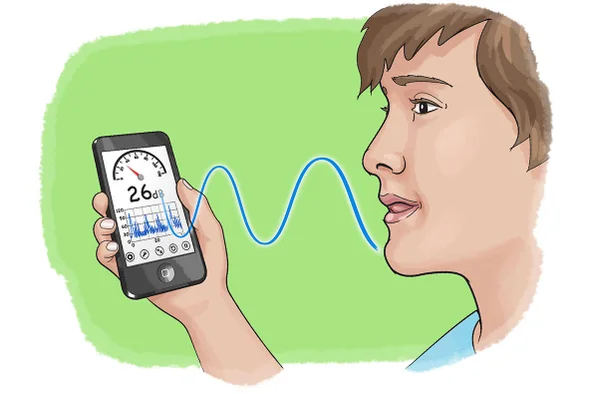

**Overview**

In this kit, there is a sound sensor. In the experiment, we test the
analog value corresponding to the sound level in the current environment
with it. The louder the sound, the larger the analog value;

**Working Principle**

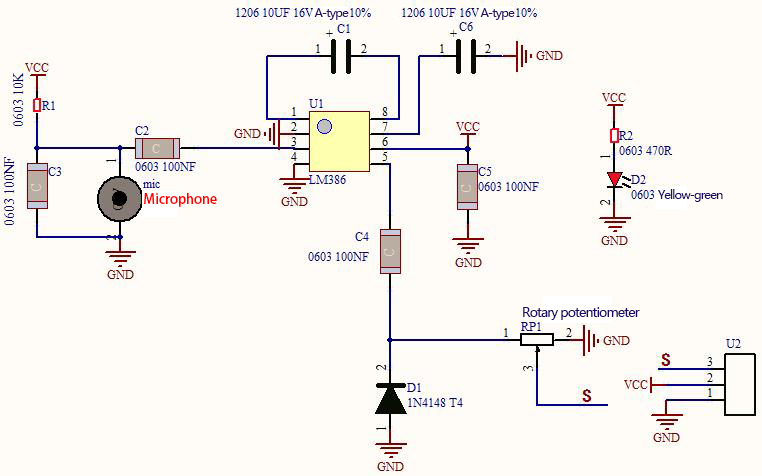It uses a
high-sensitive microphone component and an LM386 chip.

We build the circuit with the LM386 chip and amplify the sound through
the high-sensitive microphone. In addition, we can adjust the sound
volume by the potentiometer. Rotate it clockwise, the sound will get
louder.

**3.Required Components：**

<table>
<tbody>
<tr class="odd">
<td></td>
<td></td>
<td></td>
<td></td>
<td></td>
</tr>
<tr class="even">
<td>ESP32 Board*1</td>
<td>ESP32 Expansion Board*1</td>
<td>Keyestudio Sound Sensor*1</td>
<td>3P Dupont Wire*1</td>
<td>Micro USB Cable*1</td>
</tr>
</tbody>
</table>

**4.Wiring Diagram**

**Test Code：**

<table>
<tbody>
<tr class="odd">
<td>
//**********************************************************************************

/*

* Filename : MicroPhone

* Description : Read the basic usage of ADC，DAC and Voltage

* Auther : http//www.keyestudio.com

*/

#define PIN_ANALOG_IN 34 //the pin of the Sound Sensor

void setup() 

//In loop()，the analogRead() function is used to obtain the ADC value,

//and then the map() function is used to convert the value into an 8-bit precision DAC value.

//The input and output voltage are calculated according to the previous formula,

//and the information is finally printed out.

void loop() 

//**********************************************************************************
</td>
</tr>
</tbody>
</table>

**Test Result**

Upload the code power up by a USB cable, open the serial monitor and set
baud rate to 9600. The monitor will show ADC, DAC and voltage value.

Rotate clockwise the potentiometer and speak at the MIC. Then you can
see the analog value get larger, as shown below

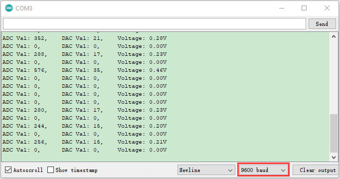

### Project 22: Photoresistor

**Description**

In this kit, there is a photoresistor which consists of photosensitive
resistance elements. Its resistance changes with the light intensity.
Also, it converts the resistance change into a voltage change through
the characteristic of the photosensitive resistive element. When wiring
it up, we interface its signal terminal (S terminal) with the analog
port of pico , so as to sense the change of the analog value, and
display the corresponding analog value in the shell.

**Working Principle**

If there is no light, the resistance is 0.2MΩ and the detected voltage
at the terminal 2 is close to 0. When the light intensity increases, the
resistance of photoresistor and detected voltage will diminish.

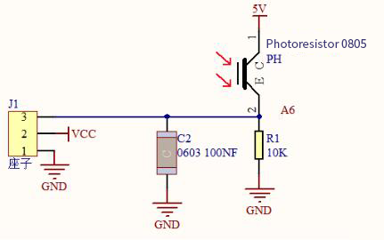

**3.Required Components：**

<table>
<tbody>
<tr class="odd">
<td></td>
<td></td>
<td></td>
<td></td>
<td></td>
</tr>
<tr class="even">
<td>ESP32 Board*1</td>
<td>ESP32 Expansion Board*1</td>
<td>Keyestudio Photoresistor*1</td>
<td>3P Dupont Wire*1</td>
<td>Micro USB Cable*1</td>
</tr>
</tbody>
</table>

**4.Wiring Diagram**

**Test Code：**

<table>
<tbody>
<tr class="odd">
<td>
//**********************************************************************************

/*

* Filename : Photoresistance

* Description : Read the basic usage of ADC，DAC and Voltage

* Auther : http//www.keyestudio.com

*/

#define PIN_ANALOG_IN 34 //the pin of the Photoresistance

void setup() 

//In loop()，the analogRead() function is used to obtain the ADC value,

//and then the map() function is used to convert the value into an 8-bit precision DAC value.

//The input and output voltage are calculated according to the previous formula,

//and the information is finally printed out.

void loop() 

//**********************************************************************************
</td>
</tr>
</tbody>
</table>

**Test Result**

Upload the code power up by a USB cable, open the serial monitor and set
baud rate to 9600. The monitor will show the ADC, DAC and voltage value
of photoresistor. When the light intensity gets stronger, the analog
value will get larger, as shown below;

### Project 23: NTC-MF52AT Thermistor

**Overview**

In the experiment, there is a NTC-MF52AT analog thermistor. We connect
its signal terminal to the analog port of the Raspberry Pi Pico Board
and read the corresponding analog value.

We can use analog values to calculate the temperature of the current
environment through specific formulas. Since the temperature calculation
formula is more complicated, we only read the corresponding analog
value.

**Working Principle**

This module mainly uses NTC-MF52AT thermistor elements. The NTC-MF52AT
thermistor element can sense the changes of the surrounding environment
temperature. Resistance changes with the temperature, causing the
voltage of the signal terminal S to change.

This sensor uses the characteristics of NTC-MF52AT thermistor element to
convert resistance changes into voltage changes.

**3.Required Components：**

<table>
<tbody>
<tr class="odd">
<td></td>
<td></td>
<td></td>
<td></td>
<td></td>
</tr>
<tr class="even">
<td>ESP32 Board*1</td>
<td>ESP32 Expansion Board*1</td>
<td>Keyestudio NTC-MF52AT Thermistor*1</td>
<td>3P Dupont Wire*1</td>
<td>Micro USB Cable*1</td>
</tr>
</tbody>
</table>

**4.Wiring Diagram**

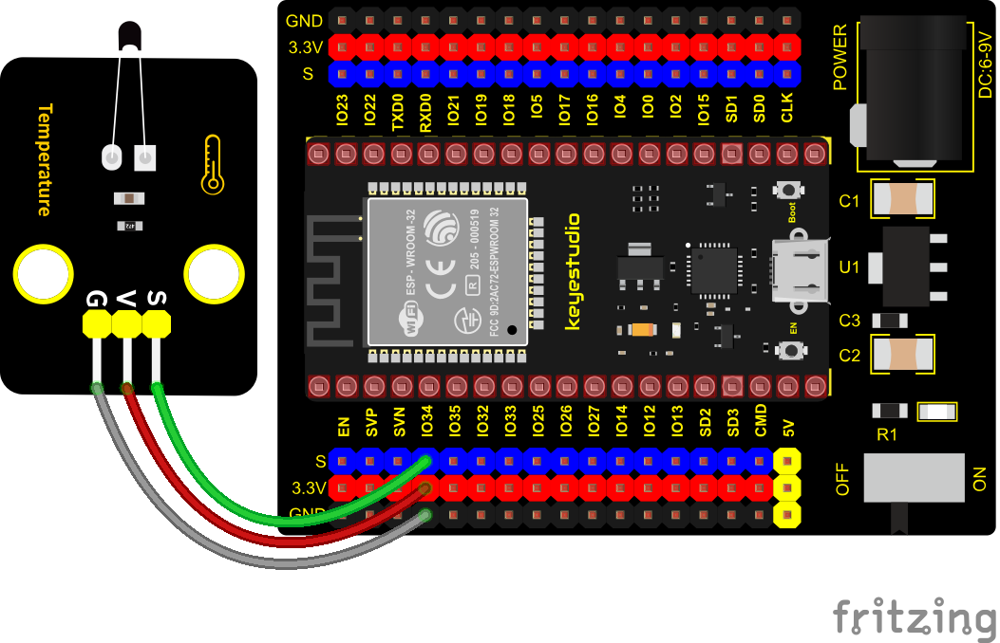

**Test Code：**

<table>
<tbody>
<tr class="odd">
<td>
//**********************************************************************************

/*

* Filename : Temperature sensor

* Description : Making a thermometer by thermistor.

* Auther : http//www.keyestudio.com

*/

#define PIN_ANALOG_IN 34

void setup() 

void loop() 

//**********************************************************************************
</td>
</tr>
</tbody>
</table>

**Test Result**

Upload the code power up by a USB cable, open the serial monitor and set
baud rate to 9600. The monitor will show the ADC value, voltage value
and temperature value. As shown below;

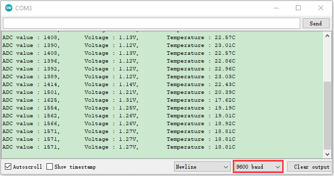

### Project 24: Thin-film Pressure Sensor

**Overview**

In this kit, there is a Keyestudio thin-film pressure sensor. The
thin-film pressure sensor composed of a new type of nano
pressure-sensitive material and a comfortable ultra-thin film substrate,
has waterproof and pressure-sensitive functions.

In the experiment, we determine the pressure by collecting the analog
signal on the S end of the module. The smaller the analog value, the
greater the pressure; and the displayed results will shown on the Shell.

**Working Principle**

When the sensor is pressed by external forces, the resistance value of
sensor will vary. We convert the pressure signals detected by the sensor
into the electric signals through a circuit. Then we can obtain the
pressure changes by detecting voltage signal changes.

**3.Required Components：**

<table>
<tbody>
<tr class="odd">
<td></td>
<td></td>
<td></td>
<td></td>
<td></td>
</tr>
<tr class="even">
<td>ESP32 Board*1</td>
<td>ESP32 Expansion Board*1</td>
<td>Keyestudio Thin-film Pressure Sensor*1</td>
<td>3P Dupont Wire*1</td>
<td>Micro USB Cable*1</td>
</tr>
</tbody>
</table>

**4.Wiring Diagram**

**Test Code：**

<table>
<tbody>
<tr class="odd">
<td>
//**********************************************************************************

/*

* Filename : Film pressure sensor

* Description : Read the basic usage of ADC，DAC and Voltage

* Auther : http//www.keyestudio.com

*/

#define PIN_ANALOG_IN 34 //the pin of the Film pressure sensor

void setup() 

//In loop()，the analogRead() function is used to obtain the ADC value,

//and then the map() function is used to convert the value into an 8-bit precision DAC value.

//The input and output voltage are calculated according to the previous formula,

//and the information is finally printed out.

void loop() 

//**********************************************************************************
</td>
</tr>
</tbody>
</table>

**Test Result**

Upload the code power up by a USB cable, open the serial monitor and set
baud rate to 9600. The monitor will show the ADC, DAC and voltage value.
When the thin-film is pressed by fingers, the analog value will
decrease, as shown below;

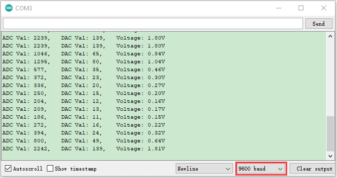

### Project 25: Flame Sensor

**Description**

In daily life, it is often seen that a fire broke out without any
precaution. It will cause great economic and human loss. So how can we
avoid this situation? Right, install a flame sensor and a speaker in
those places that easily break out a fire. When the flame sensor detects
a fire, the speaker will alarm people quickly to put out the fire.

So in this project, you will learn how to use a flame sensor and an
active buzzer module to simulate the fire alarm system.

**Working Principle**

This flame sensor can be used to detect fire or other light sources with
wavelength stands at 760nm \~ 1100nm. Its detection angle is about 60°.
You can rotate the potentiometer on the sensor to control its
sensitivity. Adjust the potentiometer to make the LED at the critical
point between on and off state. The sensitivity is the best.

From the below figure, power up. When detecting fire, the digital pin
outputs low levels, the red LED2 will light up first, the digital signal
terminal D0 outputs a low level, and the red LED1 will light up. The
stronger the external infrared light, the smaller the value; the weaker
the infrared light, the larger the value.

**3.Required Components：**

<table>
<tbody>
<tr class="odd">
<td></td>
<td></td>
<td></td>
<td></td>
<td></td>
</tr>
<tr class="even">
<td>ESP32 Board*1</td>
<td>ESP32 Expansion Board*1</td>
<td>keyestudio Flame Sensor*1</td>
<td>4P Dupont Wire*1</td>
<td>Micro USB Cable*1</td>
</tr>
</tbody>
</table>

**4.Wiring Diagram**

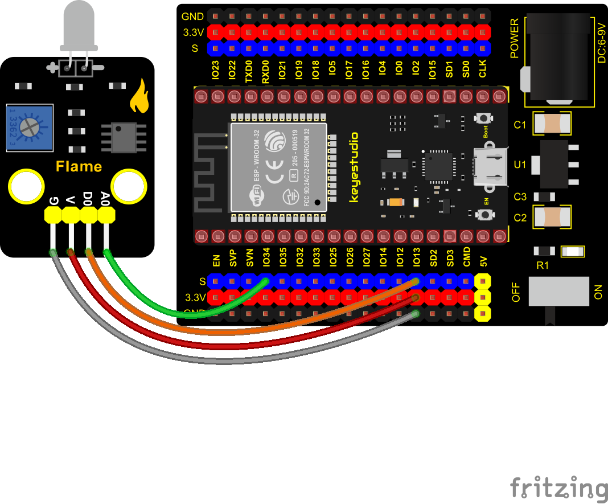

**Test Code：**

<table>
<tbody>
<tr class="odd">
<td>
//**********************************************************************************

/*

* Filename : Flame sensor

* Description : Read the basic usage of Digital，ADC，DAC and Voltage

* Auther : http//www.keyestudio.com

*/

//Flame sensor two pins 13, 34, respectively

#define PIN_ANALOG_IN 34

int digitalPin = 13;

//The following two variables hold the digital signal and adc values respectively

int analogVal = 0;

int adcVal = 0;

void setup() 

//In loop()，the digitalRead()function is used to obtain the digital value,

//the analogRead() function is used to obtain the ADC value.

//and then the map() function is used to convert the value into an 8-bit precision DAC value.

//The input and output voltage are calculated according to the previous formula,

//and the information is finally printed out.

void loop() 

//**********************************************************************************
</td>
</tr>
</tbody>
</table>

**7.实验结果：**

按照实验接线图连接好线，编译并上传代码到ESP32，代码上传成功后，利用USB线上电后，可以通过旋转传感器上的电位器，调节红色LED亮与不亮的临界点。传感器模块上的红色LED2点亮，红色LED1不亮，打开串口监视器，设置波特率为9600，串口监视器显示出火焰传感器的digital值，ADC值，DAC值和电压值，当传感器检测到火焰时，红色LED1点亮，在串口监视器中可以看到数字值由1变为0，ADC值，DAC值和电压值变小，如下图。

**Code Explanation**

Two pins we use are defined as GPIO13 and GPIO34 according to the
wiring-up diagrams, and print digital signals and analog signals
respectively.

**Test Result**

Upload the test code and power up，LED2 is on and LED1 is off. Open the
monitor and set baud rate to 9600. When fire is detected, LED1 will be
on. the digital value will change from 1 to 0, and the analog value will
become smaller, as shown in the figure below.

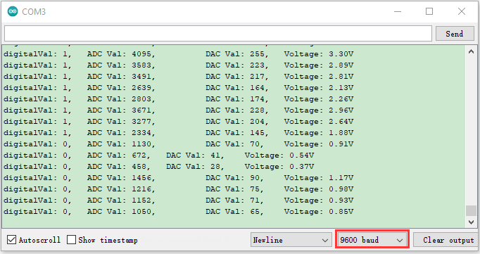

### Project 26: MQ-2 Gas Sensor

**Description**

This analog gas sensor - MQ2 is used in gas leakage detecting equipment
in consumer electronics and industrial markets.

This sensor is suitable for detecting LPG, I-butane, propane, methane,
alcohol, Hydrogen and smoke. It has high sensitivity and quick response.

In addition, the sensitivity can be adjusted by rotating the
potentiometer.

In the experiment, we read the analog value at the A0 port and the D0
port to determine the content of gas.

**Working Principle**

The greater the concentration of smoke, the greater the conductivity,
the lower the output resistance, the greater the output analog signal.

When in use, the A0 terminal reads the analog value of the corresponding
gas; the D0 terminal is connected to an LM393 chip (voltage comparator),
we can adjust the alarm threshold of the measured gas through the
potentiometer, and output the digital value at D0. When the measured gas
content exceeds the critical point, the D0 terminal outputs a low level;
when the measured gas content does not exceed the critical point, the D0
terminal outputs a high level.

**3.Required Components：**

<table>
<tbody>
<tr class="odd">
<td></td>
<td></td>
<td></td>
<td></td>
<td></td>
</tr>
<tr class="even">
<td>ESP32 Board*1</td>
<td>ESP32 Expansion Board*1</td>
<td>keyestudio DIY Analog Gas Sensor*1</td>
<td>4P Dupont Wire*1</td>
<td>Micro USB Cable*1</td>
</tr>
</tbody>
</table>

**4.Wiring Diagram**

**Test Code：**

<table>
<tbody>
<tr class="odd">
<td>
//**********************************************************************************

/*

* Filename : MQ2

* Description : Read the basic usage of Digital, ADC，DAC and Voltage

* Auther : http//www.keyestudio.com

*/

//MQ_2 two pins 13, 34, respectively

#define PIN_ANALOG_IN 34

int digitalPin = 13;

//The following two variables hold the digital signal and adc values respectively

int analogVal = 0;

int adcVal = 0;

void setup() 

//In loop()，the digitalRead()function is used to obtain the digital value,

//the analogRead() function is used to obtain the ADC value.

//and then the map() function is used to convert the value into an 8-bit precision DAC value.

//The input and output voltage are calculated according to the previous formula,

//and the information is finally printed out.

void loop() 

else 

delay(100); //Delay time 100 ms

}

//**********************************************************************************
</td>
</tr>
</tbody>
</table>

5.  **Code Explanation:**

Define GPIO13 and GPIO34, print out signals, ADC, DAC and voltage values

6.  **Test Result：**
    
    Wire up and upload the code to the ESP32, the LED will be on. Rotate
    the potentiometer to make LED at the critical point. Open the
    monitor and set baud rate to 9600, then the monitor shows
    characters. When the sensor detects the smog or combustible gases,
    the red LED will be on, the number 1 will turn into 0 and ADC, DAC
    and voltage value will get larger.

### Project 27: Joystick Module

**Overview**

Game handle controllers are ubiquitous.

It mainly uses PS2 joysticks. When controlling it, we need to connect
the X and Y ports of the module to the analog port of the single-chip
microcomputer, port B to the digital port of the single-chip
microcomputer, VCC to the power output port(3.3-5V), and GND to the GND
of the MCU. We can read the high and low levels of two analog values and
one digital port) to determine the working status of the joystick on the
module.

In the experiment, two analog values(x axis and y axis) will be shown on
Shell.

**Working Principle**

In fact, its working principle is very simple. Its inside structure is
equivalent to two adjustable potentiometers and a button. When this
button is not pressed and the module is pulled down by R1, low levels
will be output ; on the contrary, when the button is pressed, VCC will
be connected (high levels), When we move the joystick, the internal
potentiometer will adjust to output different voltages, and we can read
the analog value.

**3.Required Components：**

<table>
<tbody>
<tr class="odd">
<td></td>
<td></td>
<td></td>
<td></td>
<td></td>
</tr>
<tr class="even">
<td>ESP32 Board*1</td>
<td>ESP32 Expansion Board*1</td>
<td>Keyestudio Joystick Module*1</td>
<td>5P Dupont Wire*1</td>
<td>Micro USB Cable*1</td>
</tr>
</tbody>
</table>

**4.Wiring Diagram**

**Test Code：**

<table>
<tbody>
<tr class="odd">
<td>
//**********************************************************************************

/*

* Filename : Joystick

* Description : Read data from Rocker.

* Auther : http//www.keyestudio.com

*/

int xyzPins[] = ; //x,y,z pins

void setup() 

// In loop(), use analogRead () to read the value of axes X and Y

//and use digitalRead () to read the value of axis Z, then display them.

void loop() 

//**********************************************************************************
</td>
</tr>
</tbody>
</table>

**6. Code Explanation**

In the experiment, according to the wiring diagram, the x pin is set to
GPIO34, the y pin is set to GPIO35 and the pin of the joystick is set to
GPIO13.

**7. Test Result**

Connect the wires according to the experimental wiring diagram, compile
and upload the code to the ESP32. After uploading successfully，we will
use a USB cable to power on. Open the serial monitor and set baud rate
to 9600.

We need to press the reset button on the ESP32, then the serial monitor
will show the corresponding value. Moving the joystick or pressing it
will change the analog and digital values in the serial monitor .

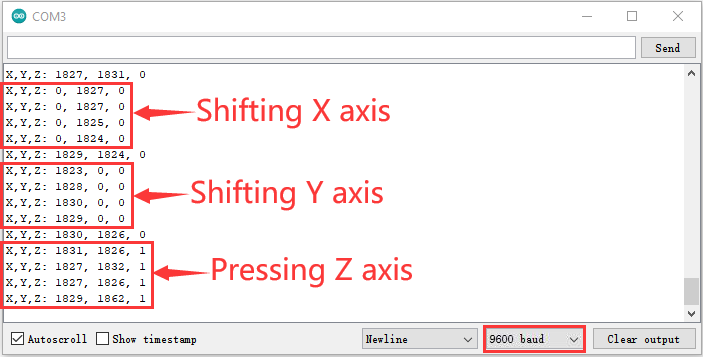

### Project 28: Relay Module

1.  **Overview**

In our daily life, we usually use communication to drive electrical
equipment, and sometimes we use switches to control electrical
equipment. If the switch is connected directly to the ac circuit,
leakage occurs and people are in danger. Therefore, from the perspective
of safety, we specially designed this relay module with NO(normally
open) end and NC(normally closed) end.  

**2. Working Principle**

Relay is compatible with a variety of microcontroller control board,
such as Arduino series microcontroller, which is a small current to
control the operation of large current "automatic switch".  

Input Voltage：3.3V-5V

It can let the MCU control board drive 3A load, such as an LED lamp
belt, a DC motor, a micro water pump and a solenoid valve plugable
interface design, which is easy to use.  

**3.Required Components：**

<table>
<tbody>
<tr class="odd">
<td></td>
<td></td>
<td></td>
<td></td>
<td></td>
</tr>
<tr class="even">
<td>ESP32 Board*1</td>
<td>ESP32 Expansion Board*1</td>
<td>Keyestudio Relay Module*1</td>
<td>3P Dupont Wire*1</td>
<td>Micro USB Cable*1</td>
</tr>
</tbody>
</table>

**4.Wiring Diagram**

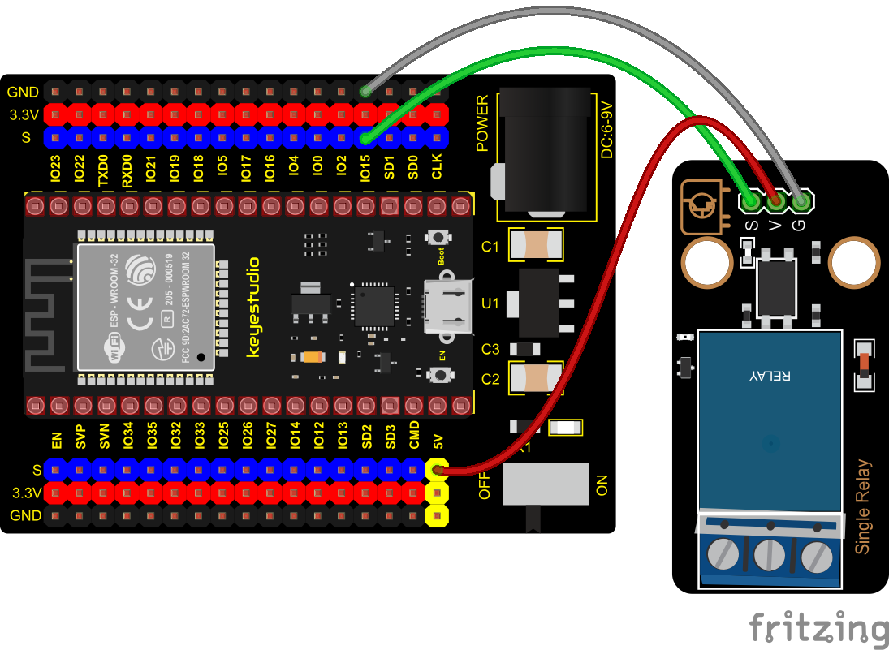

**Test Code：**

<table>
<tbody>
<tr class="odd">
<td>
//**********************************************************************************

/*

* Filename : Relay

* Description : Relay turn on and off.

* Auther : http//www.keyestudio.com

*/

#define Relay 15 // defines digital 15

void setup()

void loop()

//**********************************************************************************
</td>
</tr>
</tbody>
</table>

**6. Test Result**

Connect the wires according to the experimental wiring diagram, compile
and upload the code to the ESP32. After uploading successfully，we will
use a USB cable to power on. The relay will turn on 1 second, off for 1
second. At the same time, you can hear the sound of the relay on and off
as well as see the change of the indicator light on the relay.

Project 29: SK6812 RGB Module

**Overview**

In previous lessons, we learned about the plug-in RGB module and used
PWM signals to color the three pins of the module.

There is a Keyestudio 6812 RGB module whose the driving principle is
different from the plug-in RGB module. It can only control with one pin.
This is a set. It is an intelligent externally controlled LED light
source with the control circuit and the light-emitting circuit. Each LED
element is the same as a 5050 LED lamp bead, and each component is a
pixel. There are four lamp beads on the module, which indicates four
pixels

In the experiment, we make different lights show different colors.

**Working Principle**

From the schematic diagram, we can see that these four pixel lighting
beads are all connected in series. In fact, no matter how many they are,
we can use a pin to control a light and let it display any color. The
pixel point contains a data latch signal shaping amplifier drive
circuit, a high-precision internal oscillator and a 12V high-voltage
programmable constant current control part, which effectively ensures
the color of the pixel point light is highly consistent.

The data protocol adopts a single-wire zero-code communication method.
After the pixel is powered up and reset, the S terminal receives the
data transmitted from the controller. The first 24bit data sent is
extracted by the first pixel and sent to the data latch of the pixel.

**3.Required Components：**

<table>
<tbody>
<tr class="odd">
<td></td>
<td></td>
<td></td>
<td></td>
<td></td>
</tr>
<tr class="even">
<td>ESP32 Board*1</td>
<td>ESP32 Expansion Board*1</td>
<td>Keyestudio 6812 RGB Module*1</td>
<td>3P Dupont Wire*1</td>
<td>Micro USB Cable*1</td>
</tr>
</tbody>
</table>

**4.Wiring Diagram**

**Test Code：**

<table>
<tbody>
<tr class="odd">
<td>
//**********************************************************************************

/*

* Filename : sk6812 RGB LED

* Description : turn on sk6812 RGB LED

* Auther : http//www.keyestudio.com

*/

#include &lt;Adafruit_NeoPixel.h&gt;

#define PIN 15

// Parameter 1 = number of pixels in strip

// Parameter 2 = Arduino pin number (most are valid)

// Parameter 3 = pixel type flags, add together as needed:

// NEO_KHZ800 800 KHz bitstream (most NeoPixel products w/WS2812 LEDs)

// NEO_KHZ400 400 KHz (classic 'v1' (not v2) FLORA pixels, WS2811 drivers)

// NEO_GRB Pixels are wired for GRB bitstream (most NeoPixel products)

// NEO_RGB Pixels are wired for RGB bitstream (v1 FLORA pixels, not v2)

Adafruit_NeoPixel strip = Adafruit_NeoPixel(60, PIN, NEO_GRB + NEO_KHZ800);

// IMPORTANT: To reduce NeoPixel burnout risk, add 1000 uF capacitor across

// pixel power leads, add 300 - 500 Ohm resistor on first pixel's data input

// and minimize distance between Arduino and first pixel. Avoid connecting

// on a live circuit...if you must, connect GND first.

void setup() 

void loop() 

// Fill the dots one after the other with a color

void colorWipe(uint32_t c, uint8_t wait) 

}

void rainbow(uint8_t wait) 

strip.show();

delay(wait);

}

}

// Slightly different, this makes the rainbow equally distributed throughout

void rainbowCycle(uint8_t wait) 

strip.show();

delay(wait);

}

}

//Theatre-style crawling lights.

void theaterChase(uint32_t c, uint8_t wait) 

strip.show();

delay(wait);

for (int i=0; i &lt; strip.numPixels(); i=i+3) 

}

}

}

//Theatre-style crawling lights with rainbow effect

void theaterChaseRainbow(uint8_t wait) 

strip.show();

delay(wait);

for (int i=0; i &lt; strip.numPixels(); i=i+3) 

}

}

}

// Input a value 0 to 255 to get a color value.

// The colours are a transition r - g - b - back to r.

uint32_t Wheel(byte WheelPos)  else if(WheelPos &lt; 170)  else 

}

//*************************************************************************************
</td>
</tr>
</tbody>
</table>

**7. Test Code**

Connect the wires according to the experimental wiring diagram, compile
and upload the code to the ESP32. After uploading successfully，we will
use a USB cable to power on. Then we can see the four RGB LEDs show red,
green, blue and white color ; as shown below;

### Project 30: Rotary Encoder

**Overview**

In this kit, there is a Keyestudio rotary encoder, dubbed as switch
encoder. It is applied to automotive electronics, multimedia audio,
instrumentation, household appliances, smart home, medical equipment and
so on.

In the experiment, it it used for counting. When we rotate the rotary
encoder clockwise, the set data falls by 1; if you rotate it
anticlockwise, the set data is up 1; and when the middle button is
pressed, the value will be show on Shell.

**Working Principle**

  

The incremental encoder converts the displacement into a periodic electric signal, and then converts this signal into a counting pulse, and the number of pulses indicates the size of the displacement.This module mainly uses 20-pulse rotary encoder components. It can calculate the number of pulses output during clockwise and reverse rotation. There is no limit to count rotation. It resets to the initial state, that is, starts counting from 0. 

**3.Required Components：**

<table>
<tbody>
<tr class="odd">
<td></td>
<td></td>
<td></td>
<td></td>
<td></td>
</tr>
<tr class="even">
<td>ESP32 Board*1</td>
<td>ESP32 Expansion Board*1</td>
<td>Keyestudio Rotary Encoder*1</td>
<td>Dupont Wires 5P*1</td>
<td>Micro USB Cable*1</td>
</tr>
</tbody>
</table>

**4.Wiring Diagram**

**Test Code：**

<table>
<tbody>
<tr class="odd">
<td>
//**********************************************************************************

/*

* Filename : Encoder

* Description : Rotary encoder module counting.

* Auther : http//www.keyestudio.com

*/

//Interfacing Rotary Encoder with Arduino

//Encoder Switch -&gt; pin 27

//Encoder DT -&gt; pin 14

//Encoder CLK -&gt; pin 12

int Encoder_DT = 14;

int Encoder_CLK = 12;

int Encoder_Switch = 27;

int Previous_Output;

int Encoder_Count;

void setup() 

void loop() 

else

}

Previous_Output = digitalRead(Encoder_DT);

if (digitalRead(Encoder_Switch) == 0)

}

}

//**********************************************************************************
</td>
</tr>
</tbody>
</table>

**Code Explanation**

Set CLK to GPIO12 and DAT to GPIO14.

This code is set well in the library file. When CLK descends, read the
voltage of DAT, when DAT is a HIGH level, the value of the rotary
encoder is added by 1; when DAT is a LOW level, the value of the rotary
encoder is cut down 1.

Set the pin of the button(GP27) to LOW ans print.

**Test Result**

Upload the code power up by a USB cable, open the serial monitor and set
baud rate to 9600. Rotate the knob on the rotary encoder clockwise, the
displayed data will decrease; on the contrary, in anticlockwise way, the
data will rise. Equally, press the button on the rotary encoder,“Switch
pressed”will be shown.

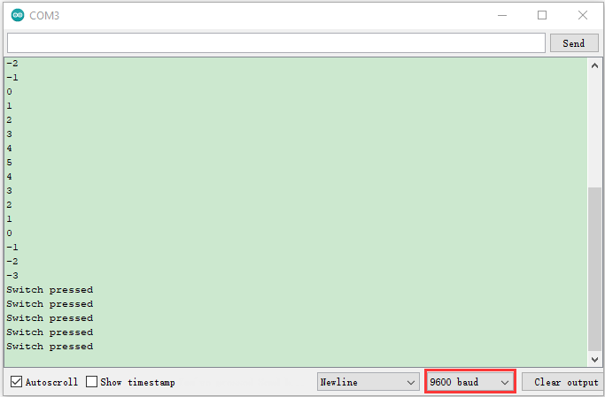

### Project 31: Servo Control

**Overview**

Servo motor is a position control rotary actuator. It mainly consists of
a housing, a circuit board, a core-less motor, a gear and a position
sensor. Its working principle is that the servo receives the signal sent
by MCU or receiver and produces a reference signal with a period of 20ms
and width of 1.5ms, then compares the acquired DC bias voltage to the
voltage of the potentiometer and obtain the voltage difference output.

In general, servo has three lines in brown, red and orange. The brown
wire is grounded, the red one is a positive pole line and the orange one
is a signal line.

**Working Principle**

When the motor speed is constant, the potentiometer is driven to rotate
through the cascade reduction gear, which leads that the voltage
difference is 0, and the motor stops rotating. Generally, the angle
range of servo rotation is 0° --180 °

The rotation angle of servo motor is controlled by regulating the duty
cycle of PWM (Pulse-Width Modulation) signal. The standard cycle of PWM
signal is 20ms (50Hz). Theoretically, the width is distributed
between 1ms-2ms, but in fact, it's between 0.5ms-2.5ms. The width
corresponds the rotation angle from 0° to 180°. But note that for
different brand motors, the same signal may have different rotation
angles. 

**3.Required Components：**

<table>
<tbody>
<tr class="odd">
<td></td>
<td></td>
<td></td>
<td></td>
</tr>
<tr class="even">
<td>ESP32 Board*1</td>
<td>ESP32 Expansion Board*1</td>
<td>Servo*1</td>
<td>Micro USB Cable*1</td>
</tr>
</tbody>
</table>

**4.Wiring Diagram**

**Test Code1：**

<table>
<tbody>
<tr class="odd">
<td>
//**********************************************************************

/*

* Filename : Servo_1

* Description : Steering gear rotation Angle 0-90-180, repeatly

* Auther : http//www.keyestudio.com

*/

int servoPin = 4;//steering gear PIN

void setup() 

void loop() 

void servopulse(int pin, int myangle) 

}

//**********************************************************************
</td>
</tr>
</tbody>
</table>

**Code Explanation**

**Code 1：**

1.  map(value, fromLow, fromHigh, toLow, toHigh)；
    
    Value is the value we map. fromLow, fromHigh is the maximum and
    minimum value；
    
    toLow, toHigh are the upper limit and lower limit we map. For
    example, map(myangle, 0, 180, 500, 2500) means that an angle value
    myangle (0°-180°）the mapping range is from 500us to 2500us.

We use the function servopulse() to make the servo move. We also make
the servo rotate 0°, 90°and 180°cyclically.

**Test Result 1：**

Upload the code 1 and power up，the servo will rotate 0°，90° and 180°.

8.  **Test Code 2：**

<table>
<tbody>
<tr class="odd">
<td>
//**********************************************************************

/*

* Filename : Servo Sweep

* Description : Control the servo motor for sweeping

* Auther : http//www.keyestudio.com

*/

#include &lt;ESP32Servo.h&gt;

Servo myservo; // create servo object to control a servo

int posVal = 0; // variable to store the servo position

int servoPin = 4; // Servo motor pin

void setup() 

void loop() 

for (posVal = 180; posVal &gt;= 0; posVal -= 1) 

}

//********************************************************************************
</td>
</tr>
</tbody>
</table>

**myservo.write(pos):** angle values of the servo. **myservo.read():**
read angle values of the servo.

**Test Result**

Upload the code 2 and power up, the servo will rotate from 0° to 180° by
moving 1° for each 15ms.

### Project 32: Ultrasonic Sensor

**Overview**

In this kit, there is a keyes HC-SR04 ultrasonic sensor, which can
detect obstacles in front and the detailed distance between the sensor
and the obstacle. Its principle is the same as that of bat flying. It
can emit the ultrasonic signals that cannot be heard by humans. When
these signals hit an obstacle and come back immediately. The distance
between the sensor and the obstacle can be calculated by the time gap of
emitting signals and receiving signals.

In the experiment, we use the sensor to detect the distance between the
sensor and the obstacle, and print the test result.

Ultrasonic detector module can provide 2cm-450cm non-contact sensing
distance, and its ranging accuracy is up to 3mm, very good to meet the
normal requirements. The module includes an ultrasonic transmitter and
receiver as well as the corresponding control circuit.

**Working Principle**

The most common ultrasonic ranging method is the echo detection. As
shown below; when the ultrasonic emitter emits the ultrasonic waves
towards certain direction, the counter will count. The ultrasonic waves
travel and reflect back once encountering the obstacle. Then the counter
will stop counting when the receiver receives the ultrasonic waves
coming back.

The ultrasonic wave is also sound wave, and its speed of sound V is
related to temperature. Generally, it travels 340m/s in the air.
According to time t, we can calculate the distance s from the emitting
spot to the obstacle.

s=340t/2.

The HC-SR04 ultrasonic ranging module can provide a non-contact distance
sensing function of 2cm-400cm, and the ranging accuracy can reach as
high as 3mm; the module includes an ultrasonic transmitter, receiver and
control circuit. Basic working principle:

1\. First pull down the TRIG, and then trigger it with at least 10us
high level signal;

2\. After triggering, the module will automatically transmit eight 40KHZ
square waves, and automatically detect whether there is a signal to
return.

3\. If there is a signal returned back, through the ECHO to output a
high level, the duration time of high level is actually the time from
emission to reception of ultrasonic.

Test distance = high level duration \* 340m/s \* 0.5.

**3.Required Components:**

<table>
<tbody>
<tr class="odd">
<td></td>
<td></td>
<td></td>
<td></td>
<td></td>
</tr>
<tr class="even">
<td>ESP32 Board*1</td>
<td>ESP32 Expansion Board*1</td>
<td>Keyestudio SR01 Ultrasonic Sensor*1</td>
<td>4P Dupont Wire*1</td>
<td>Micro USB Cable*1</td>
</tr>
</tbody>
</table>

**4.Wiring Diagram**

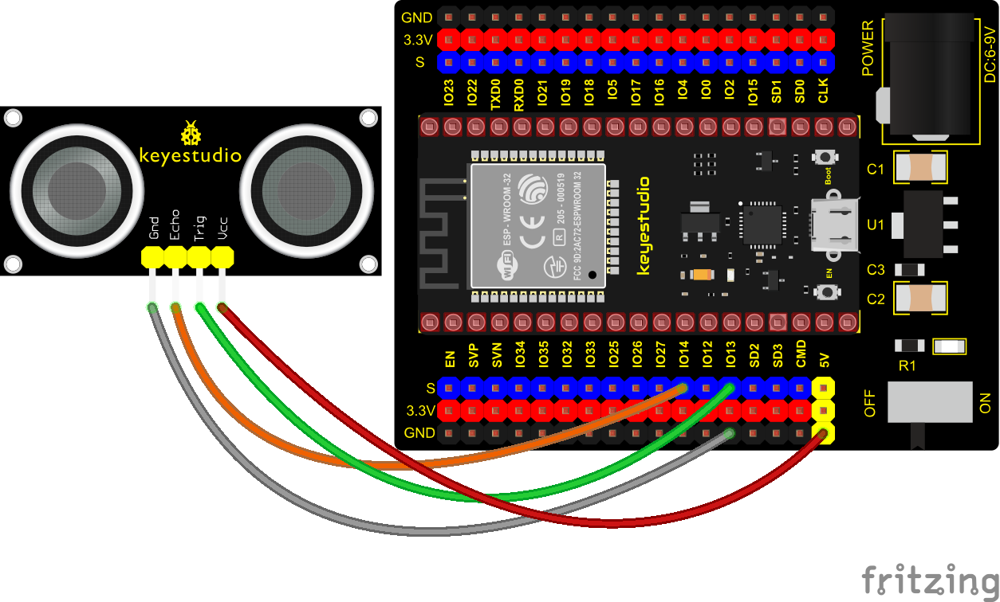

**Test Code：**

<table>
<tbody>
<tr class="odd">
<td>
//**********************************************************************************

/*

* Filename : Ultrasonic

* Description : Use the ultrasonic module to measure the distance.

* Auther : http//www.keyestudio.com

*/

const int TrigPin = 13; // define TrigPin

const int EchoPin = 14; // define EchoPin.

int duration = 0; // Define the initial value of the duration to be 0

int distance = 0;//Define the initial value of the distance to be 0

void setup()

void loop()

//**********************************************************************************
</td>
</tr>
</tbody>
</table>

**Test Result**

Upload the code power up by a USB cable, open the serial monitor and set
baud rate to 9600.

The monitor will display the distance away from the obstacle.

### Project 33: IR Receiver Module

**Overview**

There is no doubt that infrared remote control is ubiquitous in daily
life. It is used to control various household appliances, such as TVs,
stereos, video recorders and satellite signal receivers. Infrared remote
control is composed of infrared transmitting and infrared receiving
systems, that is, an infrared remote control and infrared receiving
module and a single-chip microcomputer capable of decoding.​    

In this experiment, we need to know how to use the infrared receiving
sensor. The infrared receiving sensor mainly uses the VS1838B infrared
receiving sensor element. It integrates receiving, amplifying, and
demodulating. The internal IC has already completed the demodulation,
and the output is a digital signal. It can receive 38KHz modulated
remote control signal. In the experiment, we use the IR receiver to
receive the infrared signal emitted by the external infrared
transmitting device, and display the received signal in the shell.

**Working Principle**

The main part of the IR remote control system is modulation,
transmission and reception. The modulated carrier frequency is generally
between 30khz and 60khz, and most of them use a square wave of 38kHz and
a duty ratio of 1/3. A 4.7K pull-up resistor R3 is added to the signal
end of the infrared receiver.

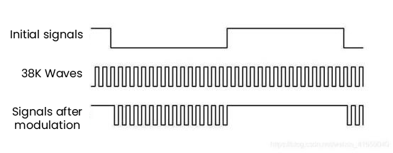

**3.Required Components：**

<table>
<tbody>
<tr class="odd">
<td></td>
<td></td>
<td></td>
<td></td>
<td></td>
<td></td>
</tr>
<tr class="even">
<td>ESP32 Board*1</td>
<td>ESP32 Expansion Board*1</td>
<td>Keyestudio IR Receiver *1</td>
<td>3P Dupont Wire*1</td>
<td>Micro USB Cable*1</td>
<td>Remote Control*1</td>
</tr>
</tbody>
</table>

**4.Wiring Diagram**

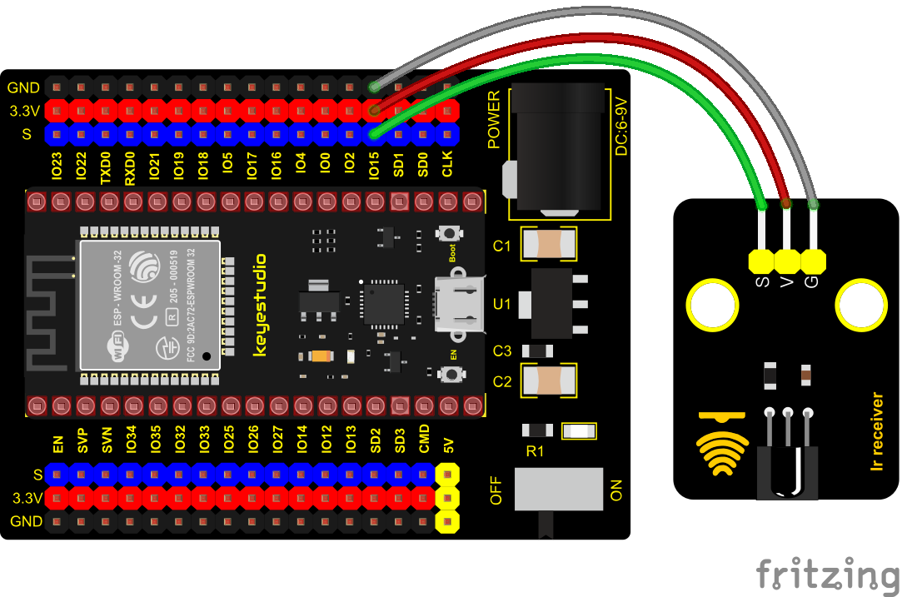

**Test Code：**

<table>
<tbody>
<tr class="odd">
<td>
//**********************************************************************************

/*

* Filename : IR Receiver

* Description : Decode the infrared remote control and print it out through the serial port.

* Auther : http//www.keyestudio.com

*/

#include &lt;Arduino.h&gt;

#include &lt;IRremoteESP8266.h&gt;

#include &lt;IRrecv.h&gt;

#include &lt;IRutils.h&gt;

const uint16_t recvPin = 15; // Infrared receiving pin

IRrecv irrecv(recvPin); // Create a class object used to receive class

decode_results results; // Create a decoding results class object

void setup() 

void loop() 

delay(1000);

}

//**********************************************************************************
</td>
</tr>
</tbody>
</table>

**6. Test Result**

Wire up, compile and upload the code to the ESP32. After uploading
successfully，we will use a USB cable to power on. Open the serial
monitor and set baud rate to 9600.

We need to press the reset button on the ESP32, point at the IR receiver
and press keys on the remote control. After receiving the signal, the
monitor will show key values and the LED will flash, as shown in the
figure below.

The key code value of each key is shown below:

### Project 34: DS18B20 Temperature Sensor

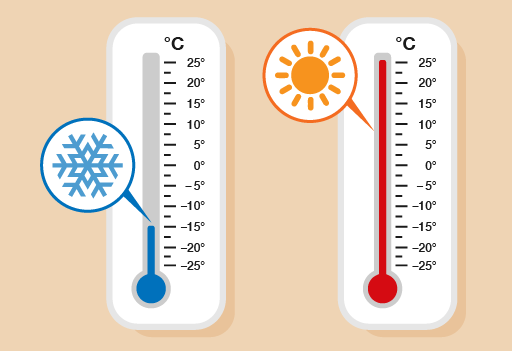

**Description**

The DS18B20 is a 1-wire programmable Temperature sensor from maxim
integrated. It is widely used to measure temperature in hard
environments like in chemical solutions, mines or soil etc. The
constriction of the sensor is rugged and also can be purchased with a
waterproof option making the mounting process easy. It can measure a
wide range of temperature from **-55°C to +125°** with a decent accuracy
of **±5°C**. Each sensor has a unique address and requires only one pin
of the MCU to transfer data so it a very good choice for measuring
temperature at multiple points without compromising much of your digital
pins on the microcontroller.

**Working Principle**

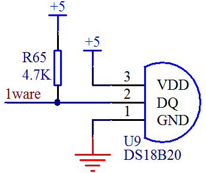

The hardware interface of the 1-Wire bus is very simple, just connect
the data pin of the DS18B20 to an IO port of the microcontroller. The
timing of the 1-Wire bus is relatively complex. Many students can’t
understand the timing diagram independently here. We have encapsulated
the complex timing operations in the library, and you can use the
library functions directly.

Schematic Diagram of DS18B20

This can save up to 12-bit temperature vale. In the register, save in
code complement. As shown below;

A total of 2 bytes, LSB is the low byte, MSB is the high byte, where MSb
is the high byte of the byte, LSb is the low byte of the byte. As you
can see, the binary number, the meaning of the temperature represented
by each bit, is expressed. Among them, S represents the sign bit, and
the lower 11 bits are all powers of 2, which are used to represent the
final temperature. The temperature measurement range of DS18B20 is from
-55 degrees to +125 degrees, and the expression form of temperature
data, S represents positive and negative temperature, and the resolution
is 2﹣⒋, which is 0.0625.

**3.Required Components：**

<table>
<tbody>
<tr class="odd">
<td></td>
<td></td>
<td></td>
<td></td>
<td></td>
</tr>
<tr class="even">
<td>ESP32 Board*1</td>
<td>ESP32 Expansion Board*1</td>
<td>Keyestudio 18B20 Temperature Sensor*1</td>
<td>3P Dupont Wire*1</td>
<td>Micro USB Cable*1</td>
</tr>
</tbody>
</table>

**4.Wiring Diagram**

**Test Code：**

<table>
<tbody>
<tr class="odd">
<td>
//**********************************************************************************

/*

* Filename : ds18b20

* Description : Read the temperature of ds18B20

* Auther : http//www.keyestudio.com

*/

#include &lt;DS18B20.h&gt;

//ds18b20 pin to 15

DS18B20 ds18b20(15);

void setup() 

void loop() 

//**********************************************************************************
</td>
</tr>
</tbody>
</table>

**6. Code Explanation**

1\. We set the pin to GPIO15 and obtain the temperature in the unit of
℃.  

2\. Set a double decimal variable to temp, and assign the measured
result to temp.

3\. The serial monitor displays the temp value, and the baud rate needs
to be set before displaying (our default setting is 9600, which can be
changed).

4\. We add the unit behind the data. If the unit is directly set to °C,
the test result will be garbled. So we directly replace ℃ with C.

**Test Result**

Run the test code, power on, open the serial monitor and set baud rate
to 9600. The monitor will display the temperature of the current
environment, as shown below.

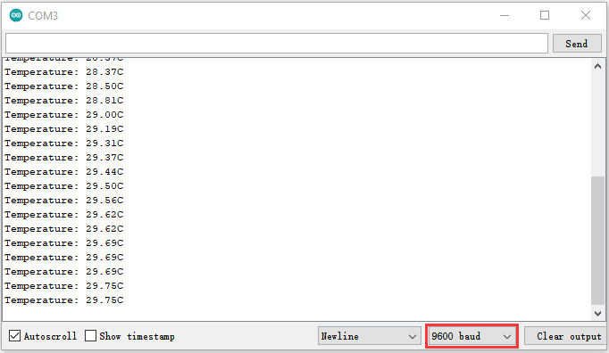

### Project 35: XHT11 Temperature and Humidity Sensor

**Description**

This DHT11 temperature and humidity sensor is a composite sensor which
contains a calibrated digital signal output of the temperature and
humidity.

DHT11 temperature and humidity sensor uses the acquisition technology of
the digital module and temperature and humidity sensing technology,
ensuring high reliability and excellent long-term stability.

It includes a resistive element and a NTC temperature measuring device.

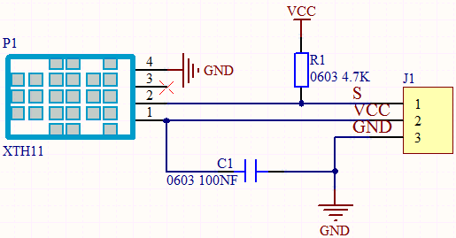

**Working Principle**

The communication and synchronization between the single-chip
microcomputer and XHT11 adopts the single bus data format. The
communication time is about 4ms. The data is divided into fractional
part and integer part.

Operation process: A complete data transmission is 40bit, high bit first
out. Data format: 8bit humidity integer data + 8bit humidity decimal
data + 8bit temperature integer data + 8bit temperature decimal data +
8bit checksum

8-bit checksum: 8-bit humidity integer data + 8-bit humidity decimal
data + 8-bit temperature integer data + 8-bit temperature decimal data
"Add the last 8 bits of the result.

**3.Required Components：**

<table>
<tbody>
<tr class="odd">
<td></td>
<td></td>
<td></td>
<td></td>
<td></td>
</tr>
<tr class="even">
<td>ESP32 Board*1</td>
<td>ESP32 Expansion Board*1</td>
<td>Keyestudio XHT11 Temperature and Humidity Sensor*1</td>
<td>3P Dupont Wire*1</td>
<td>Micro USB Cable*1</td>
</tr>
</tbody>
</table>

**4.Wiring Diagram**

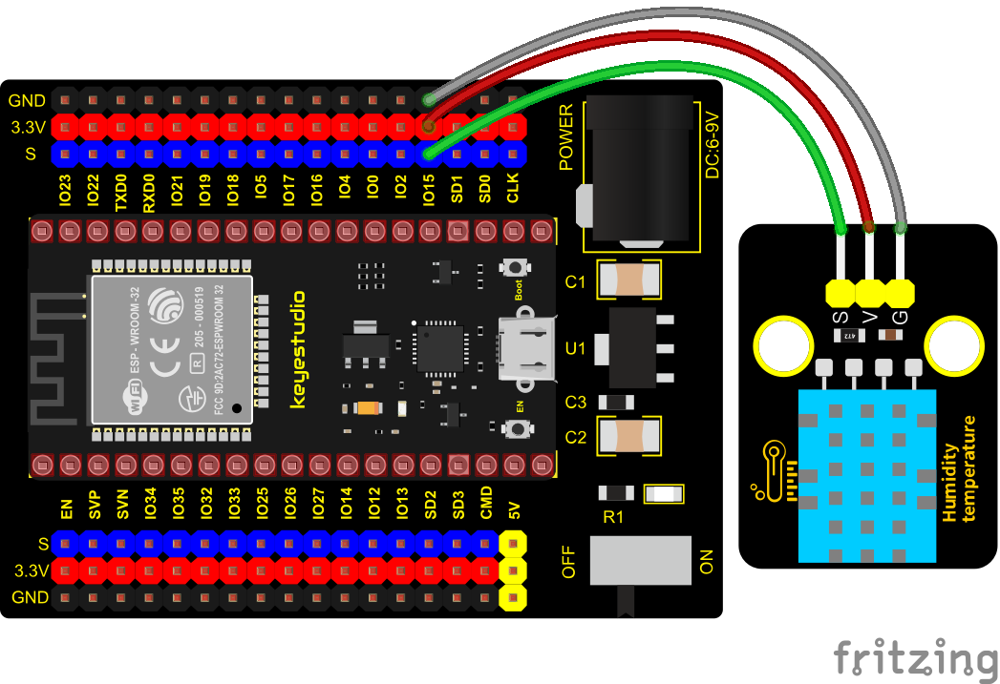

**Test Code：**

<table>
<tbody>
<tr class="odd">
<td>
//**********************************************************************************

/*

* Filename : xht11

* Description : Read the temperature and humidity values of XHT11.

* Auther : http//www.keyestudio.com

*/

#include "xht11.h"

//gpio15

xht11 xht(15);

unsigned char dht[4] = ;//Only the first 32 bits of data are received, not the parity bits

void setup() 

void loop()  else 

delay(1000); //It takes 1000ms to wait for the device to read

}

//**********************************************************************************
</td>
</tr>
</tbody>
</table>

**Code Explanation**

1.  In the experiment, we need to import the library file of XHT11
    first.

2.  We set the pin to GPIO15, and store the detected temperature and
    humidity data in the dht\[4\] array.
    
    3\. We add units behind the data. If the temperature unit is
    directly set to °C, the test results may be wrong, so we directly
    replace °C with C; the humidity unit is directly set to %.
    
    **Test Result**
    
    Upload the test code, power up, open the serial monitor and set baud
    rate to 9600. The monitor will display the temperature and humidity
    data, as shown below.

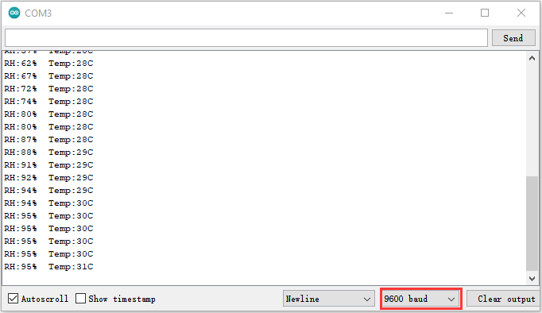

### Project 36: DS1307 Clock Module

1.  **Overview**

This module mainly uses the real-time clock chip DS1307, which is the
I2C bus interface chip that has second, minute, hour, day, month, year
and other functions as well as leap year automatic adjustment function
introduced by DALLAS. It can work independently of CPU, and won‘t’
affected by the CPU main crystal oscillator and capacitance as well as
keep accurate time. What‘s more, monthly cumulative error is generally
less than 10 seconds.The chip also has a clock protection circuit in
case of main power failure and runs on a back-up battery that denies the
CPU read and write access. At the same time, it contains automatic
switching control circuit of standby power supply, so it can guarantee
the accuracy of system clock in case of power failure of main power
supply and other bad environment.

Going forward, the DS1307 chip internal integration has a certain
capacity, with power failure protection characteristics of static RAM,
which can be used to save some key data. 

In the experiment, we use the DS1307 clock module to obtain the system
time and print the test results.  

**2. Working Principle**

Serial real-time clock records year, month, day, hour, minute, second
and week; AM and PM indicate morning and afternoon respectively; 56
bytes of NVRAM store data; 2-wire serial port; programmable square wave
output; power failure detection and automatic switching circuit; battery
current is less than 500nA.

Pins description：X1, 32.768kHz crystal terminal ;

VBAT:X2：+3V input;

SDA：serial data;

SCL：serial clock;

SQW/OUT：square waves/output drivers

**3.Required Components:**

<table>
<tbody>
<tr class="odd">
<td></td>
<td></td>
<td></td>
<td></td>
<td></td>
</tr>
<tr class="even">
<td>ESP32 Board*1</td>
<td>ESP32 Expansion Board*1</td>
<td>Keyestudio DS1307 Clock Module*1</td>
<td>4P Dupont Wire1</td>
<td>Micro USB Cable*1</td>
</tr>
</tbody>
</table>

**4.Wiring Diagram**

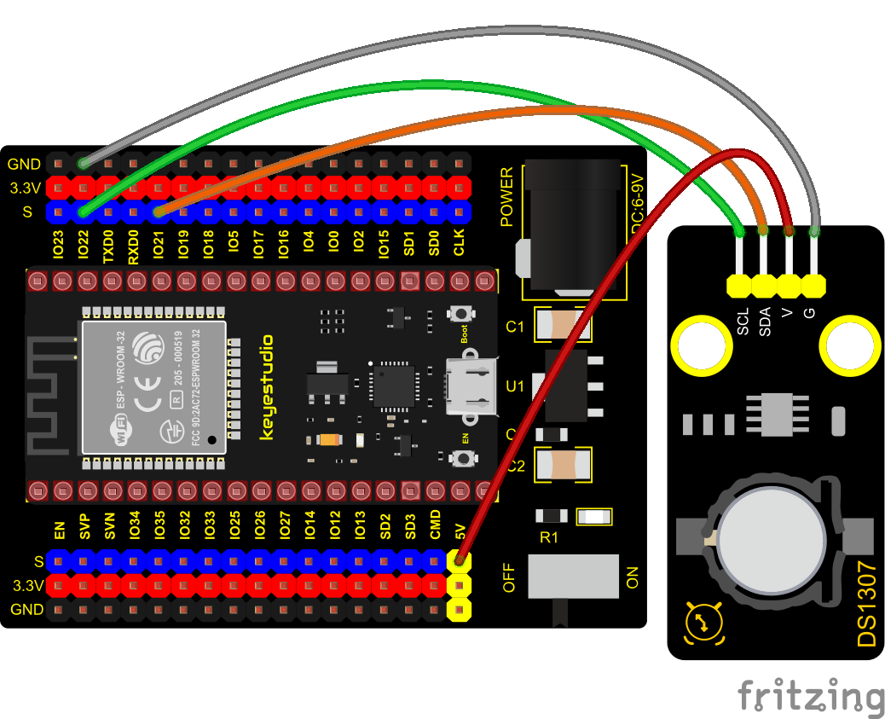

**Test Code：**

<table>
<tbody>
<tr class="odd">
<td>
//**********************************************************************************

/*

* Filename : DS1307 Real Time Clock

* Description : Read the year/month/day/hour/minute/second/week of DS1307 clock module

* Auther : http//www.keyestudio.com

*/

#include &lt;Wire.h&gt;

#include "RtcDS1307.h" //DS1307 clock module library

RtcDS1307&lt;TwoWire&gt; Rtc(Wire);//i2cport

void setup()

void loop()

//**********************************************************************************
</td>
</tr>
</tbody>
</table>

**6. Code Explanation**

Rtc.GetDateTime(): the obtained current time and date.

**Rtc.Begin();**enable DS1307 real-time clock

**Rtc.SetIsRunning(true);** run the DS1307 real-time clock, if true
changes into false, time will stop.

**Rtc.SetDateTime()；**set time

**Rtc.GetDateTime().Year()** return year

**Rtc.GetDateTime().Month()** return month

**Rtc.GetDateTime().Day()**return date

**Rtc.GetDateTime().Hour()**return hour

**Rtc.GetDateTime().Minute()**return minute

**Rtc.GetDateTime().Second()**return second

**Rtc.GetDateTime().DayOfWeek() return week**

**7. Test Result**

Wire up, attach the DS1307 sensor to a battery, compile and upload the
code to the ESP32. After uploading successfully，we will use a USB cable
to power on. Open the serial monitor and set baud rate to 9600. We need
to press the reset button on the ESP32, then we can see the displayed
year, month, day, hour, minute, second and week on themonitor, and set
the time and date to refresh every second, as shown below:

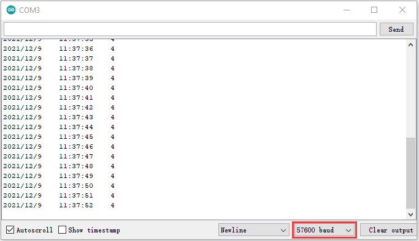

### Project 37: TM1650 4-Digit Tube Display

**Overview**

This module is mainly composed of a 0.36 inch red common anode 4-digit
digital tube, and its driver chip is TM1650. When using it, we only need
two signal lines to make the single-chip microcomputer control a
4-bitdigit tube, which greatly saves the IO port resources of the
control board.

TM1650 is a special circuit for LED (light emitting diode display) drive
control. It integrates MCU input and output control digital interface,
data latch, LED drivers, keyboard scanning, brightness adjustment and
other circuits.

TM1650 has stable performance, reliable quality and strong
anti-interference ability.

It can be applied to the application of long-term continuous working for
24 hours.

TM1650 uses 2-wire serial transmission protocol for communication (note
that this data transmission protocol is not a standard I2C protocol).
The chip can drive the digital tube and save MCU pin resources through
two pins and MCU communication.

**Working Principle**

TM1650 adopts IIC treaty and SDA and SCL wire

Data command setting is 0x48. This means that lighting up the tube
display not perform its button scanning function.

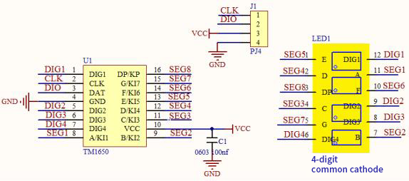

**Data command setting**: 0x48 means that we light up the digital tube,
instead of enable the function of key scanning

**Command display setting:**

bit\[6:4\]: set the brightness of tube display, and 000 is brightest

bit\[3\]: set to show decimal points

bit\[0\]: start the display of the tube display

**3.Required Components：**

<table>
<tbody>
<tr class="odd">
<td></td>
<td></td>
<td></td>
<td></td>
<td></td>
</tr>
<tr class="even">
<td>ESP32 Board*1</td>
<td>ESP32 Expansion Board*1</td>
<td>Keyestudio TM1650 4-Digit Tube Display*1</td>
<td>4P Dupont Wire*1</td>
<td>Micro USB Cable*1</td>
</tr>
</tbody>
</table>

**4.Wiring Diagram**

**Test Code：**

<table>
<tbody>
<tr class="odd">
<td>
//**********************************************************************************

/*

* Filename : TM1650 Four digital tube

* Description : TM1650 Four Digital Tube shows 0-9999

* Auther : http//www.keyestudio.com

*/

#include "TM1650.h"

#define CLK 22 //pins definitions for TM1650 and can be changed to other ports

#define DIO 21

TM1650 DigitalTube(CLK,DIO);

void setup()

// DigitalTube.displayDot(1,true); //Bit0 display dot. Use before displayBit().

DigitalTube.displayBit(1,0); //DigitalTube.Display(bit,number); bit=0---3 number=0---9

}

void loop()

}

void displayFloatNum(float num)

if(dat%10000/1000 != 0)

if(dat%1000/100 != 0)

DigitalTube.clearBit(1);

DigitalTube.clearBit(2);

DigitalTube.clearBit(3);

DigitalTube.displayBit(4, dat%100/10);

}

//**********************************************************************************
</td>
</tr>
</tbody>
</table>

**Test Result**

Run the test code, wire up and power on. 4-digit tube display will show
integer from 0 to 99999, add 1 for each 10ms. Increase to 9999 then
start from 0

### Project 38: HT16K33\_8X8 Dot Matrix Module

**Overview**

What is the dot matrix display?

The 8X8 dot matrix is composed of 64 light-emitting diodes, and each
light-emitting diode is placed at the intersection of the row line and
the column line. When the corresponding row is set to 1 level, and a
certain column is set to 0 level, the corresponding diode will light up.

**Working Principle**

As the schematic diagram shown, to light up the LED at the first row and
column, we only need to set C1 to high level and R1 to low level. To
turn on LEDs at the first row, we set R1 to low level and C1-C8 to high
level.

16 IO ports are needed, which will highly waste the MCU resources.

Therefore, we designed this module, using the HT16K33 chip to drive an
8\*8 dot matrix, which greatly saves the resources of the single-chip
microcomputer.

There are three DIP switches on the module, all of which are set to I2C
communication address. The setting method is shown below.

<table>
<tbody>
<tr class="odd">
<td>A0（1）</td>
<td>A1（2）</td>
<td>A2（3）</td>
<td>A0（1）</td>
<td>A1（2）</td>
<td>A2（3）</td>
<td>A0（1）</td>
<td>A1（2）</td>
<td>A2（3）</td>
</tr>
<tr class="even">
<td>0（OFF）</td>
<td>0（OFF）</td>
<td>0（OFF）</td>
<td>1（ON）</td>
<td>0（OFF）</td>
<td>0（OFF）</td>
<td>0（OFF）</td>
<td>1（ON）</td>
<td>0（OFF）</td>
</tr>
<tr class="odd">
<td>OX70</td>
<td>OX71</td>
<td>OX72</td>
<td></td>
<td></td>
<td></td>
<td></td>
<td></td>
<td></td>
</tr>
<tr class="even">
<td>A0（1）</td>
<td>A1（2）</td>
<td>A2（3）</td>
<td>A0（1）</td>
<td>A1（2）</td>
<td>A2（3）</td>
<td>A0（1）</td>
<td>A1（2）</td>
<td>A2（3）</td>
</tr>
<tr class="odd">
<td>1（ON）</td>
<td>1（ON）</td>
<td>0（OFF）</td>
<td>0（OFF）</td>
<td>0（OFF）</td>
<td>1（ON）</td>
<td>1（ON）</td>
<td>0（OFF）</td>
<td>1（ON）</td>
</tr>
<tr class="even">
<td>OX73</td>
<td>OX74</td>
<td>OX75</td>
<td></td>
<td></td>
<td></td>
<td></td>
<td></td>
<td></td>
</tr>
<tr class="odd">
<td>A0（1）</td>
<td>A1（2）</td>
<td>A2（3）</td>
<td>A0（1）</td>
<td>A1（2）</td>
<td>A2（3）</td>
<td></td>
<td></td>
<td></td>
</tr>
<tr class="even">
<td>0（OFF）</td>
<td>1（ON）</td>
<td>1（ON）</td>
<td>1（ON）</td>
<td>1（ON）</td>
<td>1（ON）</td>
<td></td>
<td></td>
<td></td>
</tr>
<tr class="odd">
<td>OX76</td>
<td>OX77</td>
<td></td>
<td></td>
<td></td>
<td></td>
<td></td>
<td></td>
<td></td>
</tr>
</tbody>
</table>

A0，A1 and A2 are grounded, that is, the address is 0x70

**3.Required Components：**

<table>
<tbody>
<tr class="odd">
<td></td>
<td></td>
<td></td>
<td></td>
<td></td>
</tr>
<tr class="even">
<td>ESP32 Board*1</td>
<td>ESP32 Expansion Board*1</td>
<td>
Keyestudio HT16K33_

8X8 Dot Matrix*1
</td>
<td>4P Dupont Wire*1</td>
<td>Micro USB Cable*1</td>
</tr>
</tbody>
</table>

**4.Wiring Diagram**

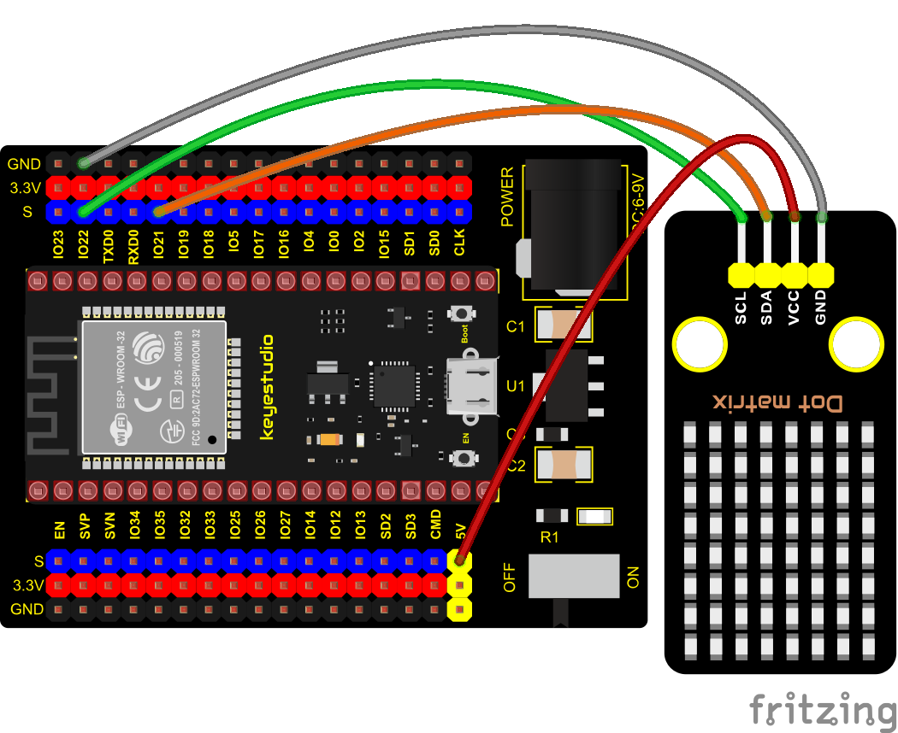

**Test Code：**

<table>
<tbody>
<tr class="odd">
<td>
//**********************************************************************************

/*

* Filename : 8×8 Dot-matrix Display

* Description : 8x8 LED dot matrix display“Heart” pattern.

* Auther : http//www.keyestudio.com

*/

#include "HT16K33_Lib_For_ESP32.h"

#define SDA 21

#define SCL 22

ESP32_HT16K33 matrix = ESP32_HT16K33();

//The brightness values can be set from 1 to 15, with 1 darkest and 15 brightest

#define A 15

byte result[8][8];

byte test1[8] = ;

void setup()

void loop()

for (int i = 7; i &gt; 0; i--)

}

//**********************************************************************************
</td>
</tr>
</tbody>
</table>

**Code Explanation**

First we need to import the library file.

1.  The pattern in our code is an array of byte data type, which is
    shown in the table below. We convert  into binary, and fill in the 8\*8 form below to
    make it clear. 1 means on, 0 means off,
    
    Then we can see that it is a heart shape.

<table>
<tbody>
<tr class="odd">
<td>0</td>
<td>0</td>
<td>0</td>
<td>0</td>
<td>0</td>
<td>0</td>
<td>0</td>
<td>0</td>
</tr>
<tr class="even">
<td>0</td>
<td>0</td>
<td>0</td>
<td>1</td>
<td>1</td>
<td>0</td>
<td>0</td>
<td>0</td>
</tr>
<tr class="odd">
<td>0</td>
<td>0</td>
<td>1</td>
<td>1</td>
<td>1</td>
<td>1</td>
<td>0</td>
<td>0</td>
</tr>
<tr class="even">
<td>0</td>
<td>1</td>
<td>1</td>
<td>1</td>
<td>1</td>
<td>1</td>
<td>1</td>
<td>0</td>
</tr>
<tr class="odd">
<td>1</td>
<td>1</td>
<td>1</td>
<td>1</td>
<td>1</td>
<td>1</td>
<td>1</td>
<td>1</td>
</tr>
<tr class="even">
<td>1</td>
<td>1</td>
<td>1</td>
<td>1</td>
<td>1</td>
<td>1</td>
<td>1</td>
<td>1</td>
</tr>
<tr class="odd">
<td>0</td>
<td>1</td>
<td>1</td>
<td>0</td>
<td>0</td>
<td>1</td>
<td>1</td>
<td>0</td>
</tr>
<tr class="even">
<td>0</td>
<td>0</td>
<td>0</td>
<td>0</td>
<td>0</td>
<td>0</td>
<td>0</td>
<td>0</td>
</tr>
</tbody>
</table>

**Test Result**

Burn the test code and wire up according to the wiring diagram; after
powering on, the dot matrix will display a heart beat pattern.

### Project 39: RFID Module 

**Description**

RFIDRFID-RC522 radio frequency module adopts a Philips MFRC522 original
chip to design card reading circuit, easy to use and low cost, suitable
for equipment development and card reader development and so on.

RFID or Radio Frequency Identification system consists of two main
components, a transponder/tag attached to an object to be identified,
and a Transceiver also known as interrogator/Reader.

In the experiment, the data read by the card swipe module is 4
hexadecimal numbers, and we print these four hexadecimal numbers as
strings. For example, we read the data of the IC card below: 0x8d, 0xfe,
0x6c, 0x4d, and the information string displayed in the shell is
8dfe6c4d; the data read from the keychain is: 0xbc, 0x33, 0x76, 0x6e,
and the information is displayed in the shell The string is bc33766e.

**Working Principle**

RFID (Radio Frequency Identification)

Radio frequency identification, the card reader is composed of a radio
frequency module and a high-level magnetic field. The Tag transponder is
a sensing device, and this device does not contain a battery. It only
contains tiny integrated circuit chips and media for storing data and
antennas for receiving and transmitting signals. To read the data in the
tag, first put it into the reading range of the card reader. The reader
will generate a magnetic field, and because the magnetic energy
generates electricity according to Lenz's law, the RFID tag will supply
power, thereby activating the device.

**3.Required Components：**

<table>
<tbody>
<tr class="odd">
<td></td>
<td></td>
<td></td>
<td></td>
</tr>
<tr class="even">
<td>ESP32 Board*1</td>
<td>ESP32 Expansion Board*1</td>
<td>Keyestudio RFID Module*1</td>
<td>4P Dupont Wire*1</td>
</tr>
<tr class="odd">
<td></td>
<td></td>
<td></td>
<td></td>
</tr>
<tr class="even">
<td>Micro USB Cable*1</td>
<td>Key*1</td>
<td>IC Card*1</td>
<td></td>
</tr>
</tbody>
</table>

**4.Wiring Diagram**

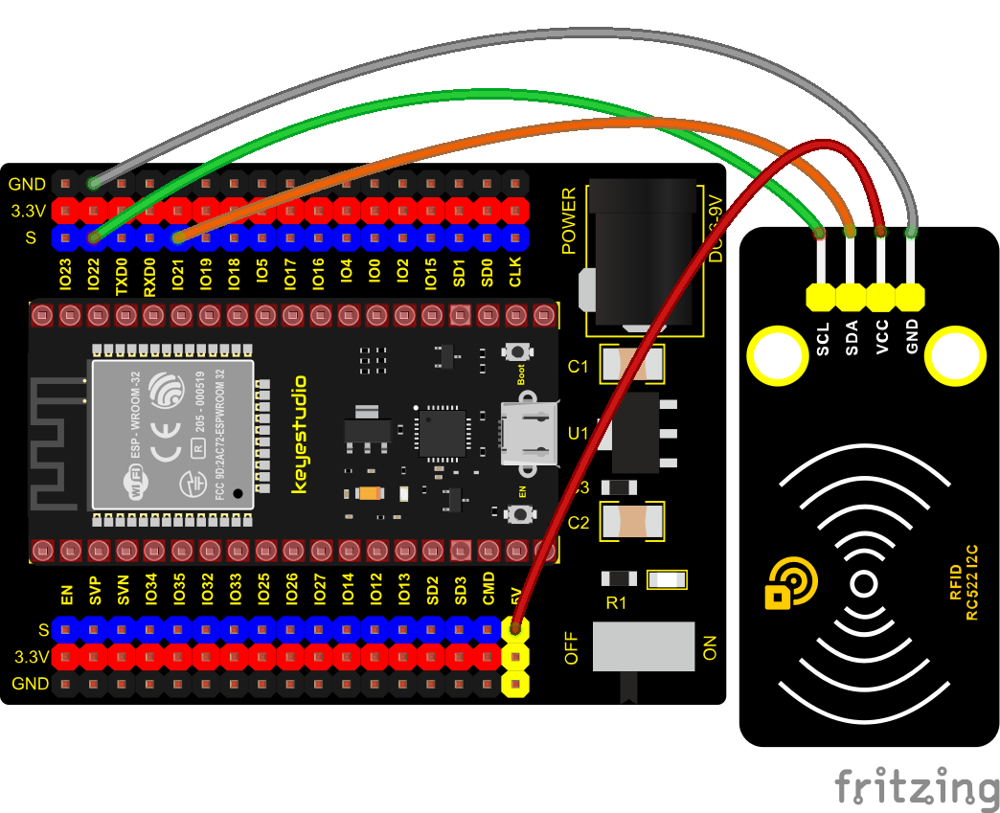

**Test Code：**

<table>
<tbody>
<tr class="odd">
<td>
//**********************************************************************************

/*

* Filename : RFID

* Description : RFID reader UID

* Auther : http//www.keyestudio.com

*/

#include &lt;Wire.h&gt;

#include "MFRC522_I2C.h"

// IIC pins default to GPIO21 and GPIO22 of ESP32

// 0x28 is the i2c address of SDA, if doesn't match，please check your address with i2c.

MFRC522 mfrc522(0x28); // create MFRC522.

void setup() 

void loop() 

// select one of door cards. UID and SAK are mfrc522.uid.

// save UID

Serial.print(F("Card UID:"));

for (byte i = 0; i &lt; mfrc522.uid.size; i++) 

Serial.println();

}

void ShowReaderDetails() 

}

//**********************************************************************************
</td>
</tr>
</tbody>
</table>

**6. Code Explanation**

**Wire.begin();** The module we use is the IIC interface, so we first
initialize the IIC

**mfrc522.PCD\_Init(); initialize** MFRC522

**String(mfrc522.uid.uidByte\[i\], HEX);** A string to convert the value
read into hexadecimal format.

**7. Test Result**

Wire up, power on, compile and upload the code to the ESP32. After
uploading successfully，we will use a USB cable to power on. Open the
serial monitor and set baud rate to 115200. We need to press the reset
button on the ESP32, when we make the IC card close to the RFID module,
the information will be printed out, as shown in the figure below.

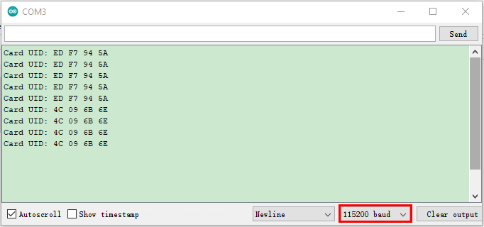

Note: For different RFID-RC522 key fob and key fob, the key fob and key
fob value may be different.

**5. Comprehensive Experiments**

The previous projects are related to single sensor or module. In the
following part, we will combine various sensors and modules to create
some comprehensive experiments to perform special functions.

### Project 40: Button-controlled LED

**Overview**

In this lesson, we will make an extension experiment with a button and
an LED. When the button is pressed and low levels are output, the LED
will light up; when the button is released, the LED will go off. Then we
can control a module with another module.

**2.Required Components：**

<table>
<tbody>
<tr class="odd">
<td></td>
<td></td>
<td></td>
<td></td>
<td></td>
<td></td>
</tr>
<tr class="even">
<td>ESP32 Board*1</td>
<td>ESP32 Expansion Board*1</td>
<td>Keyestudio Purple LED Module*1</td>
<td>Keyestudio Button Module*1</td>
<td>3P Dupont Wire*2</td>
<td>Micro USB Cable*1</td>
</tr>
</tbody>
</table>

**3.Wiring Diagram**

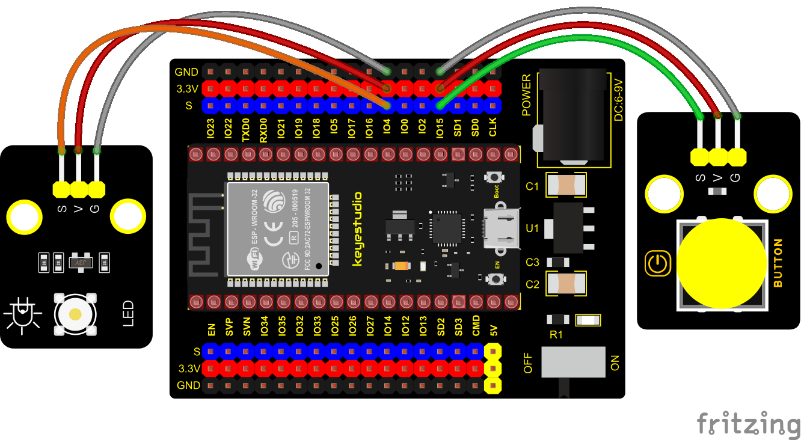

**4.Test Code**

<table>
<tbody>
<tr class="odd">
<td>
//**********************************************************************

/*

* Filename : button_control_LED

* Description : Make a table lamp.

* Auther : http//www.keyestudio.com

*/

#define PIN_LED 4

#define PIN_BUTTON 15

bool ledState = false;

void setup() 

// the loop function runs over and over again forever

void loop() 

while (digitalRead(PIN_BUTTON) == LOW);

}

}

void reverseGPIO(int pin) 

//**********************************************************************
</td>
</tr>
</tbody>
</table>

**Test Result**

Upload the code, wire up and power up with a USB cable. When the button
is pressed, the LED will light up; when pressed again, the LED will go
off.

### Project 41: Alarm Experiment

**Overview**

In the previous experiment, we control an output module though an input
module. In this lesson, we will make an experiment that the active
buzzer will emit sounds once an obstacle appears.

**2.Required Components：**

<table>
<tbody>
<tr class="odd">
<td></td>
<td></td>
<td></td>
<td></td>
<td></td>
<td></td>
</tr>
<tr class="even">
<td>ESP32 Board*1</td>
<td>ESP32 Expansion Board*1</td>
<td>Keyestudio Obstacle Avoidance Sensor*1</td>
<td>Keyestudio Active Buzzer*1</td>
<td>3P Dupont Wire*2</td>
<td>Micro USB Cable*1</td>
</tr>
</tbody>
</table>

**3.Wiring Diagram**

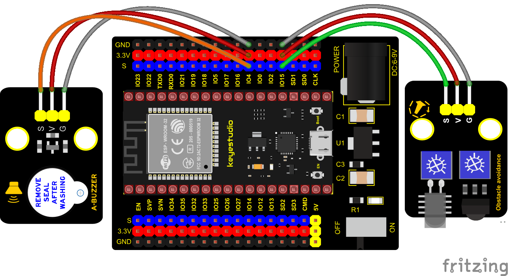

**4.Test Code**

<table>
<tbody>
<tr class="odd">
<td>
//**********************************************************************************

/*

* Filename : Avoiding alarm

* Description : Obstacle avoidance sensor controls the buzzer

* Auther : http//www.keyestudio.com

*/

int item = 0;

void setup() 

void loop()  else 

delay(100);//Delay 100ms

}

//**********************************************************************************
</td>
</tr>
</tbody>
</table>

**Code Explanation**

Set IO ports according to connection diagram then configure pins mode

The value is 0 when pressing the button, So, we can determine the key
value(0）through **if (item == 0) and make the buzzer beep.**

**Test Result**

Wire up and upload the test code and power up. if the obstacle is
detected, the active buzzer will chime; if not, it won’t beep

Project 42: PIR Motion Sensor

**Introduction**

In this experiment, we will control an active buzzer and an on-board LED
through a PIR motion sensor.

**2.Required Components：**

<table>
<tbody>
<tr class="odd">
<td></td>
<td></td>
<td></td>
<td></td>
</tr>
<tr class="even">
<td>ESP32 Board*1</td>
<td>ESP32 Expansion Board*1</td>
<td>Keyestudio PIR Motion Sensor*1</td>
<td>Keyestudio Active Buzzer*1</td>
</tr>
<tr class="odd">
<td></td>
<td></td>
<td></td>
<td></td>
</tr>
<tr class="even">
<td>Keyestudio Purple LED Module*1</td>
<td>3P Dupont Wire*3</td>
<td>Micro USB Cable*1</td>
<td></td>
</tr>
</tbody>
</table>

**3.Wiring Diagram**

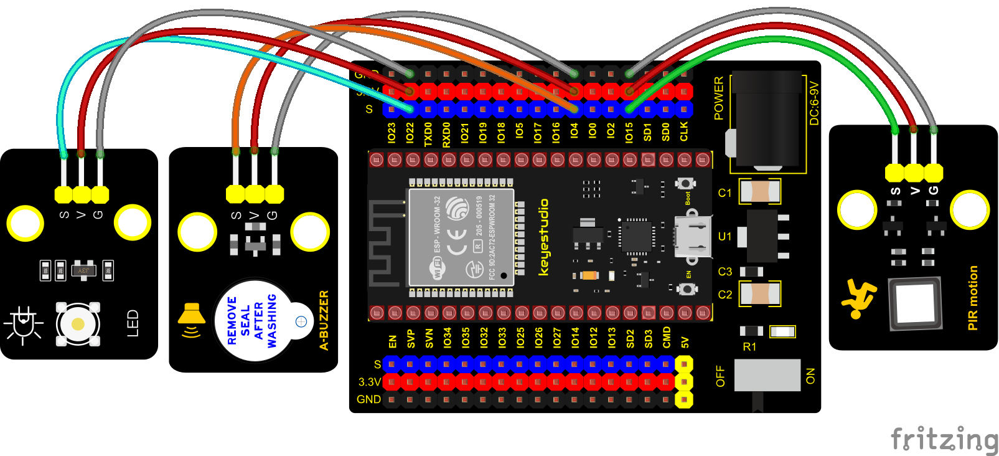

**4.Test Code**

<table>
<tbody>
<tr class="odd">
<td>
//**********************************************************************************

/*

* Filename : PIR alarm

* Description : PIR control buzzer

* Auther : http//www.keyestudio.com

*/

int item = 0;

void setup() 

void loop()  else 

}

//**********************************************************************************
</td>
</tr>
</tbody>
</table>

**Test Result**

Upload the test code, wire up and power on. if the sensor detects people
moving, the external active buzzer will chime; if not, it won’t beep.

### Project 43: Extinguishing Robot

**Description**

Today we will use Arduino simulation to build an extinguishing robot
that will automatically sense the fire and start the fan. In this
project we will learn how to build a very simple robot using pico,
(detecting flames with a flame sensor, blowing out candles with a fan)
can teach us basic concepts about robotics. Once you understand the
basics below, you can build more complex robots.

**2.Required Components：**

<table>
<tbody>
<tr class="odd">
<td></td>
<td></td>
<td></td>
<td></td>
</tr>
<tr class="even">
<td>ESP32 Board*1</td>
<td>ESP32 Expansion Board*1</td>
<td>Keyestudio 130 Motor*1</td>
<td>Keyestudio Flame Sensor*1</td>
</tr>
<tr class="odd">
<td></td>
<td></td>
<td></td>
<td></td>
</tr>
<tr class="even">
<td>3P Dupont Wire*1</td>
<td>4P Dupont Wire1</td>
<td>Micro USB Cable*1</td>
<td>6 AA Battery Holder*1</td>
</tr>
<tr class="odd">
<td></td>
<td></td>
<td></td>
<td></td>
</tr>
<tr class="even">
<td>AA Battery*6</td>
<td></td>
<td></td>
<td></td>
</tr>
</tbody>
</table>

**3.Wiring Diagram**

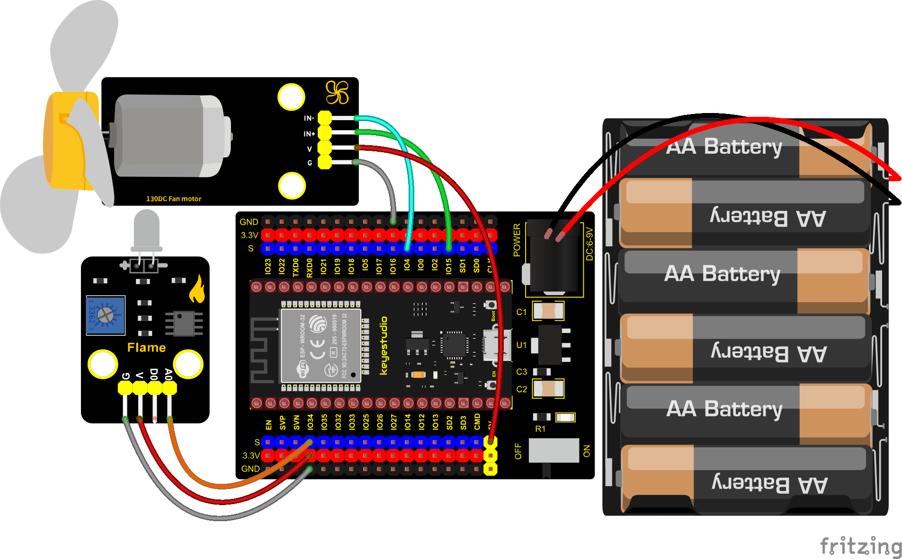

**4.Test Code**

<table>
<tbody>
<tr class="odd">
<td>
//**********************************************************************************

/*

* Filename : Fire-fighting robot

* Description : Flame sensor controls the 130 fan module

* Auther : http//www.keyestudio.com

*/

int item = 0;

void setup() 

void loop()  else 

delay(100);

}

//**********************************************************************************
</td>
</tr>
</tbody>
</table>

**Code Explanation**

In the code, we set the threshold value to 3000. When the flame sensor
detects that the analog value is lower than this threshold, the fan will
automatically turn on; otherwise, it will be turned off. For the driving
method of the fan, please refer to the previous project.

**Test Result**

Wire up and upload the test code, power up, open the monitor and set
baud rate to 9600. When this value is less than 3000, the fan will works
to blow out the fire. Basically, the flame value can be set by yourself.

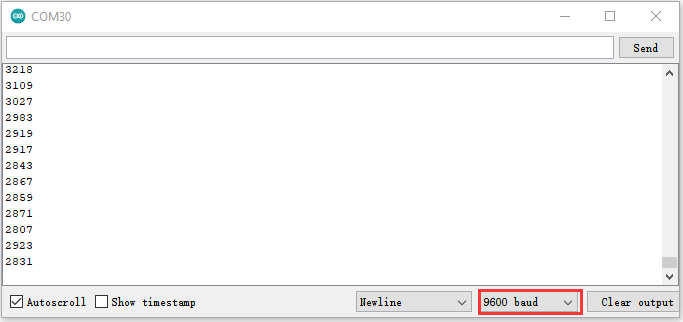

Project 44: Rotary Encoder control RGB

**Introduction**

In this lesson, we will control the LED on the RGB module to show
different colors through a rotary encoder.

When designing the code, we need to divide the obtained values by 3 to
get the remainders. The remainder is 0 and the LED will become red. The
remainder is 1, the LED will become green. The remainder is 2, the LED
will turn blue.

**2.Required Components：**

<table>
<tbody>
<tr class="odd">
<td></td>
<td></td>
<td></td>
<td></td>
</tr>
<tr class="even">
<td>ESP32 Board*1</td>
<td>ESP32 Expansion Board*1</td>
<td>Keyestudio Common Cathode RGB Module*1</td>
<td>Keyestudio Rotary Encoder Module*1</td>
</tr>
<tr class="odd">
<td></td>
<td></td>
<td></td>
<td></td>
</tr>
<tr class="even">
<td>5P Dupont Wire*1</td>
<td>4P Dupont Wire1</td>
<td>Micro USB Cable*1</td>
<td></td>
</tr>
</tbody>
</table>

**3.Wiring Diagram**

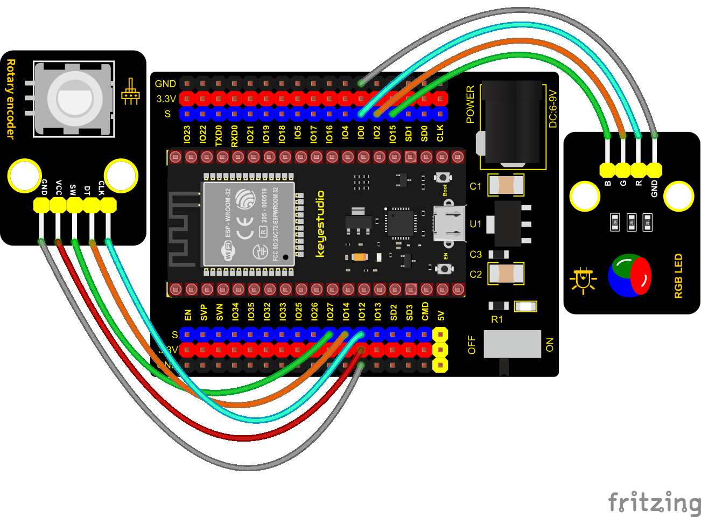

**4.Test Code**

<table>
<tbody>
<tr class="odd">
<td>
//**********************************************************************************

/*

* Filename : Encoder control RGB

* Description : Rotary encoder controls RGB to present different effects

* Auther : http//www.keyestudio.com

*/

//Interfacing Rotary Encoder with Arduino

//Encoder Switch -&gt; pin 27

//Encoder DT -&gt; pin 14

//Encoder CLK -&gt; pin 12

int Encoder_DT = 14;

int Encoder_CLK = 12;

int Encoder_Switch = 27;

int Previous_Output;

int Encoder_Count;

int ledPins[] = ; //define red, green, blue led pins

const byte chns[] = ; //define the pwm channels

int red, green, blue;

int val;

void setup() 

}

void loop() 

else

}

Previous_Output = digitalRead(Encoder_DT);

if (digitalRead(Encoder_Switch) == 0)

}

if (val == 0)  else if (val == 1)  else 

}

//**********************************************************************************
</td>
</tr>
</tbody>
</table>

**Code Explanation**

1.  In the experiment we set val to the remainder of dividing
    Encoder\_Count by 3. Encoder\_Count is the value of the encoder.
    After getting the remainder, set the pins to 9 (red light), 10
    (green light) and 11 (blue light) according to the wiring.
    
    2\. Referring to the control method learned in the previous
    experiment, use the LED on the remainder control module to display
    the corresponding light color. The value obtained by taking the
    remainder of 3 for any number is 0 or 1 or 2. We use these three
    values to judge, and Display the corresponding color.
    
    **Test Result**
    
    Wire up, run the code, open the serial monitor and set baud rate to
    9600. Rotate the knob of the rotary encoder to display the
    reminders, which can control colors of LED.
    
    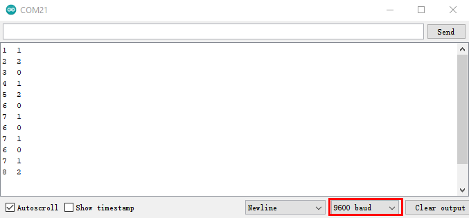

Project 45: Rotary Potentiometer

**Introduction**

In the previous courses, we did experiments of breathing light and
controlling LED with button. In this course, we do these two experiments
by controlling the brightness of LED through an adjustable
potentiometer. The brightness of LED is controlled by PWM values, and
the range of analog values is the same as the PWM’s, from 0 to 65535.

After the code is set successfully, we can control the brightness of the
LED on the module by rotating the potentiometer.

**2.Required Components：**

<table>
<tbody>
<tr class="odd">
<td></td>
<td></td>
<td></td>
<td></td>
<td></td>
<td></td>
</tr>
<tr class="even">
<td>ESP32 Board*1</td>
<td>ESP32 Expansion Board*1</td>
<td>Keyestudio Purple LED Module*1</td>
<td>Keyestudio Rotary Potentiometer*1</td>
<td>3P Dupont Wire*2</td>
<td>Micro USB Cable*1</td>
</tr>
</tbody>
</table>

**3.Wiring Diagram**

**4.Test Code**

<table>
<tbody>
<tr class="odd">
<td>
//**********************************************************************************

/*

* Filename : adjust the light

* Description : Controlling the brightness of LED by potentiometer.

* Auther : http//www.keyestudio.com

*/

#define PIN_ANALOG_IN 34 //the pin of the potentiometer

#define PIN_LED 15 // the pin of the LED

#define CHAN 0

void setup() 

void loop() 

//**********************************************************************************
</td>
</tr>
</tbody>
</table>

**Code Explanation**

In the experiment, the mapping function maps val1 from the range of
0-4095 to 0-255, and assigns it to pwmVal.

**Test Result**

Run the test code and turn the potentiometer on the module to adjust the
brightness of the LED on the LED module.

### Project 46: Smart Windows

**Description**

In life, we can see all kinds of smart products, such as smart home.
Smart homes include smart curtains, smart windows, smart TVs, smart
lights, and more. In this experiment, we use a steam sensor to detect
rainwater, and then achieve the effect of closing and opening the window
by a servo.

**2.Required Components：**

<table>
<tbody>
<tr class="odd">
<td></td>
<td></td>
<td></td>
<td></td>
<td></td>
<td></td>
</tr>
<tr class="even">
<td>ESP32 Board*1</td>
<td>ESP32 Expansion Board*1</td>
<td>Keyestudio Steam Sensor*1</td>
<td>Servo*1</td>
<td>3P Dupont Wire*1</td>
<td>Micro USB Cable*1</td>
</tr>
</tbody>
</table>

**3.Wiring Diagram**

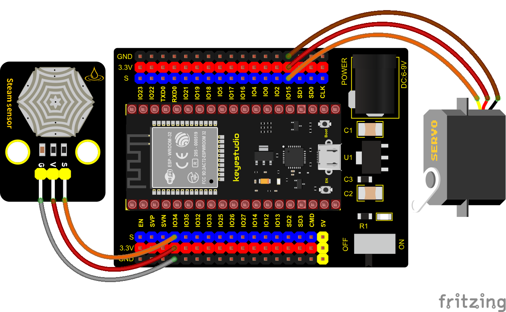

**4.Test Code**

<table>
<tbody>
<tr class="odd">
<td>
//**********************************************************************************

/*

* Filename : smart window

* Description : Water drop sensor controls steering gear rotation.

* Auther : http//www.keyestudio.com

*/

#include &lt;ESP32Servo.h&gt;//Import the steering gear library file

int adcVal = 0;//A variable that holds the ADC value output by the droplet sensor

int servoPin = 15; // Define the servo pin

Servo myservo;//Defines an instance of the steering gear class

#define PIN_ADC 34 //the pin of the Water drop sensor

void setup()

void loop() else 

}

//**********************************************************************************
</td>
</tr>
</tbody>
</table>

**Code Explanation**

We can control a servo to rotate by a threshold.(you can set it)

The analog value exceeds the threshold value, the servo will rotate.

**Test Result**

Wire up and run the test code. When the sensor detects a certain amount
of water, the servo rotates to achieve the effect of closing or opening
windows.

Project** **47: Sound Activated Light

**Introduction**

In this lesson, we will make a smart sound activated light using a sound
sensor and an LED module. When we make a sound, the light will
automatically turn on; when there is no sound, the lights will
automatically turn off. How it works? Because the sound-controlled light
is equipped with a sound sensor, and this sensor converts the intensity
of external sound into a corresponding value. Then set a threshold, when
the threshold is exceeded, the light will turn on, and when it is not
exceeded, the light will go out.

**2.Required Components：**

<table>
<tbody>
<tr class="odd">
<td></td>
<td></td>
<td></td>
<td></td>
<td></td>
<td></td>
</tr>
<tr class="even">
<td>ESP32 Board*1</td>
<td>ESP32 Expansion Board*1</td>
<td>Keyestudio Sound Sensor*1</td>
<td>Keyestudio Purple LED Module*1</td>
<td>3P Dupont Wire*2</td>
<td>Micro USB Cable*1</td>
</tr>
</tbody>
</table>

**3.Wiring Diagram**

**4.Test Code**

<table>
<tbody>
<tr class="odd">
<td>
//**********************************************************************************

/*

* Filename : sound-controlled lights

* Description : Sound sensor controls LED on and off

* Auther : http//www.keyestudio.com

*/

int ledPin = 15;//LED is connected to GP15

int microPin = 34;//Sound sensor is connected to GPIO34

void setup() 

void loop() else

delay(100);

}

//**********************************************************************************
</td>
</tr>
</tbody>
</table>

**Code Explanation**

We set the analog threshold value to 600. If more than 600, LED will be
on 3s; on the contrary, it will be off.

**Test Result**

Run the test code, open the monitor and set baud rate to 9600. The
monitor displays the corresponding volume value. When the analog value
of sound is greater than 600, the LED on the LED module will light up,
otherwise it will go off.

### Project 48: Fire Alarm

**Description**

In this experiment, we will make a fire alarm system. Just use a flame
sensor to control an active buzzer to emit sounds.

**2.Required Components：**

<table>
<tbody>
<tr class="odd">
<td></td>
<td></td>
<td></td>
</tr>
<tr class="even">
<td>ESP32 Board*1</td>
<td>ESP32 Expansion Board*1</td>
<td>Keyestudio Active Buzzer*1</td>
</tr>
<tr class="odd">
<td></td>
<td></td>
<td></td>
</tr>
<tr class="even">
<td>keyestudio Flame Sensor*1</td>
<td>Micro USB Cable*1</td>
<td>3P Dupont Wire*2</td>
</tr>
</tbody>
</table>

**3.Wiring Diagram**

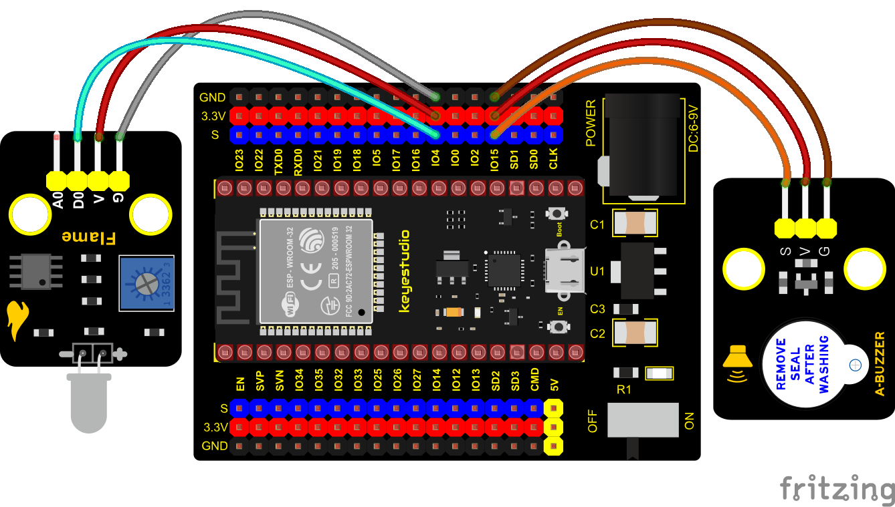

**4.Test Code**

<table>
<tbody>
<tr class="odd">
<td>
//**********************************************************************************

/*

* Filename : Flame Alarm

* Description : Controlling the buzzer by flame sensor.

* Auther : http//www.keyestudio.com

*/

int item = 0;

void setup() 

void loop()  else 

delay(100);//Delay 100ms

}

//**********************************************************************************
</td>
</tr>
</tbody>
</table>

**Code Explanation**

This flame sensor uses an analog pin and a digital pin. When a flame is
detected, the digital pin outputs a low level. In this experiment we
will use the digital port.

**Test Result**

Wire up, run the test code and power on. The sensor detects the flame,
and the external active buzzer will beep, otherwise the active buzzer
won’t

### Project 49: Smoke Alarm

**Description**

In this experiment, we will make a smoke alarm by a TM16504-Digit
segment module, a gas sensor and an active buzzer.

**2.Required Components：**

<table>
<tbody>
<tr class="odd">
<td></td>
<td></td>
<td></td>
<td></td>
</tr>
<tr class="even">
<td>ESP32 Board*1</td>
<td>ESP32 Expansion Board*1</td>
<td>Keyestudio Active Buzzer*1</td>
<td>Keyestudio TM16504-Digit Segment Module*1</td>
</tr>
<tr class="odd">
<td></td>
<td></td>
<td></td>
<td></td>
</tr>
<tr class="even">
<td>keyestudio Analog Gas Sensor*1</td>
<td>3P Dupont Wire*2</td>
<td>4P Dupont Wire1</td>
<td>Micro USB Cable*1</td>
</tr>
</tbody>
</table>

**3.Wiring Diagram**

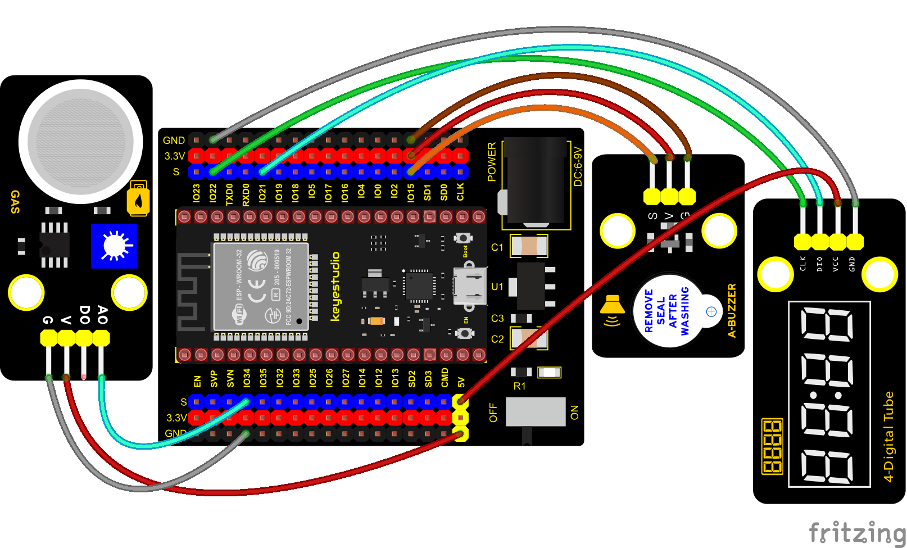

**4.Test Code**

<table>
<tbody>
<tr class="odd">
<td>
//**********************************************************************************

/*

* Filename : smoke alarm

* Description : MQ2 controls a buzzer and a four-digit analog smoke tester

* Auther : http//www.keyestudio.com

*/

#include "TM1650.h" //Import the TM1650 library file

int adcVal = 0; //display ADC value

//the interfaces are GPIO21 and GPIO22

#define DIO 21

#define CLK 22

TM1650 DigitalTube(CLK,DIO);

void setup() 

// DigitalTube.displayDot(1,true); //Bit0 display dot. Use before displayBit().

DigitalTube.displayBit(1,0); //DigitalTube.Display(bit,number); bit=0---3 number=0---9

pinMode(15, OUTPUT);//the buzzer is connected to GPIO15

}

void loop()  else 

delay(100);//delay 100ms

}

void displayFloatNum(float adcVal)

if(dat%10000/1000 != 0)

if(dat%1000/100 != 0)

DigitalTube.clearBit(1);

DigitalTube.clearBit(2);

DigitalTube.clearBit(3);

DigitalTube.displayBit(4, dat%100/10);

}

//**********************************************************************************
</td>
</tr>
</tbody>
</table>

**Code Explanation**

Define an integer variable adcVal to store the ADC value of the smoke
sensor. Since micropython maps the ADC to 12 bits, the maximum is 4095.
Then we display the ADC value on the 4-digit display module, and set a
threshold (the threshold value of 1000 can be changed according to the
actual situation). Reaching this threshold makes the active buzzer
sound.

**Test Result**

Run the test code, wire up and power on. When the concentration of
combustible gas exceeds the standard, the active buzzer module will give
an alarm, and the four-digit digital tube will display the concentration
value.

Project 50: Ultrasonic Radar

**Description**

We know that bats use echoes to determine the direction and the location
of their preys. In real life, sonar is used to detect sounds in the
water. Since the attenuation rate of electromagnetic waves in water is
very high, it cannot be used to detect signals, however, the attenuation
rate of sound waves in the water is much smaller, so sound waves are
most commonly used underwater for observation and measurement.In this
experiment, we will use a speaker module, an RGB module and a 4-digit
tube display to make a device for detection through ultrasonic.

**2.Required Components：**

<table>
<tbody>
<tr class="odd">
<td></td>
<td></td>
<td></td>
<td></td>
<td></td>
</tr>
<tr class="even">
<td>ESP32 Board*1</td>
<td>ESP32 Expansion Board*1</td>
<td>Keyestudio HC-SR04 Ultrasonic Sensor*1</td>
<td>Keyestudio 8002b Audio Power Amplifier*1</td>
<td>
Keyestudio

Common Cathode RGB Module*1
</td>
</tr>
<tr class="odd">
<td></td>
<td></td>
<td></td>
<td></td>
<td></td>
</tr>
<tr class="even">
<td>Keyestudio TM1650 4-Digit Tube Display*1</td>
<td>4P Dupont Wire3</td>
<td>3P Dupont Wire*1</td>
<td>Micro USB Cable*1</td>
<td></td>
</tr>
</tbody>
</table>

**3.Wiring Diagram**

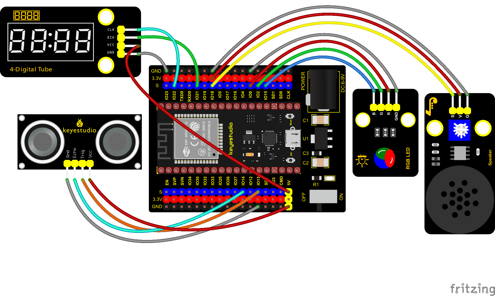

**4.Test Code**

<table>
<tbody>
<tr class="odd">
<td>
//**********************************************************************************

/*

* Filename : Ultrasonic radar

* Description : Ultrasonic control four digit tube, buzzer and RGB analog ultrasonic radar.

* Auther : http//www.keyestudio.com

*/

#include "TM1650.h" //Import the TM1650 library file

//the interfaces are GPIO21 and GPIO22

#define DIO 21

#define CLK 22

TM1650 DigitalTube(CLK,DIO);

int beeppin = 18; //Define the horn pin as GPIO18

int TrigPin = 13; //Set the Trig pin to GPIO13

int EchoPin = 14; //Set the Echo pin to GPIO14

int distance;//Distance measured by ultrasound

int ledPins[] = ; //define red, green, blue led pins

const byte chns[] = ; //define the pwm channels

float checkdistance() 

void setup() 

// DigitalTube.displayDot(1,true); //Bit0 display dot. Use before displayBit().

DigitalTube.displayBit(1,0); //DigitalTube.Display(bit,number); bit=0---3 number=0---9

pinMode(TrigPin, OUTPUT);//Sets the Trig pin as output

pinMode(EchoPin, INPUT); //Set the Echo pin as input

ledcSetup(3, 1000, 8);//setup the pwm channels,1KHz,8bit

ledcAttachPin(18, 3);

for (int i = 0; i &lt; 3; i++) 

}

void loop()  else if (distance &gt; 10 &amp;&amp; distance &lt;= 20)  else 

}

void displayFloatNum(float distance)

if(dat%10000/1000 != 0)

if(dat%1000/100 != 0)

DigitalTube.clearBit(1);

DigitalTube.clearBit(2);

DigitalTube.clearBit(3);

DigitalTube.displayBit(4, dat%100/10);

}

//**********************************************************************************
</td>
</tr>
</tbody>
</table>

**5. Code Explanation**

We set sound frequency and light color by adjusting different distance
range.

We can adjust the distance range in the code.

**Test Result**

Wire up and power on. When the ultrasonic sensor detects different
distances, the buzzer will produce different frequencies of sound, the
RGB will show different colors, and the measured distances are displayed
on the 4-digit tube display.

Project 51: IR Remote Control

**Introduction**

In the previous experiments, we learned to turn on or turn off the LED,
adjust the brightness of a light through PWM, and how to use the
infrared receiver module. So in this experiment, we use an infrared
remote control to control an LED module.

When we receive a value, we set the PWM value by the corresponding
button value, thus you can adjust the brightness. Control the LED to
turn on or turn off is in the same way. If we want to use the same
button to control the LED to turn on or turn off, we can achieve it
through the code.

**2.Required Components：**

<table>
<tbody>
<tr class="odd">
<td></td>
<td></td>
<td></td>
<td></td>
</tr>
<tr class="even">
<td>ESP32 Board*1</td>
<td>ESP32 Expansion Board*1</td>
<td>Keyestudio Purple LED Module*1</td>
<td>Keyestudio IR Receiver*1</td>
</tr>
<tr class="odd">
<td></td>
<td></td>
<td></td>
<td></td>
</tr>
<tr class="even">
<td>Micro USB Cable*1</td>
<td>Remote Control*1</td>
<td>3P Dupont Wire*2</td>
<td></td>
</tr>
</tbody>
</table>

**3.Wiring Diagram**

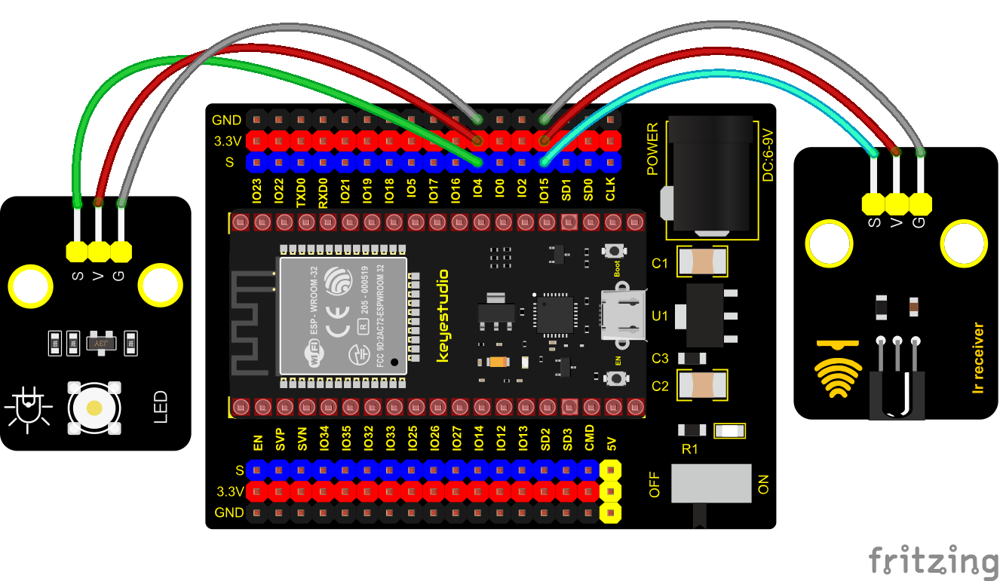

**4.Test Code**

<table>
<tbody>
<tr class="odd">
<td>
//**********************************************************************************

/*

* Filename : IR Control LED

* Description : Remote controls LED on and off

* Auther : http//www.keyestudio.com

*/

#include &lt;Arduino.h&gt;

#include &lt;IRremoteESP8266.h&gt;

#include &lt;IRrecv.h&gt;

#include &lt;IRutils.h&gt;

const uint16_t recvPin = 15; // Infrared receiving pin 15

IRrecv irrecv(recvPin); // Create a class object used to receive class

decode_results results; // Create a decoding results class object

int led = 4;//LED connect to GP4

void setup() 

////////////////////

void loop() 

}

void handleControl(unsigned long value) 

else if (value == 0xFF9867) // Receive the number '2'

}

//**********************************************************************************
</td>
</tr>
</tbody>
</table>

**5. Code Explanation**

Connect the wires according to the experimental wiring diagram, compile
and upload the code to the ESP32. After uploading successfully, we will
use a USB cable to power on. Open the serial monitor and set the baud
rate to 9600. We need to press the reset button on the ESP32, then press
the button 1 of the remote, which will be displayed on the monitor, and
the LED will be on. Similarly, press the button 2 , the LED will be off.

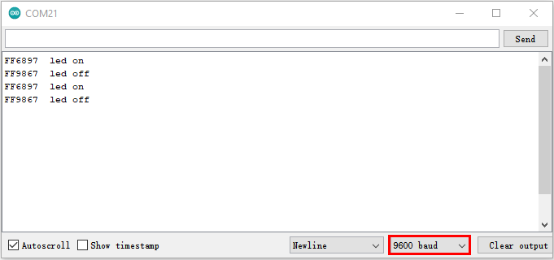

### Project 52: Heat Dissipation Device

**Description**

We will use a temperature sensor and some modules to make a smart
cooling device in this experiment. When the ambient temperature is
higher than a certain value, the motor is turned on, thereby reducing
the ambient temperature and achieving the heat dissipation effect. Then
display the temperature value in the four-digit segment display.

**2.Required Components：**

<table>
<tbody>
<tr class="odd">
<td></td>
<td></td>
<td></td>
<td></td>
</tr>
<tr class="even">
<td>ESP32 Board*1</td>
<td>ESP32 Expansion Board*1</td>
<td>Keyestudio 130 Motor*1</td>
<td>Keyestudio TM1650 4-Digit Segment Display*1</td>
</tr>
<tr class="odd">
<td></td>
<td></td>
<td></td>
<td></td>
</tr>
<tr class="even">
<td>Keyestudio 18B20 Temperature Sensor*1</td>
<td>3P Dupont Wire*1</td>
<td>4P Dupont Wire2</td>
<td>Micro USB Cable*1</td>
</tr>
<tr class="odd">
<td></td>
<td></td>
<td></td>
<td></td>
</tr>
<tr class="even">
<td>6 AA Battery Holder*1</td>
<td>AA Battery*6</td>
<td></td>
<td></td>
</tr>
</tbody>
</table>

**3.Wiring Diagram**

**4.Test Code**

<table>
<tbody>
<tr class="odd">
<td>
//**********************************************************************************

/*

* Filename : heat abstractor

* Description : DS18B20 controls a four digit tube and a motor that simulates Heat Abstractor

* Auther : http//www.keyestudio.com

*/

#include &lt;DS18B20.h&gt;

#include "TM1650.h" //Import the TM1650 library file

//The two ports are GP21 and GP22

#define DIO 21

#define CLK 22

TM1650 DigitalTube(CLK,DIO);

//ds18b20 pin to 13

DS18B20 ds18b20(13);

void setup() 

// DigitalTube.displayDot(1,true); //Bit0 display dot. Use before displayBit().

DigitalTube.displayBit(1,0); //DigitalTube.Display(bit,number); bit=0---3 number=0---9

//Motor is connected to 15 4

pinMode(15, OUTPUT);

pinMode(4, OUTPUT);

}

void loop()  else 

delay(100);

}

void displayFloatNum(float temp)

if(dat%10000/1000 != 0)

if(dat%1000/100 != 0)

DigitalTube.clearBit(1);

DigitalTube.clearBit(2);

DigitalTube.clearBit(3);

DigitalTube.displayBit(4, dat%100/10);

}

//**********************************************************************************
</td>
</tr>
</tbody>
</table>

**Code Explanation**

The setting of variables and the storage of detection values are the
same as what we learned earlier. We also set a temperature threshold and
control the rotation of the motor when the threshold is exceeded, and
then we use the digital tube to display the temperature value.

**Test Result**

Wire up and run the test code. We can see the temperature of the current
environment (unit is Celsius) on the four-digit segment display, as
shown in the figure below. If this value exceeds the value we set, the
fan will rotate to dissipate heat.

### Project 53: Intelligent Entrance Guard System

**Description**

In this project, we use the RFID522 card swiping module and the servo to
set up an intelligent access control system. The principle is very
simple.We use RFID522 swipe card module, an IC card or key card to
unlock

**2.Required Components：**

<table>
<tbody>
<tr class="odd">
<td></td>
<td></td>
<td></td>
<td></td>
</tr>
<tr class="even">
<td>ESP32 Board*1</td>
<td>ESP32 Expansion Board*1</td>
<td>Key*1</td>
<td>IC Card*1</td>
</tr>
<tr class="odd">
<td></td>
<td></td>
<td></td>
<td></td>
</tr>
<tr class="even">
<td>Keyestudio RFID Module*1</td>
<td>Servo*1</td>
<td>4P Dupont Wire1</td>
<td>Micro USB Cable*1</td>
</tr>
</tbody>
</table>

**3.Wiring Diagram**

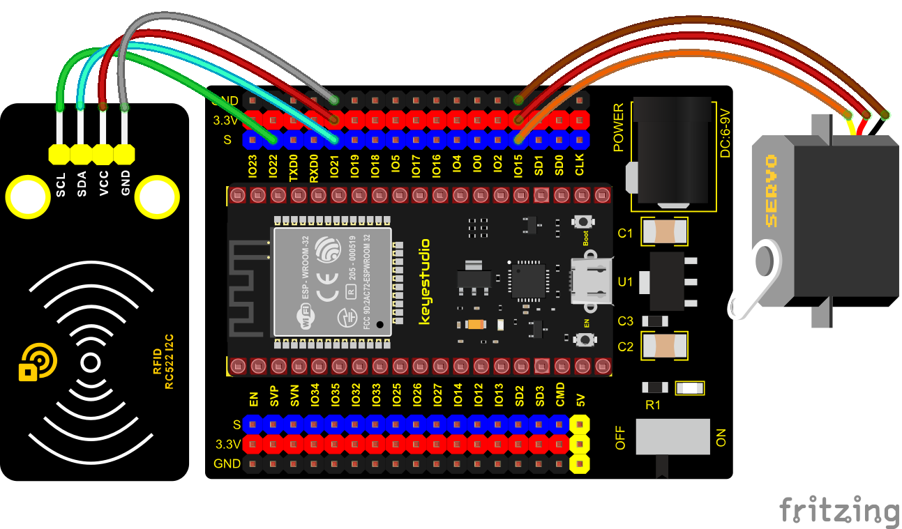

**4.Test Code**

**Note: Different RFID-MFRC522 IC cards and keys have diverse values.You
can substitute your own IC cards and keys values for the corresponding
values read by the RFID-MFRC522 module in the program, otherwise the
servo can’t be controlled when uploading the test code to the ESP32.**

**For example: You can replace the rfid\_str of the**
 **in the program code with your own IC cards
and keys values read by the RFID-MFRC522 module.**

<table>
<tbody>
<tr class="odd">
<td>
//*************************************************************************************

/*

* Filename : Intelligent_access_control

* Description : RFID controlled steering gear simulated door opening

* Auther : http//www.keyestudio.com

*/

#include &lt;Wire.h&gt;

#include "MFRC522_I2C.h"

// IIC pins default to GPIO21 and GPIO22 of ESP32

// 0x28 is the i2c address of SDA, if doesn't match，please check your address with i2c.

MFRC522 mfrc522(0x28); // create MFRC522.

#include &lt;ESP32Servo.h&gt;

Servo myservo; // create servo object to control a servo

int servoPin = 15; // Servo motor pin

String rfid_str = "";

void setup() 

void loop() 

// select one of door cards. UID and SAK are mfrc522.uid.

// save UID

rfid_str = ""; //String emptying

Serial.print(F("Card UID:"));

for (byte i = 0; i &lt; mfrc522.uid.size; i++) 

Serial.println(rfid_str);

if (rfid_str == "edf7945a" || rfid_str == "4c96b6e") 

}

void ShowReaderDetails() 

}

//*************************************************************************************
</td>
</tr>
</tbody>
</table>

**Code Explanation**

In the previous experiment, our card swipe module has tested the
information of IC card and key. Then we use this corresponding
information to control the door.

**Test Result**

Upload the test code, wire up and power up with a USB cable, open the
shell and set the baud rate to 9600; the shell displays information.

When we use the IC card or blue key to swipe the card, the shell
displays the card information and "open the door", as shown in the
figure below, the servo rotates to the corresponding angle to simulate
opening the door.

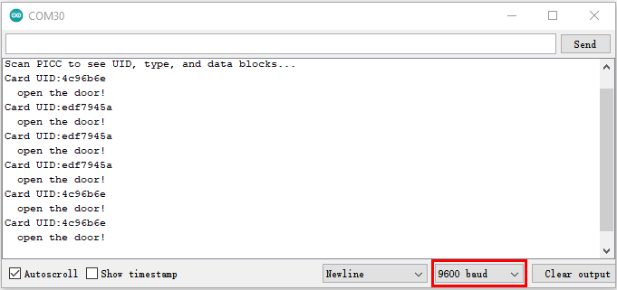

### Project 54：Bluetooth

This chapter mainly introduces how to use the bluetooth of ESP32 for
simple data transmission with mobile phone. Project 60.1 is conventional
bluetooth, and Project 60.2 is bluetooth control LED.

Project 54.1：Classic Bluetooth

1.  **Components**

<table>
<tbody>
<tr class="odd">
<td></td>
<td></td>
</tr>
<tr class="even">
<td>Micro USB Cable*1</td>
<td>ESP32*1</td>
</tr>
</tbody>
</table>

In this experiment, we need to use a BT dobbed serial terminal to make
an experiment. If you haven’t install it, please click the installation:
<https://www.appsapk.com/serial-bluetooth-terminal/> .

2.  **Component Knowledge**

Bluetooth is a short-distance communication system that can be divided
into two types, namely low power bluetooth (BLE) and classic bluetooth.
There are two modes for simple data transfer: master mode and slave
mode. 

**Master Mode**: In this mode, work is done on the master device and can
be connected to the slave device. When the device initiates a connection
request in the main mode, information such as the address and pairing
password of other bluetooth devices are required.  Once paired, you can
connect directly to them.  

**Slave Mode**: A bluetooth module in the slave mode can only accept
connection requests from the host, but cannot initiate connection
requests. After being connected to a host device, it can send and
receive data through the host device . Bluetooth devices can interact
with each other, when they interact, the bluetooth device in the main
mode searches for nearby devices. While a connection is established,
they can exchange data. For example, when a mobile phone exchanges data
with ESP32, the mobile phone is usually in master mode and the ESP32 is
in slave mode.  

master mode slave mode

**3. Wiring Diagram**

We can use a USB cable to connect ESP32 mainboard to the USB port on the
Computer.

**Test Code**

<table>
<tbody>
<tr class="odd">
<td>
//**********************************************************************************

/*

* Filename : Classic Bluetooth--SerialToSerialBT

* Description : ESP32 communicates with the phone by bluetooth and print phone's data via a serial port

* Auther : http//www.keyestudio.com

*/

#include "BluetoothSerial.h"

BluetoothSerial SerialBT;

String buffer;

void setup() 

void loop() 

if (SerialBT.available()) 

delay(20);

}

//**********************************************************************************
</td>
</tr>
</tbody>
</table>

**5. Test Result**

Compile and upload the code to the ESP32. After uploading
successfully，we will use a USB cable to power on. Open the serial
monitor and set the baud rate to 115200. We need to press the reset
button on the ESP32, when you see the serial prints the character, as
shown below, it means that the ESP32's bluetooth is waiting for
connection with a phone. (If open the serial monitor and set the baud
rate to 115200, the information is not displayed, please press the
button RESET of the ESP32)

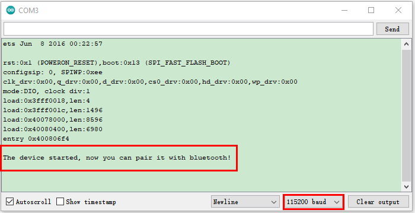

Ensure that your mobile phone bluetooth is enabled and the bluetooth
application of "Serial Bluetooth Terminal" is installed.  

Click“Search”，search for the nearby bluetooth and select to connect
the“ESP32 test”.

Open the software APP and click the left side of the terminal, select
"Devices".

If you select ESP32test in classic Bluetooth mode, a successful
connection message will appear as shown below.  

Data can be transferred between your phone and Raspberry Pi via ESP32
now.  

Send “Hello！”, When the Raspberry Pi receives it, which will reply with
"Hi\!".

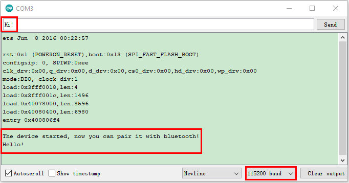

Project 54.2：Bluetooth Control LED

1.  **Required Components：**

<table>
<tbody>
<tr class="odd">
<td></td>
<td></td>
<td></td>
</tr>
<tr class="even">
<td>ESP32*1</td>
<td>ESP32 Expansion Board*1</td>
<td></td>
</tr>
<tr class="odd">
<td></td>
<td></td>
<td></td>
</tr>
<tr class="even">
<td>Keyestudio Purple LED Module*1</td>
<td>3P Dupont Wire*1</td>
<td>Micro USB Cable*1</td>
</tr>
</tbody>
</table>

2.  **Wiring Diagram**
    
    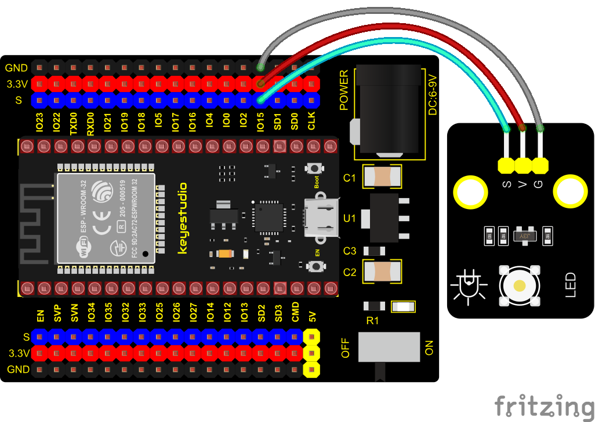

<table>
<tbody>
<tr class="odd">
<td>
<strong>Test Code</strong>//**********************************************************************************

/*

* Filename : Bluetooth Control LED

* Description : The phone controls esp32's led via bluetooth.

When the phone sends "LED_on," ESP32's LED lights turn on.

When the phone sends "LED_off," ESP32's LED lights turn off.

* Auther : http//www.keyestudio.com

*/

#include "BluetoothSerial.h"

#include "string.h"

#define LED 15

BluetoothSerial SerialBT;

char buffer[20];

static int count = 0;

void setup() 

void loop() 

if(count&gt;0)

if(strncmp(buffer,"led_off",7)==0)

count=0;

memset(buffer,0,20);

}

}

//**********************************************************************************
</td>
</tr>
</tbody>
</table>

**4. Test Result**

Wire up, power on, compile and upload the code to the ESP32. The APP
operation is the same as the project 54.1. We need to press the reset
button on the ESP32, if you want to make the external LED on and off,
just change the sending content into "LED\_on" and "LED\_OFF".

The serial monitor will display as follows:

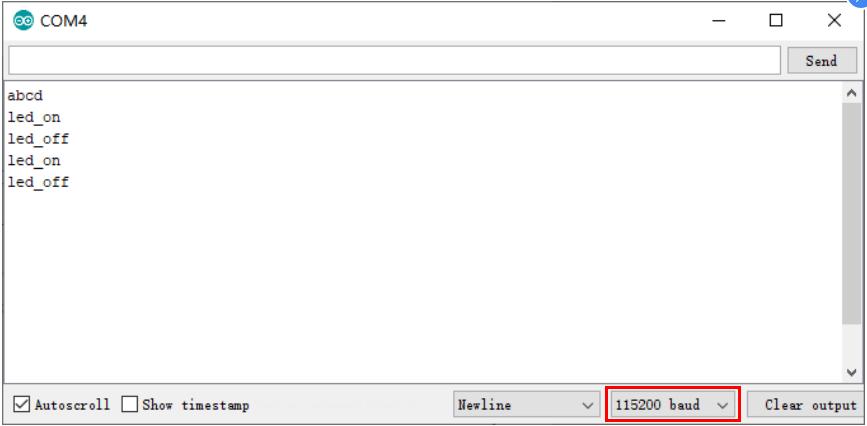

**Note:** If the sent content is not "LED-on 'or" LED-off ", the status
of the LED will not change. If the LED is on, it remains on when
irrelevant content is received; Conversely, if the LED is off, it
continues to be off when irrelevant content is received.  

### Project 55：WiFi Station Mode

1.  **Description**

ESP32 has three different WiFi modes: Station mode, AP mode and
AP+Station mode. All WiFi programming projects must be configured with
WiFi running mode before using, otherwise the WiFi cannot be used. In
this project, we are going to learn the WiFi Station mode of the ESP32.

**2. Components**

<table>
<tbody>
<tr class="odd">
<td></td>
<td></td>
</tr>
<tr class="even">
<td>Micro USB*1</td>
<td>ESP32*1</td>
</tr>
</tbody>
</table>

**3. Wiring Diagram**

Plug the ESP32 to the USB port of your computer..

**4. Component Knowledge**

**Station mode：**

When setting Station mode, the ESP32 is taken as a WiFi client. It can
connect to the router network and communicate with other devices on the
router via a WiFi connection. As shown in the figure below, the PC and
the router have been connected. If the ESP32 wants to communicate with
the PC, the PC and the router need to be connected.

**5. Test Code**

Since WiFi names and passwords vary from place to place, thereby users
need to enter the correct WiFi names and passwords in the box shown
below before the program code runs.

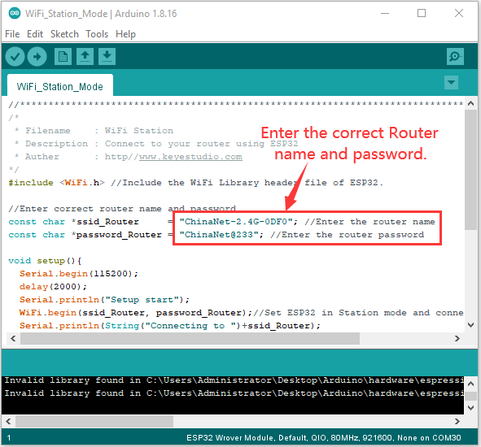

<table>
<tbody>
<tr class="odd">
<td>
//**********************************************************************************

/*

* Filename : WiFi Station

* Description : Connect to your router using ESP32

* Auther : http//www.keyestudio.com

*/

#include &lt;WiFi.h&gt; //Include the WiFi Library header file of ESP32.

//Enter correct router name and password.

const char *ssid_Router = "ChinaNet-2.4G-0DF0"; //Enter the router name

const char *password_Router = "ChinaNet@233"; //Enter the router password

void setup()

Serial.println("\nConnected, IP address: ");

Serial.println(WiFi.localIP());//Serial monitor prints out the IP address assigned to ESP32.

Serial.println("Setup End");

}

void loop() 

//**********************************************************************************
</td>
</tr>
</tbody>
</table>

**6. Test Result**

After entering the correct WiFi names and passwords, compile and upload
the code to the ESP32. After uploading successfully，we will use a USB
cable to power on. Open the serial monitor and set the baud rate to
115200. When the ESP32 successfully connects to ssid\_WiFi, the serial
monitor prints out the IP address, then monitor will display as follows:
(If open the serial monitor and set the baud rate to 115200, the
information is not displayed, please press the button RESET of the
ESP32)

### Project 56：WIFI AP Mode

1.  **Description**

ESP32 has three different WiFi modes: Station mode, AP mode and
AP+Station mode. All WiFi programming projects must be configured with
WiFi running mode before using, otherwise the WiFi cannot be used. In
this project, we are going to learn the WiFi AP mode of the ESP32.

**2.Required Components：**

<table>
<tbody>
<tr class="odd">
<td></td>
<td></td>
</tr>
<tr class="even">
<td>Micro USB Cable*1</td>
<td>ESP32*1</td>
</tr>
</tbody>
</table>

**3. Wiring Diagram**

Plug the ESP32 mainboard to the USB port of your computer.

**4. Component Knowledge**

**AP Mode:**

When setting AP mode, a hotspot network will be created, waiting for
other WiFi devices to connect. As shown below;

Take the ESP32 as the hotspot, if a phone or PC needs to communicate
with the ESP32, it must be connected to the ESP32's hotspot.
Communication is only possible after a connection is established via the
ESP32.

**5.Test Code**

Before the program code runs, you can make any changes to the ESP32 AP
name and password in the box as shown below, but in a default
circumstance, it doesn’t need to modify.

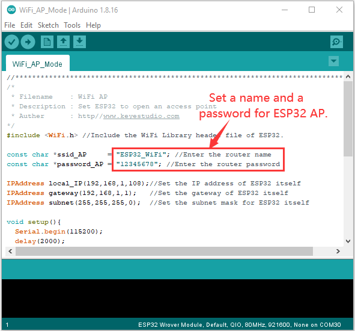

<table>
<tbody>
<tr class="odd">
<td>
//**********************************************************************************

/*

* Filename : WiFi AP

* Description : Set ESP32 to open an access point

* Auther : http//www.keyestudio.com

*/

#include &lt;WiFi.h&gt; //Include the WiFi Library header file of ESP32.

const char *ssid_AP = "ESP32_WiFi"; //Enter the router name

const char *password_AP = "12345678"; //Enter the router password

IPAddress local_IP(192,168,1,108);//Set the IP address of ESP32 itself

IPAddress gateway(192,168,1,1); //Set the gateway of ESP32 itself

IPAddress subnet(255,255,255,0); //Set the subnet mask for ESP32 itself

void setup()else

Serial.println("Setup End");

}

void loop() 

//**********************************************************************************
</td>
</tr>
</tbody>
</table>

**6. Test Result**

Compile and upload the code to the ESP32. After uploading
successfully，we will use a USB cable to power on. Open the serial
monitor and set the baud rate to 115200, then monitor will display as
follows: (If open the serial monitor and set the baud rate to 115200,
the information is not displayed, please press the button RESET of the
ESP32)

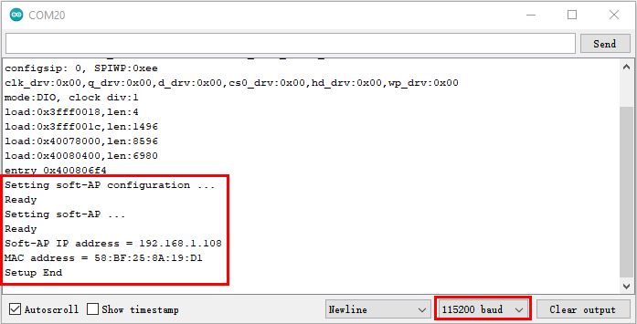

Observe printed information of the serial port monitor and turn on the
WiFi scanning function of the mobile phone, you can see the ssid\_AP on
ESP32, which is dubbed as "ESP32\_Wifi" in this program code.

Enter password "12345678" to connect it or modify the program code to
change AP name and password.  

### Project 57：WIFI AP+Station Mode

1.  **Description**

In this project, we are going to learn the AP+Station mode of the ESP32.

**2. Components**

<table>
<tbody>
<tr class="odd">
<td></td>
<td></td>
</tr>
<tr class="even">
<td>MicroUSB Cable*1</td>
<td>ESP32*1</td>
</tr>
</tbody>
</table>

**3. Wiring Diagram**

Plug the ESP32 mainboard to the USB port of your computer.

**4. Component Knowledge**

**AP+Station mode**

In addition to the AP mode and the Station mode, **AP+Station mode** can
be used at the same time. Turn on the Station mode of the ESP32, connect
it to the router network, and it can communicate with the Internet
through the router. Then turn on the AP mode to create a hotspot
network. Other WiFi devices can be connected to the router network or
the hotspot network to communicate with the ESP32.

**5. Test Code：**

Before the program code runs, you need to modify the ssid\_Router,
password\_Router, ssid\_AP and password\_AP, as shown in the box below:

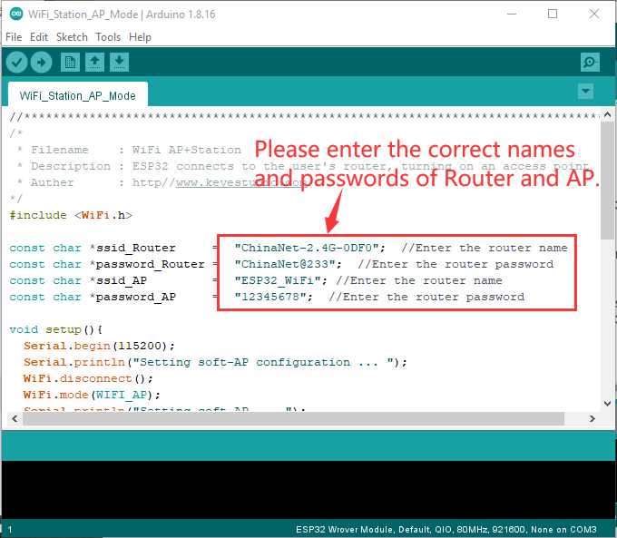

<table>
<tbody>
<tr class="odd">
<td>
//**********************************************************************************

/*

* Filename : WiFi AP+Station

* Description : ESP32 connects to the user's router, turning on an access point

* Auther : http//www.keyestudio.com

*/

#include &lt;WiFi.h&gt;

const char *ssid_Router = "ChinaNet-2.4G-0DF0"; //Enter the router name

const char *password_Router = "ChinaNet@233"; //Enter the router password

const char *ssid_AP = "ESP32_WiFi"; //Enter the router name

const char *password_AP = "12345678"; //Enter the router password

void setup()else

Serial.println("\nSetting Station configuration ... ");

WiFi.begin(ssid_Router, password_Router);

Serial.println(String("Connecting to ")+ ssid_Router);

while (WiFi.status() != WL_CONNECTED)

Serial.println("\nConnected, IP address: ");

Serial.println(WiFi.localIP());

Serial.println("Setup End");

}

void loop() 

//**********************************************************************************
</td>
</tr>
</tbody>
</table>

**6. Test Result**

Ensure that the code in the program has been modified correctly, compile
and upload the code to the ESP32. After uploading successfully，we will
use a USB cable to power on. Open the serial monitor and set the baud
rate to 115200, then monitor will display as follows: (If open the
serial monitor and set the baud rate to 115200, the information is not
displayed, please press the button RESET of the ESP32)

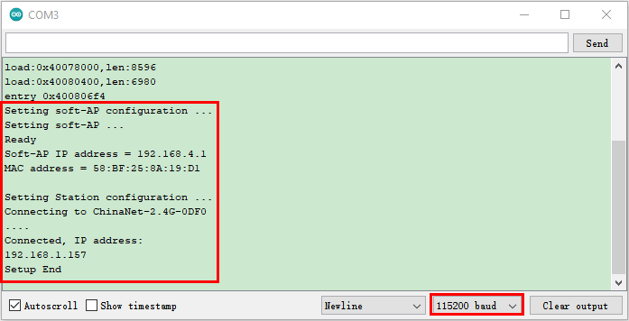

Open the WiFi scanning function of the mobile phone, you can see the
ssid\_AP.

Project 58: Comprehensive Experiment

**Introduction**

We did a lot of experiments, and for each one we needed to re-upload the
code, so can we achieve different functions through an experiment? In
this experiment, we will use an external button module to achieve
different functions.

**2.Required Components：**

<table>
<tbody>
<tr class="odd">
<td></td>
<td></td>
<td></td>
<td></td>
<td></td>
<td></td>
</tr>
<tr class="even">
<td>ESP32 Board*1</td>
<td>ESP32 Expansion Board*1</td>
<td>Keyestudio Purple LED Module*1</td>
<td>KeyestudioButton Module*1</td>
<td>Keyestudio Rotary Encoder*1</td>
<td>Keyestudio Obstacle Avoidance Sensor*1</td>
</tr>
<tr class="odd">
<td></td>
<td></td>
<td></td>
<td></td>
<td></td>
<td></td>
</tr>
<tr class="even">
<td>Keyestudio Line Tracking Sensor*1</td>
<td>Keyestudio Joystick Module*1</td>
<td>Keyestudio HC-SR04 Ultrasonic sensor *1</td>
<td>Keyestudio Common Cathode RGB Module *1</td>
<td>
Keyestudio XHT11 Temperature and Humidity Sensor

*1
</td>
<td>Micro USB Cable*1</td>
</tr>
<tr class="odd">
<td></td>
<td></td>
<td></td>
<td></td>
<td></td>
<td></td>
</tr>
<tr class="even">
<td>3P Dupont Wire*6</td>
<td>4P Dupont Wire2</td>
<td>5P Dupont Wire*1</td>
<td></td>
<td></td>
<td></td>
</tr>
</tbody>
</table>

**3.Wiring Diagram**

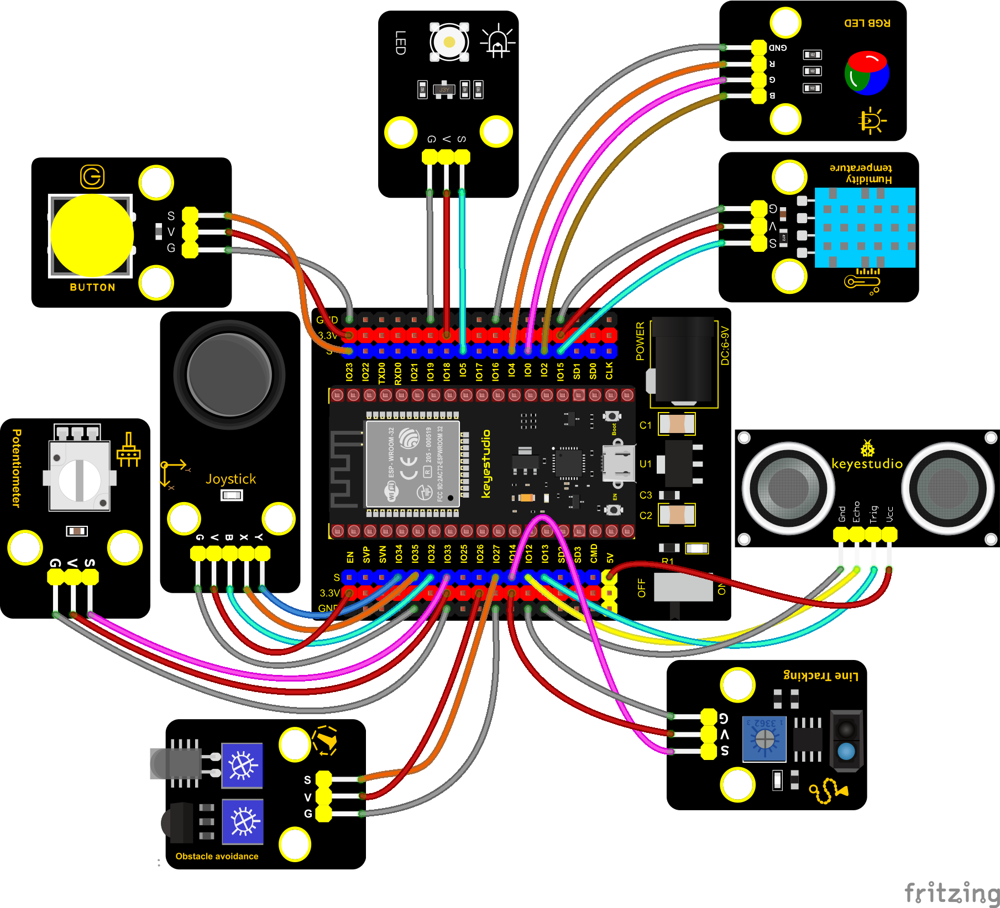

**4.Test Code**

<table>
<tbody>
<tr class="odd">
<td>
//**********************************************************************

/*

* Filename : Comprehensive experiment

* Description : Multiple sensors/modules work together

* Auther : http//www.keyestudio.com

*/

#include "xht11.h"

//xht11 to gpio15

xht11 xht(15);

//rgb is connected to 4,0,2

int ledPins[] = ; //define red, green, blue led pins

const byte chns[] = ; //define the pwm channels

int red, green, blue;

//Rocker module port

int X = 35;

int Y = 34;

int KEY = 32;

//Potentiometer pin is connected to analog port 33

int resPin = 33;

//Trace sensor pin connected to IO port 14

int TrackingPin = 14;

//LED is Connected to GP5

#define PIN_LED 5 // the pin of the LED

#define CHAN 3

//Obstacle avoidance sensor is connected to GP27

int Avoid = 27;

//Ultrasonic sensor port

int Trig = 13;

int Echo = 12;

//Key module port

int button = 23;

int PushCounter = 0;//Store the number of times a key is pressed

int yushu = 0;

unsigned char dht[4] = ;//Only the first 32 bits of data are received, not the parity bits

bool ir_flag = 1;

float out_X, out_Y, out_Z;

void counter() 

}

void setup() 

}

void loop()  else if (yushu == 1)  else if (yushu == 2)  else if (yushu == 3) else if (yushu == 4)  else if (yushu == 5)  else if (yushu == 6) 

}

//RGB

void yushu_0() 

void setColor(byte r, byte g, byte b) 

void yushu_1() 

else 

}

void yushu_2()  else 

delay(1200);

}

void yushu_3() 

void yushu_4() 

void yushu_5() 

else 

delay(100);

}

void yushu_6() 

float checkdistance() 

//*************************************************************************************
</td>
</tr>
</tbody>
</table>

**Code Explanation**

Calculate how many times the button is pressed, divide it by 7, and get
the remainder which is 0, 1 2, 3, 4, 5 , 6. According to different
remainders, construct seven unique functions to realize different
functions.

We can add or reduce sensors or modules.

**Test Result：**

Wire up, upload the code, power on, open the monitor and set baud rate
to 9600. At the beginning, the time of pressing buttons is 0 and
remainder is 0. Then RGB will flash.

Open the monitor, set baud rate to 9600, hold down a button, the RGB
will stop flashing, the time of pressing key is 1, the remainder is 1.
If the tracking sensor doesn’t detect objects or only detect black ones,
val is 1 and monitor shows 1 Black; if white objects are detected, val
is 0 and 0 White is shown.As shown below;

Note: if a key is pressed, the time of pressing turns out to be 1. Open
the monitor, the program will reset, the time of pressing becomes into
0. You need to press keys to reset times of pressing keys.

Press a key twice, the time of pressing buttons is 2 and the remainder
is 2. Read temperature and humidity values. As shown below;

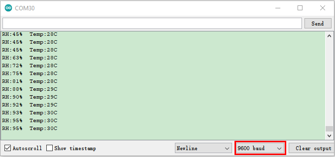

Press this key again, the time of pressing buttons is 3 and the
remainder is 3. Read digital values at x, y and z axis of the joystick
module. As shown below;

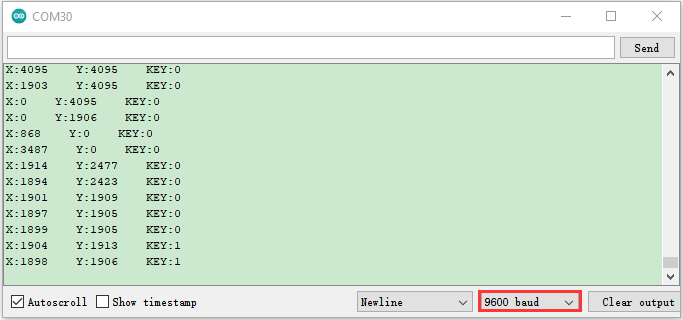

Press the key for the fourth time, the remainder is 4. Then the
potentiometer can adjust the PWM value at the GPI05 port to control LED
brightness of the purple LED.

Press the key for the fifth time, the remainder is 5. Then the
ultrasonic sensor can detect obstacles, as shown below;

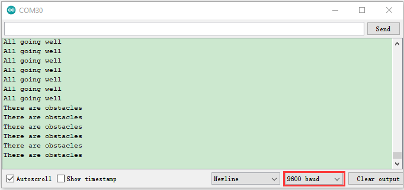

Press the key for the sixth time, the remainder is 6. Then the distance
away from obstacles will be shown, as shown below;

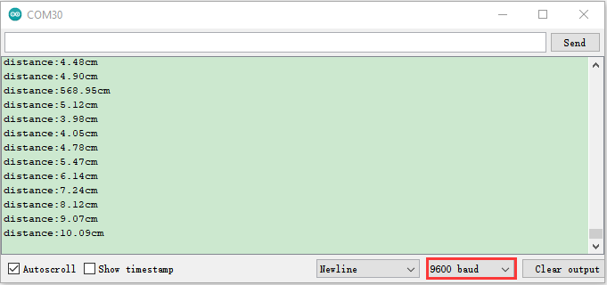

Press the key for seventh time and the remainder is 0. The RGB will
flash. If pressing keys continuously, remainders also change.

Project 59: WiFi
**[Smart](C:/Users/NINGMEI/AppData/Local/youdao/dict/Application/8.10.7.0/resultui/html/index.html#/javascript:;) [Home](C:/Users/NINGMEI/AppData/Local/youdao/dict/Application/8.10.7.0/resultui/html/index.html#/javascript:;)**

1.  **Description**

In the previous experiment, we have learned the WiFi Station mode, WiFi
AP mode and WiFi AP+Station mode of the ESP32. In this project, We will
use ESP32's WiFi Station mode to control the work of multiple
sensors/modules through APP connection with WiFi to achieve the effect
of WiFi smart home.

**2.Required Components：**

<table>
<tbody>
<tr class="odd">
<td></td>
<td></td>
<td></td>
<td></td>
<td></td>
</tr>
<tr class="even">
<td>ESP32 Board*1</td>
<td>ESP32 Expansion Board*1</td>
<td>Keyestudio 130 Motor*1</td>
<td>Keyestudio 5V Relay Module*1</td>
<td>Servo*1</td>
</tr>
<tr class="odd">
<td></td>
<td></td>
<td></td>
<td></td>
<td></td>
</tr>
<tr class="even">
<td>Keyestudio XHT11 Temperature and Humidity Sensor*1</td>
<td>Keyestudio HC-SR04 Ultrasonic Sensor*1</td>
<td>3P Dupont Wire*2</td>
<td>4P Dupont Wire*2</td>
<td>Smart Phone/PC*1</td>
</tr>
<tr class="odd">
<td></td>
<td></td>
<td></td>
<td></td>
<td></td>
</tr>
<tr class="even">
<td>6 AA Battery Holder*1</td>
<td>AA Battery*6</td>
<td>Micro USB Cable*1</td>
<td></td>
<td></td>
</tr>
</tbody>
</table>

**3. Wiring Diagram**

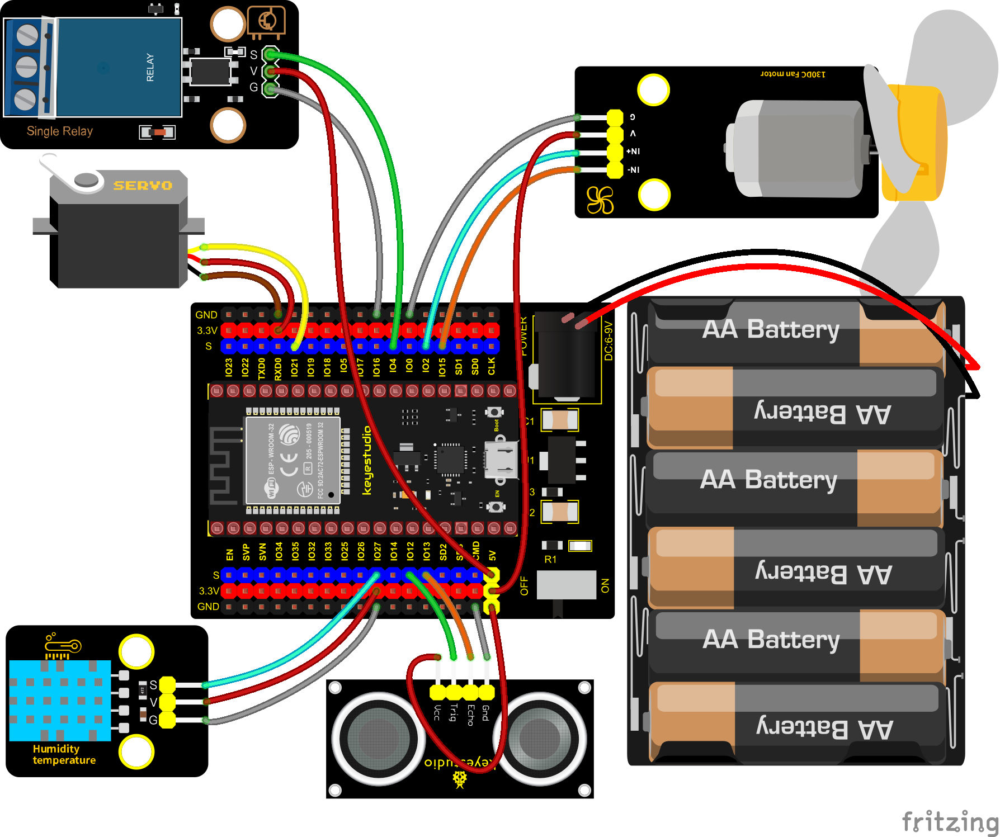

**4. Install APP**

Android device (mobile phone/PC) APP:

We provide the Android APP
[installation](C:/Users/NINGMEI/AppData/Local/youdao/dict/Application/8.10.7.0/resultui/html/index.html#/javascript:;)
[package](C:/Users/NINGMEI/AppData/Local/youdao/dict/Application/8.10.7.0/resultui/html/index.html#/javascript:;)

Now transfer the keyes wifi.apk file in the Android APP installation
package to the Android phone or PC, click the keyes wifi.apk file to
enter the installation page, click "ALLOW" key, and then click "INSTALL"
button. After installation, click "OPEN" button to enter the APP
interface.  

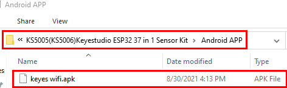

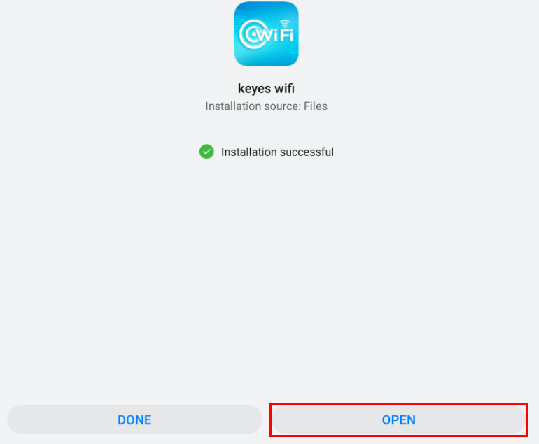

IOS (mobile phone /iPad)

1.  Open App Store

> 

B. Enter keyes link in the search box and click search, the download
interface appears. Click "" to download and
install the APP of the keyes link. The following operations are similar
to those of Android system. You can refer to the steps of Android
system.

**5. Test Code**

<table>
<tbody>
<tr class="odd">
<td>
//**********************************************************************************

/*

* Filename : WiFi Smart Home.

* Description : WiFi APP controls Multiple sensors/modules work to achieve the effect of WiFi smart home.

* Auther : http//www.keyestudio.com

*/

#include &lt;Arduino.h&gt;

#include &lt;WiFi.h&gt;

#include &lt;ESPmDNS.h&gt;

#include &lt;WiFiClient.h&gt;

#include "xht11.h"

//gpio27

xht11 xht(27);

unsigned char dht[4] = ;

#include &lt;ESP32Servo.h&gt;

Servo myservo;

int servoPin = 21;

#define Relay 4

#define IN1 2 //IN1 corresponds to IN+

#define IN2 15 //IN2 corresponds to IN-

#define trigPin 12

#define echoPin 13

int distance1;

String dis_str;

int ip_flag = 1;

int ultra_state = 1;

int temp_state = 1;

int humidity_state = 1;

String item = "0";

const char* ssid = "ChinaNet-2.4G-0DF0"; //the name of user's wifi

const char* password = "ChinaNet@233"; //the password of user's wifi

WiFiServer server(80);

String unoData = "";

void setup() 

Serial.println("");

Serial.print("Connected to ");

Serial.println(ssid);

Serial.print("IP address: ");

Serial.println(WiFi.localIP());

server.begin();

Serial.println("TCP server started");

MDNS.addService("http", "tcp", 80);

digitalWrite(IN1, LOW);

digitalWrite(IN2, LOW);

digitalWrite(Relay, LOW);

pinMode(trigPin, OUTPUT);

pinMode(echoPin, INPUT);

}

void loop() 

while(client.connected() &amp;&amp; !client.available())

String req = client.readStringUntil('\r');

int addr_start = req.indexOf(' ');

int addr_end = req.indexOf(' ', addr_start + 1);

if (addr_start == -1 || addr_end == -1) 

req = req.substring(addr_start + 1, addr_end);

item=req;

Serial.println(item);

String s;

if (req == "/")

else if(req == "/btn/0")

else if(req == "/btn/1")

else if(req == "/btn/2")

else if(req == "/btn/3")

else if(req == "/btn/4")

else if(req == "/btn/5")

else if(req == "/btn/6")

while(ultra_state&gt;0)

}

else if(req == "/btn/7")

else if(req == "/btn/8")

while(temp_state&gt;0)

temp_state = 0;

}

}

else if(req == "/btn/9")

else if(req == "/btn/10")

while(humidity_state &gt; 0)

humidity_state = 0;

}

}

else if(req == "/btn/11")

//client.print(s);

client.stop();

}

int checkdistance() 

//**********************************************************************************
</td>
</tr>
</tbody>
</table>

Note: You need to 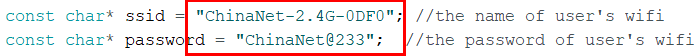change the Wifi name and
default Wifi password of the experimental code to your own Wifi name and
Wifi password. 

**Test Result**

After the code has been modified correctly, connect the external power
supply and power on. Turn the DIP switch ON the ESP32 expansion board to
the ON end, compile and upload the code to the ESP32 mainboard.（If
uploading the code is not successful，hold down the Boot
button,
release it when the upload progress percentage appears.)

Open the monitor and set baud rate to 115200. Then the monitor can print
the WiFi IP address.

If no information is displayed, you can press the RESET button

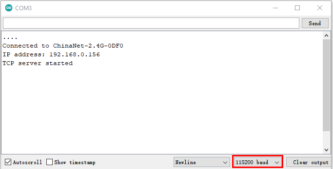

Open WiFi APP, enter the detected WIFI IP address in the text box in
front of the WIFI button (for example, the IP address detected by the
serial monitor above is 192.168.0.156). Next, click the WIFI button to
connect to WIFI, at the same time, the corresponding WiFi IP address
will be displayed in the text box :“Hello from ESP32 at 192.168.0.156”,
then the APP has connected to WiFi.(WiFi IP address sometimes changes,
if the original IP address can not use, you need to re-check it.)  

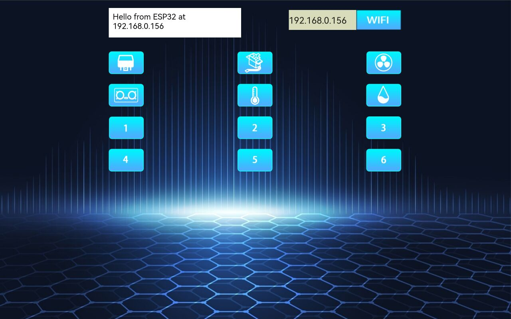

After the APP is connected to WiFi, the following operations are
performed:

1)  Clickbutton, the relay will be opened, the
    APP will display，and the indicator lights up
    on the module. Clickagain, the relay will be
    closed , the APP will display ，and the
    indicator on the module is off.

2)  Clickbutton，the servo rotates 180°，the APP
    will display
    again，the
    APP will display ，the servo rotates 0°.

3)  Clickbutton，the motor（with small fan
    blades）rotates，the APP will display
    again，close
    the motor，the APP will display ；

4)  Clickbutton，the ultrasonic sensor detects
    the distance, put an object in front of the ultrasonic sensor, the
    APP will display

5)  , the distance between the object and the
    ultrasonic sensor is 14cm；click  again, turn
    off the sensor, the APP will display
    button，the
    temperature and humidity sensor measures the temperature in the
    environment, the APP will display （，the
    ambient temperature is 28 ° C., click again,
    turn off the sensor，the APP will display .

6)  Click  button，the temperature and humidity
    sensor measures the humidity in the environment,，the APP will
    display  the ambient humidity is
    52%；clickagain，turn off the sensor, the
    APP will display .

# 6\. Resources

https://fs.keyestudio.com/KS5005-5006
